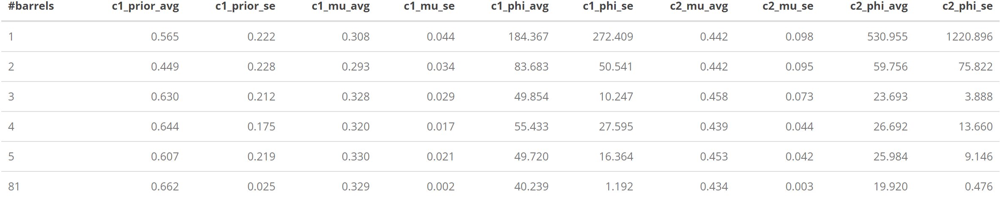

```{r setup, include=FALSE}
knitr::opts_chunk$set(echo = TRUE)
library(betareg)
library(dplyr)
library(kableExtra)
fau330_km_beta_no_A <- readRDS("fau330_km_beta_no_A.rds")
fau330_knm_beta_no_A <- readRDS("fau330_knm_beta_no_A.rds")
fau330_km_beta_A <- readRDS("fau330_km_beta_A.rds")
fau330_knm_beta_A <- readRDS("fau330_knm_beta_A.rds")
full_km_model <- readRDS("full_km_model.rds")
full_knm_model <- readRDS("full_knm_model.rds")

beta_params <- function(model){
  
  output <- lapply(model$flexmix@components, FUN = function(x){
    beta_mean <- plogis(x[[1]]@parameters$mean)
    beta_phi <- exp(x[[1]]@parameters$precision)
    
    alpha <- beta_mean*beta_phi
    beta <- beta_phi - alpha
    
    output <- list(alpha = alpha, beta = beta)
  })
  
  output
}

cv_summary <- function(x) {
  information_list <- lapply(x, FUN = function(x) {
    prior <- x$flexmix@prior
    params <- beta_params(x)
    mu_phi_params <- x$flexmix@components
    
    # order the components according to their mean: from small to large
    order <- order(unlist(lapply(params, FUN = function(x) x[[1]]/(x[[1]]+x[[2]]))))
    prior <- prior[order]
    params <- params[order]
    mu_phi_params <- mu_phi_params[order]
    names(params) <- NULL
    names(mu_phi_params) <- NULL
    
    # simlify the structure(this is updated on June 5/2020)
    mu_phi_params <- lapply(1:length(mu_phi_params), FUN = function(i){
      output <- mu_phi_params[[i]][[1]]@parameters
    })
    
    
    output <- list(prior=prior, params=params, order=order, mu_phi_params=mu_phi_params)
    output
  })
  information_list
}

extract_params <- function(summary_something) {
  
  temp1 <- lapply(summary_something, FUN = function(d){
    p1 <- d$prior[[1]]
    c1_alpha <- d$params[[1]]$alpha
    c1_beta <- d$params[[1]]$beta
    c1_mu <- plogis(d$mu_phi_params[[1]]$mean)
    c1_phi <- exp(d$mu_phi_params[[1]]$precision)
    
    c2_alpha <- d$params[[2]]$alpha
    c2_beta <- d$params[[2]]$beta
    c2_mu <- plogis(d$mu_phi_params[[2]]$mean)
    c2_phi <- exp(d$mu_phi_params[[2]]$precision)
    
    output <- c(p1, c1_alpha, c1_beta, c1_mu, c1_phi, c2_alpha, c2_beta, c2_mu, c2_phi)
    output
  })
  
  temp2 <- lapply(1:9, FUN = function(i){
    
    theparamvector <- lapply(temp1, FUN = function(d2){
      output <- d2[i]
    }) %>% unlist()
    
    theparamvector
  }) 
  
  names(temp2) <-  c("p1", "c1_alpha", "c1_beta", "c1_mu", "c1_phi", "c2_alpha", "c2_beta", "c2_mu", "c2_phi")
  
  temp3 <- as.data.frame(temp2)
  temp3
}
```


## The work we have done

Before the summer, we have done the following:

- We have 62 barrels with manually identified grooves (this can be extended, e.g. FAU 330 is not one of those)

- We have gone through the matching process for the (all) 2232 known matches, sampled 3276 known non-matches from the above data set (these numbers can be changed)

- Fitted the beta-mixture distribution with 2 or 3 components for the KNM and KM, with all the data, with the code, e.g.:

```{r, eval=FALSE}
fau330_knm_beta_no_A <- betamix(ccf~1|1, data = fau330_knm_no_A, k = 2)
```

- Different samples with the fit: ten-fold samples, cummulated samples, some single barrel cases

- Some summarized statistics for those comparison are shown in the tables (also see this-is-us repo), some plots are also drawn


```{r, fig.cap="KM", out.width="100%", fig.keep="hold", fig.align='center', echo=FALSE}
knitr::include_graphics("km-table1.png")
```

```{r, fig.cap="KNM", out.width="100%", fig.keep="hold", fig.align='center', echo=FALSE}

```

## What we focus now

- How does this model fit work for the single barrel case? (with one bullet left out as the suspect bullet from the crime scene, some more detailed metric to this question need to be clear)

- How is the fit for the single barrel case compared with the full data fit we have? (how to compare, to what extent, with other sample size?)


## The new progress

To address the above two questions, I refit the models(KM and KNM) to FAU 330 with bullet A left out. And then fit the models including bullet A as we would do in reality, get all possible comparisons including bullet A, i.e. compare bullet A to the test fired bullets. By doing this, we got four models, with two for known bullets, with two for the bullet A compared to the known bullets.

First we should have a look at the original models we estimated before we go to the inference. Note that, the components are always reordered to make the component with smaller mean value be the first component. So the p1 is the prior probability for the first component, is also the prior probability for the component on the left hand side. Also notice that the p1 of fau330_km_beta_no is much larger than the p1 of full_km_model, however, this doesn't mean the function reversed the two components. The reason is the estimation for the fau330_km_beta_no is done with only 18 obeservations which is not good to estimate two components, the two components both have large enough mean(both similar to the second component of the full_km_model).

```{r}
estimated_model <- extract_params(cv_summary(list(fau330_km_beta_no_A, fau330_knm_beta_no_A, fau330_km_beta_A,fau330_knm_beta_A, full_km_model, full_knm_model)))

rownames(estimated_model) <- c("fau330_km_beta_no_A", "fau330_knm_beta_no_A", "fau330_km_beta_A", "fau330_knm_beta_A", "full_km_model", "full_knm_model")

estimated_model %>% round(digits = 2) %>%kable() %>% kable_styling(bootstrap_options = c("striped", "hover"))
```

Then I did bootstrap inferences as follows:

1. For a given model (e.g. the km distritbution of FAU 330 without bullet A), I use the estimated distribution to generate a number of new samples with equal sample size to the original data(e.g. for km of FAU 330 without A, this is just 18). Here I totally generated 3000 bootstrap samples.

2. Then construct a basic parametric bootstrap intervals for our original estimation based on the bootstrap samples.

The results (90% bootstrap confidence intervals) for the four models of FAU 330 and two models of the full data are shown in the below. (These are not edited to show in a nicer format since the list can label each of the sets of intervals better with a dollar sign, don't how to achieve this in a data.frame)

```{r}
bootstrap90_CI <- readRDS("bootstrap90_CI.rds")
bootstrap90_CI
```

```{r}
bootstrap_full_90_CI <- readRDS("bootstrap_full_90_CI.rds")
bootstrap_full_90_CI
```

Besides the individual confidence intervals, we also test if some models are the same, e.g. if the km distribution for the three known bullets in FAU 330 without bullet A the same as the km distribution for the comparisons between bullet A and other known bullets. So we construct the bootstrap intervals as following:

1. Since we have 3000 bootstrap samples for every model, if we assume iid(which actually is), we can simply match the pair of sampled models for different original estimated models, and calculate the difference, as a bootstrap sample for the difference(whatever way used to match the pairs as long as not to reuse any of them should get same theorical properties). The difference between the original estimated models is the point estimation for the difference.

2. Construct bootstrap confidence intervals for the diffence as shown below

```{r}
bootstrap90_CI_diff <- readRDS("bootstrap90_CI_diff.rds")
bootstrap90_CI_diff
```


The following are the comparisons between the distributions for the three known bullets and the full data ones

```{r}
bootstrap_full_90_CI_diff <- readRDS("bootstrap_full_90_CI_diff.rds")
bootstrap_full_90_CI_diff
```

The following are the comparisons between the distributions for FAU 330 bullet A(compared to other known bullets) and the full data ones

```{r}
bootstrap_full_90_CI_diff_withA <- readRDS("bootstrap_full_90_CI_diff_withA.rds")
bootstrap_full_90_CI_diff_withA
```

## How should we interpret the results and what's next?

...


