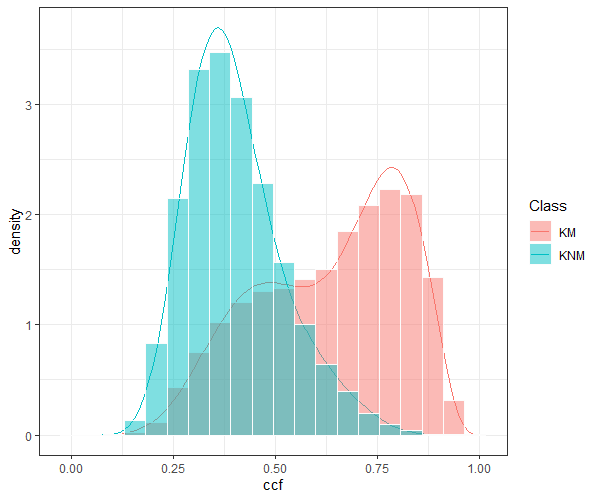

\newcommand{\hh}[1]{{\textcolor{orange}{#1}}}
\newcommand{\yg}[1]{{\textcolor{blue}{#1}}}

_Text based on elsarticle sample manuscript, see [http://www.elsevier.com/author-schemas/latex-instructions#elsarticle](http://www.elsevier.com/author-schemas/latex-instructions#elsarticle)_

Introduction
====================================

Firearm examination is an important topic in forensic science to help reveal the underlying pattern of firearm evidence. Currently, those examinations are executed in forensic labs by experienced examiners under the regulation of AFTE [@AFTE1992]. However, this process in nature is human based and largely subjective. The subjectivity in the conventional firearm evidence identification processes is called to be reduced or to be complemented by more objective procedures by the National Research Council [@Council2009]. The President’s Council of Advisers on Science and Technology (PCAST) also emphasized the importance to establish the scientific validity and reliability of subjective forensic feature-comparison methods by blind empirical test [@PCAST2016]. The PCAST also recognized the importance of developing of objective computer-based algorithms in its following addendum [@PCAST2016addendum]. In cartridge case comparisons, the congruent matching cells (CMC) was developed to conduct the comparisons automatically [@Song2015]. And the error rates are estimated in following papers by establishing distributional models [@Song2018; @Zhang2019]. In bullet comparisons, an automatic matching algorithm was proposed by Hare [@Hare2016]. The discussion about the degraded land comparison was also made in the following paper [@Hare2017]. The empirical error rates associated with this method based on three test sets are discussed by Vanderplas [@Vanderplas2020]. The most prominent single feature in the random forest proposed by Hare [@Hare2016] is the cross-correlation function [@vorburger2011] according to the empirical studies [@Vanderplas2020; @Hare2016]. Other automated comparison methods or improvement such as Robust LOESS in groove engraved area identification [@Rice2020], Chumbley score method [@Krishnan2019] are also proposed. 

However, due to the limitation of sample sizes and designs of study, a sound distributional assumption about the resulting similarity scores was not well established in the bullet comparison field for automated matching algorithms. The error rates are estimated empirically from dozens of bullets which were originally designed for examiner proficiency tests. And many of those tests are also criticized for the closed-set design and potential information provided to the examiners as pointed out by PCAST [@PCAST2016; @PCAST2016addendum]. It’s important to understand the underlying distributions of the similarity scores to estimate the theoretical error rates of any automatic algorithm. And that also helps later to choose proper thresholds for the methods instead of simply choosing 0.5 (in a 0-1 range of similarity scores) as a belief. 

Generally, in forensic science, we consider the problem of distinguishing two pieces of evidence coming from a same source or different sources. Specifically, in bullet comparisons, we want to know if two bullets are coming from a same gun or not. When shooting a bullet, the barrel will leave markings on the surface of bullets due to the imperfectness of manufacturing. We distinguish land engraved areas (LEA) and groove engraved error areas. And the former is compared by examiners by inspecting the striations under confocal microscopes in labs [@AFTE1992]. And the LEA is also used in the developed computer-based methods. A fired bullet has several LEAs according to the barrels’ design. So, we are not doing one step to identify bullets, instead we consider each LEA and then combine the land level conclusions to a bullet level one. Accordingly, we start our discussion about underlying distributions and error rates from the land level.

There are two types of distributions we would consider in the bullet comparison cases. One is called known-match (KM) distributions for those actually matched lands. The other is called known-non-match distributions (KNM) for those actually not matched lands. Those two distributions are only available in experimental settings where we know the ground truth. They are the starting point for any discussion about theoretical error rates. And particularly, we consider the cross-correlation function (CCF) for bullet signatures as a typical similarity score with range 0-1 used to distinguish between same source and different source comparisons. The cross-correlation function (CCF) is calculated after extracting the signatures of bullet lands by maximizing the cross correlation of two sequence of signatures by horizontally adjusting the signatures [@vorburger2011]. 

In section 2... In section 3...


<!-- The firearm examiners are focusing on the same source and different source problems of bullets and cartridge cases which serve as important forensic evidence in the court/to the jurors. \hh{XX this is quite vague - could you try to find a number in the literature on how much evidence in trials is related to firearms or ballistic evidence?} The subjectivity and lack of quantified error rates in the traditional forensic process is called to be reduced or complemented by more objective methods [@Council2009; @PCAST2016].  Some \hh{XX 'some' is too vague - instead cite literature - i.e. something like: in response xxx, yyy, zzz, ... have introduced automatic matching algorithms ...} automatic matching algorithms are developed which usually return a similarity score to quantify the similarity or the probability to be an actual match for a certain comparison. However, this raises questions about how to interpret the reported scores and how these scores are distributed. \hh{XXX more details before this thus - why is it \hh{XXX it? write out your reference} not clear to draw inference?} Thus, it \hh{XXX it? write out your reference} is not all clear how to conduct inference based on these similarity scores. @Song2018 proposed binomial and beta-binomial for the number of matched cells of the CMC method for cartridge case comparisons.  Therefore, @Song2018 provides a way to quantify the theoretical error rate of the algorithm. However, for the bullets LEA comparisons, quantitative measurements for the theoretical error rate have not been established. In this paper, we will evaluate the possible models/distributions for the LEA comparisons scores generated by the random forest proposed by @Hare2016. And then, we will also evaluate the error rates based on the estimated distribution for the automatic matching algorithm. -->

<!-- In section 2, we will discuss  distributional forms of random forest scores produced by the automatic LEA matching algorithm proposed by @Hare2016. In section 3, we will introduce the LAPD data set and the estimated distributions. In section 4, the theoretical error rates based on the distributions are discussed. In section 5, we evaluate the performance of the estimation, stability of the distribution within a changing sample size context. In section 6, we will conclude the discussion. -->

<!-- To combine the following introduction Part2 -->
<!-- ====================================== -->

<!-- The subjectivity in the conventional forensic evidence identification processes according to the AFTE is called to be reduced or be complemented by more objective procedures [@Council2009]. \hh{Don't use passive voice in the start} The three possible conclusions \hh{XXX which conclusions are you refering to? you need to introduce that before you can refer to them} for a comparison between a known pattern (from tests of the tools or firearms of the suspect) and an unknown pattern (extracted from the crime scene) according to AFTE [@AFTE1992] are identification, elimination and inconclusive. Besides, for some comparisons which are thought to be impossible to do any meaningful judgement, a forth decision will be made to exclude those cases. \hh{XXX Careful: exclusions are based on single pieces of evidence. Only if evidence is considered to carry information, a comparison is done.} The conventional standards established by AFTE were usually carried out by experienced examiners. However, this process in nature is human based and subjective. \hh{the previous sentence explains the foundation, put it earlier.} In recent years, this procedure was called to be changed. \hh{XXX repeat from first sentence.} Especially with the improvement of the technology in measurement tools and higher computational power. (some more general discussions  could be made, such as the power/usefulness of this kind of evidence, the current stage of those procedures, how to cooperate with human judgement) -->

<!-- The identification results of bullets sources are part of the important evidence to jurors. \hh{XXX are there numbers of how often firearms evidence is presented in court? } When the gun fires a bullet, the barrel and the rifling will leave an impression on the bullet surface. For different barrels and rifling, the marks left on the bullets are believed to be unique (@AFTE1992). On the highest level, we can easily distinguish some class characteristics such as numbers of land engraved areas, types of bullets etc. When the bullet from the crime scene is different from the test bullets which are test fired from a suspect gun in terms of the class characteristic, the decision can be made easily as elimination.(what about sub-class characteristic) However, we can never make identification solely based on class characteristics. The bullet forensic researchers compare the individual characteristics, which are usually due to the imperfectness of guns or wear of guns, thus leaves unique marks on the bullets. The bullet examiner in the US labs will put two bullets under the confocal microscope, and try to match the striae on each bullet visually. With technology improvement, researchers are able to get 3D scans of the bullets and develop more advanced comparison algorithms. Hare et al developed a random forest based automatic matching algorithm with some well used features on the Hamby data (@Hare2016). They developed a whole process to start with the 3D scan and go through a sequence of data manipulations to reach the final comparison. Vanderplas et al also applied this method to another three external data sets Hamby set 44, Phoenix PD, Houston FSC (@Vanderplas2020). According to their study, the random forest algorithm is the best while ccf is the most prominent feature. Hare et al extended this approach to include degraded cases and operator effect into consideration (@Hare2017). Rice improved the groove engraved area identification algorithm by using the Robust LOESS (@Rice2020). Krishnan proposed Chumbley score method to match striae on the LEAs (@Krishnan2019). -->

<!-- The automatic identification processes always produce a similarity score (usually in range 0 to 1) or a probability to be an actual match as results(references). This raises questions about how to interpret the reported probabilities and how these probabilities are distributed. In practice, the default cutoff of similarity score above which to be classified as matches is usually 0.5 with intuitive interpretation. However, without knowing how the similarity score is distributed and the classification errors associated with it, a sensible decision is hard to make. Song et al used a beta-binomial distribution to model the CMC cartridge cases classification results (@Song2018). Garton et al illustrated the use of score based likelihood in evaluating the strength of forensic evidence (@Garton2020). -->

<!-- In this paper, we focused on the bullet LEAs, and the results returned from the automatic matching algorithm of Hare et al (@Hare2016). We make use of the LAPD bullets data base (reference or explanation, in a separate section), which provided a large number of samples making the modeling process and evaluating the model possible to us. (The priciple outcome) -->

<!-- \hh{This needs a more general introduction to  firearms examinations to motivate the problem} -->

<!-- \hh{things the intro needs to cover: } -->

<!-- - \hh{define the same-source problem} -->
<!-- - \hh{cross-correlation function} -->
<!-- Based on the cross-correlation function we produced through..., -->
<!-- - \hh{discuss approaches in the literature: (NIST paper) on modelling Beta distribution} -->
<!-- - \hh{how does this paper expand on the knowledge?} -->


The distributional forms of similarity scores
============================

The quantitative methods used to objectively measure the similarity between LEAs report various quantities, such as counts, correlations, distances, probabilities and more general similarity scores [@ma2004; @nichols1997; @nichols2003; @Hare2016]. To understand how those quantities reflect the strength of evidence and to study the underlying error rates in making decisions based on those quantities, distributional forms are usually set up [@Zhang2019; @Song2018]. Particularly, we are focusing on the similarity scores which range from 0 to 1 and the probabilities reported as the likelihood of an actual match. The similarity scores reported in the forensic researches are classified into two categories as known matches (KM) and known non-matches (KNM), and the corresponding distributions are named as KM distributions and KNM distributions. When we make any decisions based on any quantitative measurement, we are actually making a distinguish between those two potential distributions. The strength of any identification process is also measured by the disparities of those distributions. However, in practice, we can hardly discriminate those two distributions entirely, thus, we are never 100% sure which distribution the observed score comes from. This is where the identification error raises. 

The cross-correlation function (CCF) is the most prominent single feature in the automatic random forest algorithm [@Hare2016] which has theoretical range from -1 to 1. But in real applications, this similarity score always has values in 0 to 1, e.g. in our case, none of 121992 comparisons has negative values. So, it is selected as a representative of similarity scores with range from 0 to 1 in this paper for further analysis. The similarity scores in 0 to 1 can be explained as probabilities that quantify the likelihood that a pair of LEAs are actually a match. Or we can think of them as general similarity measurement. As the name indicated, the higher the similarity score is, the stronger evidence is to support the same source assumption. For different combination of ammunition and firearms, the scores are distributed differently. It is expected that systematic differences exist there for different cases [@Vanderplas2020]. So, it is necessary to study the scores under controlled conditions.

We can see from the Figure ... (a figure of nonparametric fit of the CCF?), which is a typical one we usually have for the similarity scores, that the distributions of KM and KNM are apart for the majorities. In the bullet LEA comparison problems, we usually have a well separated bullet scores but for the land scores, there are usually some overlaps [@Vanderplas2020]. We propose beta distributions for those scores. Because the beta distribution is a well-used distribution in statistics to describe a quantity from 0 to 1 which is usually a probability or proportion quantifying our knowledge for another distribution in Bayesian analysis. And it is very flexible to capture unimodal asymmetric shapes in 0 to 1. However, it may not be adequate to explain a heavy tail or even a second mode. Thus, we further consider the beta mixture distribution which is a more complex distribution than the beta distribution as a special case. In the beta mixture distribution, we introduce a hierarchical structure with a prior probability to combine a few beta distributions as one. The two-component beta mixture distributions are defined below.

The reported similarity scores are denoted as $Y_{ij}$ for $j^{th}$ LEA comparison within class $i$, where $i = 1$ is KM and $i = 2$ is KNM. $Y_{ij}$'s are considered independent and identically distributed within each class, i.e.

\begin{align*}
Y_{1j} \stackrel{iid}{\sim}  Betamix(p_1, \mu_{11}, \phi_{11}, \mu_{12}, \phi_{12})\\
Y_{2j} \stackrel{iid}{\sim}  Betamix(p_2, \mu_{21}, \phi_{21}, \mu_{22}, \phi_{22})
\end{align*}

where $\mu_{ik}$ and $\phi_{ik}$ are distribution parameters for $i^{th}$ class and $k^{th}$ component, $k = 1$ or $2$. And $p_i$ is the prior probability for the first component in $i^{th}$ class, thus, $1-p_i$ is the prior probability for the second component in $i^{th}$ class. Note that we are using the mean and precision parameterization of beta distributions which simplifies the math in calculation and is more intuitive ($\mu$ is the mean, and the variance is roughly proportional to the reciprocal of $\phi$). It's equivalent to the usual $\alpha$ and $\beta$ parameterization through the following transformation:

\begin{align*}
\mu = \frac{\alpha}{\alpha+\beta} \\
\phi = \alpha + \beta
\end{align*}

LAPD data set and the estimated distributions
==========================================

For the following sections of the paper, we will base our analysis on the LAPD data sets. This is a large data set of … It is the first time such a large data set available to the researchers, which makes it possible for a statistical analysis for the distribution of similarity scores. (More on the data. Is there any formal documentation for LAPD? And number of land comparisons for different cases should be discussed here)

We consider cross correlation functions (CCF) for land comparisons, which is produced by calculating the maximized CCF between two signatures extracted from a pair of bullet LEAs.

The estimation was done using Nelder-Mead algorithm in R [reference]. This is a general purpose numeric method which works reasonably well for multidimensional optimization problems. In our case, the objective function is the log likelihood function of the beta mixture distribution. Therefore, we finally found the maximum likelihood estimates (MLE). Instead of a simpler beta model, we start with the more complex two-component beta mixture model, see how well it fits the data and test if some components are necessary. We estimated beta mixture distributions for both KM and KNM as in Table \ref{Full Data KM Distribution Estimation} and Table \ref{Full Data KNM Distribution Estimation} respectively. For the beta distributions, the KM distribution has a mean at 0.635 and the KNM distribution has a mean at 0.404. We can also see that for the two component beta mixture distributions for both KM and KNM, there are components with mean around 0.5 and the other components more separated from each other. This indicates the model successfully accounted for different situations of comparisons involving tank rash and random identification etc. This is an ideal property we would like to see and make use in explaining the similarity scores. Another point about the estimates that worth mentioning is that the $\phi$ of the KM beta distribution is much smaller than any of the two components of the two-component KM beta mixture distribution. This indicates that the two component distribution could be better because of smaller variances for components.


\begin{table}[h]
\centering
\begin{tabular}{ |p{1.3cm}||p{2.1cm} p{0.8cm} p{0.8cm} p{0.8cm}p {1.2cm} p{1.2cm}|}
 \hline
 \multicolumn{7}{|c|}{Full Data KM Distribution Estimation} \\
 \hline
 Model & Component& $\mu$ & $\phi$ & logLik & p-value& BIC\\

       & Prior& & & & &\\

       & Probability& & & & & \\
 \hline
 \multirow{3}{*}{3-comp} &  0.247 &0.406&   24.097 & \multirow{3}{*}{6278} & &\multirow{3}{*}{-12479}\\
 & 0.521  & 0.664 & 13.342& & &\\
 & 0.232 &0.819&   33.823 & & &\\
 \hline
 \multirow{2}{*}{2-comp} & 0.419  & 0.466 & 15.812 & \multirow{2}{*}{6243} & \multirow{2}{*}{0}&\multirow{2}{*}{-12438}\\
 & 0.581 &0.759&   18.476 & & &\\
 \hline
 Beta &  & 0.635 & 6.529 & 5712 & 0&-11404\\
 \hline
\end{tabular}
\caption{Parameter estimations for the Beta distribution (1-component beta mixture distribution), 2-component and 3-component distributions for the KM CCF. "2-comp" refers to the 2-component beta mixture distribution, and the same for "3-comp". Column "logLik" is the maximized log likelihood for each distribution. Column "p-value" is the p-value for asymptotic likelihood ratio tests between the current model and one-step more complex model, where 0 indicates that we would reject the hypothesis that the current one is sufficient to decribe the data}
\label{Full Data KM Distribution Estimation}

\end{table}


\begin{table}[h]
\centering
\begin{tabular}{ |p{1.3cm}||p{2.1cm} p{0.8cm} p{0.8cm} p{0.8cm}p {1.2cm} p{1.2cm}|}
 \hline
 \multicolumn{7}{|c|}{Full Data KNM Distribution Estimation} \\
 \hline
 Model & Component& $\mu$ & $\phi$ & logLik & p-value& BIC\\

       & Prior& & & & &\\

       & Probability& & & & & \\
 \hline
 \multirow{3}{*}{3-comp} &  0.650 &0.345&   35.017 & \multirow{3}{*}{78961} & &\multirow{3}{*}{-157830}\\
 & 0.314  & 0.490 & 24.979& & &\\
 & 0.032 &0.667&   18.454 & & &\\
 \hline
 \multirow{2}{*}{2-comp} & 0.674  & 0.358 & 39.908 & \multirow{2}{*}{78808} & \multirow{2}{*}{0}&\multirow{2}{*}{-157558}\\
 & 0.336 &0.494&   13.324& & &\\
 \hline
 Beta &  & 0.404 & 15.801 & 75349 & 0&-150675\\
 \hline
\end{tabular}
\caption{Parameter estimations for the Beta distribution (1-component beta mixture distribution), 2-component and 3-component distributions for the KNM CCF. "2-comp" refers to the 2-component beta mixture distribution, and the same for "3-comp". Column "logLik" is the maximized log likelihood for each distribution. Column "p-value" is the p-value for asymptotic likelihood ratio tests between the current model and one-step more complex model, where 0 indicates that we would reject the hypothesis that the current one is sufficient to decribe the data}
\label{Full Data KNM Distribution Estimation}

\end{table}

The estimated beta distributions are shown in the Figure \ref{singlebeta} and the estimated two-component beta mixture distributions are also shown in the Figure \ref{two-component-betamix}. As expected, the estimated distributions show the properties we desire for the similarity scores. The majorities of the estimated distributions are apart from each other, while the minority part between the two distributions has some overlap. It's worth to note that both curves have heavy tails to the farther boundaries and the KM curve has the heavier tail compared to KNM. We can see the two-component distributions fit the data very well, while the single beta distributions are not as good as the two-component distributions for both KM and KNM. The single beta distribution for KM clearly failed to capture the potential second mode of the histogram indicating it is not sufficient. The single beta distribution for KNM is not too bad but still failed to capture the distributional information for some parts. This indicates that even though beta distributions are flexible for variables in 0 to 1, they are still restricted too much to be able to describe the cases here. The two-component beta mixture distributions look more promising.


\begin{figure}[h]
    \centering
    \includegraphics[width=0.5\textwidth]{../code/organized code/generated figures/singlebeta.png}
    \caption{Estimated beta distributions for full data}
    \label{singlebeta}
\end{figure}

\begin{figure}[h]
    \centering
    \includegraphics[width=0.5\textwidth]{../code/organized code/generated figures/two-component-betamix.png}
    \caption{Estimated two-component beta mixture distributions for full data}
    \label{two-component-betamix}
\end{figure}

Three candidate distributions for each of KM and KNM are considered. For the increasing of complexity, we have single beta, two-component beta mixture and three-component beta mixture distributions. And they are also nested in that order. Naturally, we first look at the maximized log-likelihood of each model, and we can do asymptotic log-likelihood ratio chi-square tests for single beta against two-component beta mixture distributions, and two-component against three-component beta mixture distributions. The p-values of those test are shown in the Table \ref{Full Data KM Distribution Estimation} and Table \ref{Full Data KNM Distribution Estimation} as the column "p-value". Surprisingly (or not), we found all those p-values are 0 which strongly suggests a more complex model when there is one. However, considering the size of the data we are using to fit these models, we can expect the statistical significance will be easily achieved since any small difference of the sufficiency will be detected. So we have to take the sample size effect into consideration. As Bayesian information criterion (BIC) is a well used criterion which takes the model complexity, sufficiency and the sample size (by a log function) into account. As shown in the column "BIC" in the tables, the BICs for the single beta distributions are larger than that of the two-component beta mixtures by relatively large proportions. And the BICs for the two-component beta mixture distributions are a little larger than that of the three-component beta mixture distributions for both KM and KNM. Obviously, we would prefer the two-component beta mixture distributions, but we would cast a doubt when it comes to the three-component beta mixture distributions. We still prefer the two-component one instead of the three-component one. The reasons are: 1) these differences of BICs between two and three component distributions are really small in proportion (by 0.3% for KM and 0.017% for KNM), 2) the estimation cost is not accounted, which will be higher for a more complex model, 3) the BICs still don't take the sample size effect fully into account since the log function for sample size goes to flat when the sample sizes are large. By simple calculation, we can see that the log-likelihood increased by a multiplicative factor more than 10 when the sample sizes increased from KM case to KNM case, however, at the same time, the log of sample size only roughly increased from 9 to 11. So we choose the two-component beta mixture distributions for both KM and KNM. And also as we have seen, these distributions have potential good forensic interpretations. 

It’s also helpful to see how the individual components look like in the beta mixture distributions as in Figure \ref{components}. The KNM and KM distributions seem to share a common component while keeping the other components far apart from each other. The separated components represent the ideal cases where the bullet land engraved areas preserved the information of source well and result in clearly distinct separation. The shared components represent the cases where the KM results in lower scores because of some degree of tank rash, pitting, breakoff or other damages on the bullets and the KNM results in higher score because of the random identification effect. According to the estimated prior probabilities, both distributions put less weight on the common component while putting larger weight on the the components characterizing the differences of KM and KNM respectively, which agrees on our expectation that majorities of the distributions are separated while the minorities overlapped. These properties together well explained the observed empirical distribution of similarity scores in our cases. Particularly, the heavier tail of the KM comparisons is explicitly included in the form of the model by one of the components.

\begin{figure}[h]
    \centering
    \includegraphics[width=0.5\textwidth]{../code/organized code/generated figures/components.png}
    \caption{Estimated components}
    \label{components}
\end{figure}

Evaluate the error rates
================================

(report theoretical error rates)

- given the cutoff point where the two distributions have equal density (also a likelihood ratio with value 1, which does an optimal classification under 0-1 loss? or at the point where the probabilities equal to each other instead of the densities)

- Consider four types of error rates (will need a table to illustrate this): false positive error rate, false negative error rate, false identification error rate, false exclusion error rate.

- Given the iid assumption, could we develop a further model for the bullet level distribution and estimate the corresponding error rates?


Estimations with changing sample size
================================

(quantify the variation, reproduce some results in the previous sections with changing sample size)

Conclusion
==================================


```{r, include=FALSE}
library(ggplot2)
fau330_combined_A_observed <- readRDS("../data/fau330_combined_A_observed.rds")
fau330_combined_noA_simulated <- readRDS("../data/fau330_combined_noA_simulated.rds")
fau330_combined_A_rf_observed <- readRDS("../data/fau330_combined_A_rf_observed.rds")
fau330_combined_noA_rf_simulated <- readRDS("../data/fau330_combined_noA_rf_simulated.rds")
```

```{r, fig.cap="Densities from training, rugs from test (ccf)", out.width="70%", fig.keep="hold", fig.align='center', include=FALSE}
ggplot() + 
  geom_line(data = fau330_combined_noA_simulated, 
            mapping = aes(x = ccf, y = y, color = id)) + 
  geom_rug(data = fau330_combined_A_observed, 
           mapping = aes(x = ccf, color = id), alpha = 0.3) +
  ggtitle("FAU330: rugs with A, densities without A (ccf)")
```

```{r, fig.cap="Densities from training, rugs from test (rfscore)", out.width="70%", fig.keep="hold", fig.align='center', include=FALSE}
ggplot() + 
  geom_line(data = fau330_combined_noA_rf_simulated, 
            mapping = aes(x = rfscore, y = y, color = id)) + 
  geom_rug(data = fau330_combined_A_rf_observed, 
           mapping = aes(x = rfscore, color = id), alpha = 0.3) +
  ggtitle("FAU330: rugs with A, densities without A (RF)")
```


```{r, fig.cap="rf_full_2components_combined", out.width="70%", fig.keep="hold", fig.align='center', include=FALSE}

```


References {#references .unnumbered}
==========
