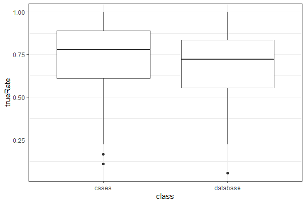
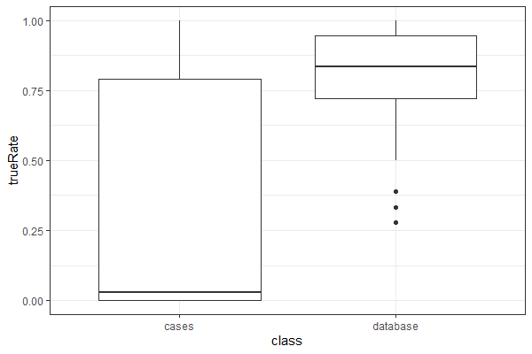
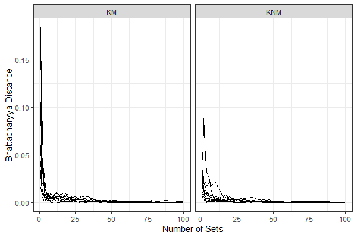
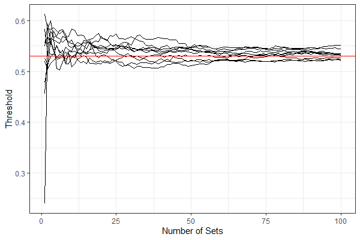
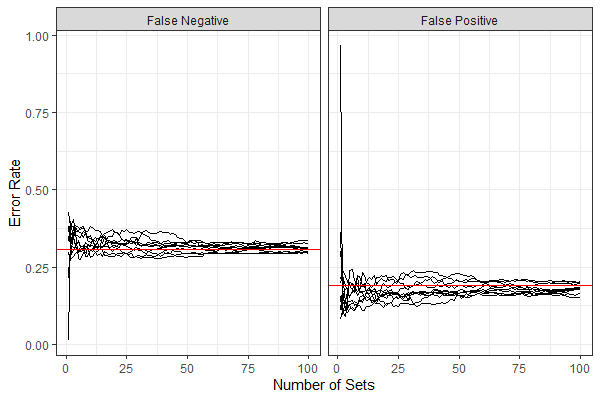
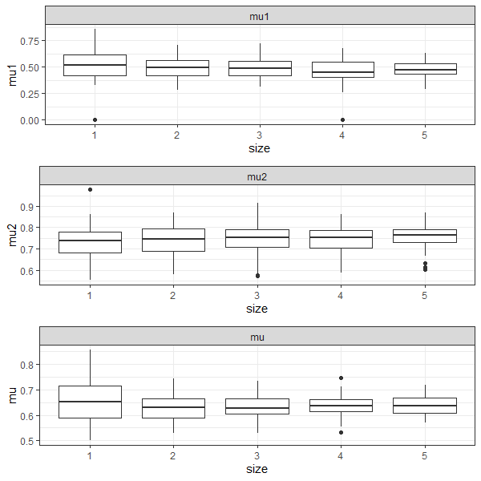
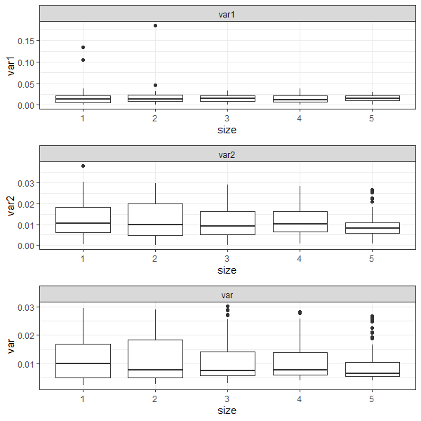
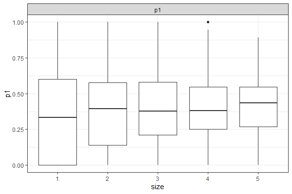
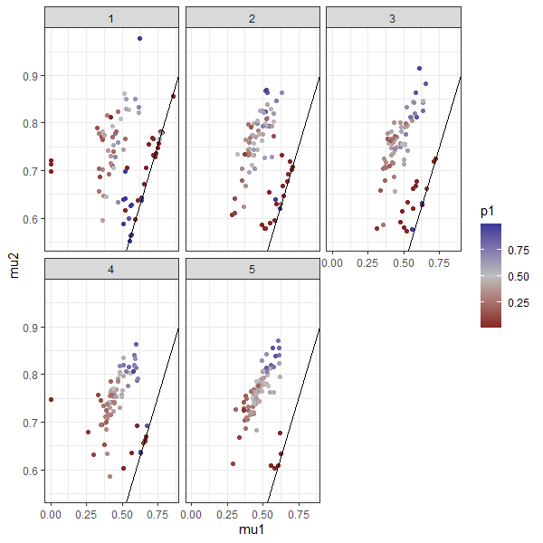

\newcommand{\hh}[1]{{\textcolor{orange}{#1}}}
\newcommand{\yg}[1]{{\textcolor{blue}{#1}}}

_Text based on elsarticle sample manuscript, see [http://www.elsevier.com/author-schemas/latex-instructions#elsarticle](http://www.elsevier.com/author-schemas/latex-instructions#elsarticle)_

```{r setup, warning=FALSE,message=FALSE, echo=FALSE}
library(dplyr)
library(ggplot2)
theme_set(theme_bw())
knitr::opts_chunk$set(echo = FALSE)
```

```{r prepare-data}
# two-component betamix
myfit1_simulation <- data.frame(ccf = (1:99)/100, 
                                y1 = dbeta((1:99)/100, shape1 = 7.366, shape2 = 8.450),
                                y2 = dbeta((1:99)/100, shape1 = 14.026, shape2 = 4.451))

myfit1_simulation <- myfit1_simulation %>% mutate(y = 0.41938*y1 + (1-0.41938)*y2)

myfit2_simulation <- data.frame(ccf = (1:99)/100, 
                                y1 = dbeta((1:99)/100, shape1 = 11.0696, shape2 = 19.8388),
                                y2 = dbeta((1:99)/100, shape1 = 6.5794, shape2 = 6.745))

myfit2_simulation <- myfit2_simulation %>% mutate(y = 0.6737*y1 + (1-0.6737)*y2)

myfit1n2_simulation <- bind_rows(myfit1_simulation, myfit2_simulation, .id = "Class")

# single beta
# one component
myfit3_simulation <- data.frame(ccf = (1:99)/100, 
                                y = dbeta((1:99)/100, shape1 = 4.1447, shape2 = 2.384))

myfit4_simulation <- data.frame(ccf = (1:99)/100, 
                                y = dbeta((1:99)/100, shape1 = 6.38, shape2 = 9.42))

myfit3n4_simulation <- bind_rows(myfit3_simulation, myfit4_simulation, .id = "Class")
```

```{r prepare-data2}
ccf_km_full <- readRDS("../data/organized data/ccf-related/ccf_km_full.rds")
ccf_knm_full <- readRDS("../data/organized data/ccf-related/ccf_knm_full.rds")

ccf_km_full_data <- bind_rows(ccf_km_full)
ccf_knm_full_data <- bind_rows(ccf_knm_full)

# Currently, we removed these lands (some of them are known to be mis-scanned)
# only 29 knms out of 106080 knms are greater than 0.9, remove those
ccf_knm_full_data <- ccf_knm_full_data %>% filter(ccf < 0.90)
```

Introduction
====================================

Firearm examination is an important topic in forensic science to \yg{help identify if two pieces of firearm evidence are from a same source or not by examining the characteristics on the evidence left by the firearms.} \hh{XXX go into a bit more detail on what you mean by the underlying pattern} Currently, those examinations are executed in forensic labs by Firearms and Toolmark Examiners (FTEs) under the regulation of AFTE [@AFTE1992]. However, this process is in its nature based on human decisions and therefore subjective. \yg{The National Research Countcil called out this subjectivity in conventional firearm identification processes to be reduced or to be complemented by more objective procedures} [@Council2009]. The President’s Council of Advisers on Science and Technology (PCAST) also emphasized the importance to establish the scientific validity and reliability of subjective forensic feature-comparison methods by blind empirical test [@PCAST2016]. The PCAST report also recognized the importance of developing of objective computer-based algorithms in its following addendum [@PCAST2016addendum].

In \hh{response to this criticism, subsequent research on } cartridge case comparisons introduced the method of  congruent matching cells (CMC) [@Song2015], which \hh{allows a quantitative assessment of the similarity of two breech face impressions.} Theoretical error rates of CMC were analyzed by @Song2018 and @Zhang2019 on \yg{the data set of} @Fadul2011 based on \yg{the beta-binomial model and the correlated binomial model}. \hh{XXX could you expand on those distributional models?}.


\hh{XXX xiao-hue Tai's paper should be mentioned.}

\hh{XXX mention the data that all of these methods are based on.}

In bullet comparisons, an automatic matching algorithm was proposed by Hare [@Hare2016]. The discussion about the degraded land comparison was also made in the following paper [@Hare2017]. The empirical error rates associated with this method based on three test sets are discussed by Vanderplas [@Vanderplas2020]. The most prominent single feature in the random forest proposed by Hare [@Hare2016] is the cross-correlation function [@vorburger2011] according to the empirical studies [@Vanderplas2020; @Hare2016]. Other automated comparison methods or improvement such as Robust LOESS in groove engraved area identification [@Rice2020], Chumbley score method [@Krishnan2019] are also proposed. 

\hh{XXX What does this however refer to?}
However, due to the limitation of sample sizes and designs of study, a sound distributional assumption about the resulting similarity scores was not well established in the bullet comparison field for automated matching algorithms. The error rates are estimated empirically from dozens of bullets which were originally designed for examiner proficiency tests. And many of those tests are also criticized for the closed-set design and potential information provided to the examiners as pointed out by PCAST [@PCAST2016; @PCAST2016addendum]. It’s important to understand the underlying distributions of the similarity scores to estimate the theoretical error rates of any automatic algorithm. And that also helps later to choose proper thresholds for the methods instead of simply choosing 0.5 (in a 0-1 range of similarity scores) as a belief. 

\hh{A sketch of a bullet and a barrel would be good here - showing rifling (grooves and lands) and striation marks. Introduce rifling, Describe LEA and GEA, and structure of LEAs}
A fired bullet has several LEAs according to the barrels’ design. 

Generally, in forensic science, we consider the problem of distinguishing two pieces of evidence coming from a same source or different sources. Specifically, in bullet comparisons, we want to know if two bullets were fired from the same gun. When shooting a bullet, micro-imperfections inside the barrel leave markings on the surface of a bullet in form of striations. Striations on land engraved areas (LEAs) are used by firearms and toolmarks examiners in comparisons to determine same source of two pieces of evidence [@AFTE1992].

\hh{include paragraph on PCAST and NRC reports: lack of objectivity and error rates}

\hh{Automatic matching algorithms were introduced to address the criticism by PCAST and NRC.} 

\hh{The next paragraph needs to be worked out in more detail. You are getting to densities too fast. First define scores as outcomes of an algorithm, then describe same source density and different source density and (score based) likelihood ratios.} 
And the LEA is also used in the developed computer-based methods. So, we are not doing one step to identify bullets, instead we consider each LEA and then combine the land level conclusions to a bullet level one. Accordingly, we start our discussion about underlying distributions and error rates from the land level.


There are two types of distributions we would consider in the bullet comparison cases. One is called known-match (KM) distributions for those actually matched lands. The other is called known-non-match distributions (KNM) for those actually not matched lands. Those two distributions are only available in experimental settings where we know the ground truth. They are the starting point for any discussion about theoretical error rates. And particularly, we consider the cross-correlation function (CCF) for bullet signatures as a typical similarity score with range 0-1 used to distinguish between same source and different source comparisons. The cross-correlation function (CCF) is calculated after extracting the signatures of bullet lands by maximizing the cross correlation of two sequence of signatures by horizontally adjusting the signatures [@vorburger2011]. 

In section 2... In section 3...


The distributional forms of similarity scores
============================

The quantitative methods used to objectively measure the similarity between LEAs report various quantities, such as counts, correlations, distances, probabilities and more general similarity scores [@ma2004; @nichols1997; @nichols2003; @Hare2016]. To understand how those quantities reflect the strength of evidence and to study the underlying error rates in making decisions based on those quantities, distributional forms are usually set up [@Zhang2019; @Song2018]. Particularly, we are focusing on the similarity scores which range from 0 to 1 and the probabilities reported as the likelihood of an actual match. The similarity scores reported in the forensic researches are classified into two categories as known matches (KM) and known non-matches (KNM), and the corresponding distributions are named as KM distributions and KNM distributions. When we make any decisions based on any quantitative measurement, we are actually making a distinguish between those two potential distributions. The strength of any identification process is also measured by the disparities of those distributions. However, in practice, we can hardly discriminate those two distributions entirely, thus, we are never 100% sure which distribution the observed score comes from. This is where the identification error raises. 

The cross-correlation function (CCF) is the most prominent single feature in the automatic random forest algorithm [@Hare2016] which has theoretical range from -1 to 1. But in real applications, this similarity score always has values in 0 to 1, e.g. in our case, none of 121992 comparisons has negative values. So, it is selected as a representative of similarity scores with range from 0 to 1 in this paper for further analysis. The similarity scores in 0 to 1 can be explained as probabilities that quantify the likelihood that a pair of LEAs are actually a match. Or we can think of them as general similarity measurement. As the name indicated, the higher the similarity score is, the stronger evidence is to support the same source assumption. For different combination of ammunition and firearms, the scores are distributed differently. It is expected that systematic differences exist there for different cases [@Vanderplas2020]. So, it is necessary to study the scores under controlled conditions.

We can see from the Figure ... (a figure of nonparametric fit of the CCF?), which is a typical one we usually have for the similarity scores, that the distributions of KM and KNM are apart for the majorities. In the bullet LEA comparison problems, we usually have a well separated bullet scores but for the land scores, there are usually some overlaps [@Vanderplas2020]. We propose beta distributions for those scores. Because the beta distribution is a well-used distribution in statistics to describe a quantity from 0 to 1 which is usually a probability or proportion quantifying our knowledge for another distribution in Bayesian analysis. And it is very flexible to capture unimodal asymmetric shapes in 0 to 1. However, it may not be adequate to explain a heavy tail or even a second mode. Thus, we further consider the beta mixture distribution which is a more complex distribution than the beta distribution as a special case. In the beta mixture distribution, we introduce a hierarchical structure with a prior probability to combine a few beta distributions as one. The two-component beta mixture distributions are defined below.

The reported similarity scores are denoted as $Y_{ij}$ for $j^{th}$ LEA comparison within class $i$, where $i = 1$ is KM and $i = 2$ is KNM. $Y_{ij}$'s are considered independent and identically distributed within each class following a k-component beta mixture distribution, i.e.

\begin{align*}
Y_{1j} \stackrel{iid}{\sim}  Betamix(p_1, \mu_{1}, \phi_{1})\\
Y_{2j} \stackrel{iid}{\sim}  Betamix(p_2, \mu_{2}, \phi_{2})
\end{align*}

where $p_i$, $\mu_i$ and $\phi_i$ are parameter vectors defined as:

\begin{align*}
&p_i = (p_{i1}, p_{i2}, p_{i3}, ... , p_{ik}),                  &p_{il} \in [0, 1], l = 1, 2, 3, ..., k~~ \mbox{and} ~~\sum_{l = 1}^k p_{il} = 1 \\
&\mu_i = (\mu_{i1}, \mu_{i2}, \mu_{i3}, ... , \mu_{ik}),        &\mu_{il} \in (0, 1), l = 1, 2, 3, ..., k \\
&\phi_i = (\phi_{i1}, \phi_{i2}, \phi_{i3}, ... , \phi_{ik},    &\phi_{il} \in (0, +\infty), l = 1, 2, 3, ..., k
\end{align*}

then, the $Betamix(p_i, \mu_i, \phi_i)$ distribution can be explicitly written as:

\begin{align*}
f(x;p_i, \mu_i, \phi_i) =& p_{i1}f_1(x;\mu_{i1}, \phi_{i1}) + p_{i2}f_2(x;\mu_{i2}, \phi_{i2}) +...+ p_{ik}f_k(x;\mu_{ik}, \phi_{ik})
\end{align*}

where $f_l(\cdot;\mu_{il}, \phi_{il})$, $l = 1, 2, 3, ..., k$ are beta distributions with probability densities as:

\begin{align*}
f_l(x;\mu_{il}, \phi_{il}) =  \frac{\Gamma(\phi_{il})}{\Gamma(\mu_{il}\phi_{il})\Gamma((1-\mu_{il})\phi_{il})}x^{\mu_{il}\phi_{il}-1}(1-x)^{(1-\mu_{il})\phi_{il}-1}
\end{align*}


In this definition, $\mu_{il}$ and $\phi_{il}$ are distribution parameters for $i^{th}$ class and $l^{th}$ component. And $p_i$ is the prior probability for components in $i^{th}$ class which is considered as a fixed real value vector. Note that we are using the mean and precision parameterization of beta distributions which simplifies the math in calculation and is more intuitive ($\mu_{il}$ is the mean, and the variance is roughly proportional to the reciprocal of $\phi_{il}$). It's equivalent to the usual $\alpha_{il}$ and $\beta_{il}$ parameterization through the following transformation:

\begin{align*}
\mu_{il} = \frac{\alpha_{il}}{\alpha_{il}+\beta_{il}} \\
\phi_{il} = \alpha_{il} + \beta_{il}
\end{align*}


LAPD data set and the estimated distributions
==========================================

For the following sections of the paper, we will base our analysis on the LAPD data sets. This is a large data set of … It is the first time such a large data set available to the researchers, which makes it possible for a statistical analysis for the distribution of similarity scores. (More on the data. Is there any formal documentation for LAPD? And number of land comparisons for different cases should be discussed here)

We consider cross correlation functions (CCF) for land comparisons, which is produced by calculating the maximized CCF between two signatures extracted from a pair of bullet LEAs.

The estimation was done using Nelder-Mead algorithm in R [reference]. This is a general purpose numeric method which works reasonably well for multidimensional optimization problems. In our case, the objective function is the log likelihood function of the beta mixture distribution. Therefore, we finally found the maximum likelihood estimates (MLE). Instead of a simpler beta model, we start with the more complex two-component beta mixture model, see how well it fits the data and test if some components are necessary. We estimated beta mixture distributions for both KM and KNM as in Table \ref{Full Data KM Distribution Estimation} and Table \ref{Full Data KNM Distribution Estimation} respectively. For the beta distributions, the KM distribution has a mean at 0.635 and the KNM distribution has a mean at 0.404. We can also see that for the two component beta mixture distributions for both KM and KNM, there are components with mean around 0.5 and the other components more separated from each other. This indicates the model successfully accounted for different situations of comparisons involving tank rash and random identification etc. This is an ideal property we would like to see and make use in explaining the similarity scores. Another point about the estimates that worth mentioning is that the $\phi$ of the KM beta distribution is much smaller than any of the two components of the two-component KM beta mixture distribution. This indicates that the two component distribution could be better because of smaller variances for components.


\begin{table}[h]
\centering
\begin{tabular}{ |p{1.3cm}||p{2.1cm} p{0.8cm} p{0.8cm} p{0.8cm}p {1.2cm} p{1.2cm}|}
 \hline
 \multicolumn{7}{|c|}{Full Data KM Distribution Estimation} \\
 \hline
 Model & Component& $\mu$ & $\phi$ & logLik & p-value& BIC\\

       & Prior& & & & &\\

       & Probability& & & & & \\
 \hline
 \multirow{3}{*}{3-comp} &  0.247 &0.406&   24.097 & \multirow{3}{*}{6278} & &\multirow{3}{*}{-12479}\\
 & 0.521  & 0.664 & 13.342& & &\\
 & 0.232 &0.819&   33.823 & & &\\
 \hline
 \multirow{2}{*}{2-comp} & 0.419  & 0.466 & 15.812 & \multirow{2}{*}{6243} & \multirow{2}{*}{0}&\multirow{2}{*}{-12438}\\
 & 0.581 &0.759&   18.476 & & &\\
 \hline
 Beta &  & 0.635 & 6.529 & 5712 & 0&-11404\\
 \hline
\end{tabular}
\caption{Parameter estimations for the Beta distribution (1-component beta mixture distribution), 2-component and 3-component distributions for the KM CCF. "2-comp" refers to the 2-component beta mixture distribution, and the same for "3-comp". Column "logLik" is the maximized log likelihood for each distribution. Column "p-value" is the p-value for asymptotic likelihood ratio tests between the current model and one-step more complex model, where 0 indicates that we would reject the hypothesis that the current one is sufficient to decribe the data}
\label{Full Data KM Distribution Estimation}

\end{table}


\begin{table}[h]
\centering
\begin{tabular}{ |p{1.3cm}||p{2.1cm} p{0.8cm} p{0.8cm} p{0.8cm}p {1.2cm} p{1.2cm}|}
 \hline
 \multicolumn{7}{|c|}{Full Data KNM Distribution Estimation} \\
 \hline
 Model & Component& $\mu$ & $\phi$ & logLik & p-value& BIC\\

       & Prior& & & & &\\

       & Probability& & & & & \\
 \hline
 \multirow{3}{*}{3-comp} &  0.650 &0.345&   35.017 & \multirow{3}{*}{78961} & &\multirow{3}{*}{-157830}\\
 & 0.314  & 0.490 & 24.979& & &\\
 & 0.032 &0.667&   18.454 & & &\\
 \hline
 \multirow{2}{*}{2-comp} & 0.674  & 0.358 & 39.908 & \multirow{2}{*}{78808} & \multirow{2}{*}{0}&\multirow{2}{*}{-157558}\\
 & 0.336 &0.494&   13.324& & &\\
 \hline
 Beta &  & 0.404 & 15.801 & 75349 & 0&-150675\\
 \hline
\end{tabular}
\caption{Parameter estimations for the Beta distribution (1-component beta mixture distribution), 2-component and 3-component distributions for the KNM CCF. "2-comp" refers to the 2-component beta mixture distribution, and the same for "3-comp". Column "logLik" is the maximized log likelihood for each distribution. Column "p-value" is the p-value for asymptotic likelihood ratio tests between the current model and one-step more complex model, where 0 indicates that we would reject the hypothesis that the current one is sufficient to decribe the data}
\label{Full Data KNM Distribution Estimation}

\end{table}

The estimated beta distributions are shown in \autoref{fig:singlebeta} and the estimated two-component beta mixture distributions are also shown in \autoref{fig:two-component-betamix}. As expected, the estimated distributions show the properties we desire for the similarity scores. The majorities of the estimated distributions are apart from each other, while the minority part between the two distributions has some overlap. It's worth to note that both curves have heavy tails to the farther boundaries and the KM curve has the heavier tail compared to KNM. We can see the two-component distributions fit the data very well, while the single beta distributions are not as good as the two-component distributions for both KM and KNM. The single beta distribution for KM clearly failed to capture the potential second mode of the histogram indicating it is not sufficient. The single beta distribution for KNM is not too bad but still failed to capture the distributional information for some parts. This indicates that even though beta distributions are flexible for variables in 0 to 1, they are still restricted too much to be able to describe the cases here. The two-component beta mixture distributions look more promising.


```{r singlebeta, out.width="70%", fig.align="center", fig.cap="Estimated beta distributions for full data", fig.keep="hold", fig.pos="h"}
myfit3n4_simulation %>%
  ggplot(aes(color = Class, fill = Class)) + 
  geom_line(aes(x = ccf, y = y)) + 
  geom_histogram(aes(x = ccf, y = ..density..), bins = 20, color = "gray99",
                 position = "identity", alpha = 0.5, 
                 data = bind_rows(ccf_km_full_data, ccf_knm_full_data, .id = "Class")) +
  scale_color_discrete(breaks = c("1", "2"), label = c("KM", "KNM")) + 
  scale_fill_discrete(breaks = c("1", "2"), label = c("KM", "KNM")) +
  ylab("density")
```


```{r two-component-betamix, out.width="70%", fig.align="center", fig.cap="Estimated two-component beta mixture distributions for full data", fig.pos="h"}
myfit1n2_simulation %>%
  ggplot(aes(color = Class, fill = Class)) + 
  geom_line(aes(x = ccf, y = y)) + 
  geom_histogram(aes(x = ccf, y = ..density..), bins = 20, color = "gray99",
                 position = "identity", alpha = 0.5, 
                 data = bind_rows(ccf_km_full_data, ccf_knm_full_data, .id = "Class")) +
  scale_color_discrete(breaks = c("1", "2"), label = c("KM", "KNM")) + 
  scale_fill_discrete(breaks = c("1", "2"), label = c("KM", "KNM")) +
  ylab("density")
```

Three candidate distributions for each of KM and KNM are considered. For the increasing of complexity, we have single beta, two-component beta mixture and three-component beta mixture distributions. And they are also nested in that order. Naturally, we first look at the maximized log-likelihood of each model, and we can do asymptotic log-likelihood ratio chi-square tests for single beta against two-component beta mixture distributions, and two-component against three-component beta mixture distributions. The p-values of those test are shown in the Table \ref{Full Data KM Distribution Estimation} and Table \ref{Full Data KNM Distribution Estimation} as the column "p-value". Surprisingly (or not), we found all those p-values are 0 which strongly suggests a more complex model when there is one. However, considering the size of the data we are using to fit these models, we can expect the statistical significance will be easily achieved since any small difference of the sufficiency will be detected. So we have to take the sample size effect into consideration. As Bayesian information criterion (BIC) is a well used criterion which takes the model complexity, sufficiency and the sample size (by a log function) into account. As shown in the column "BIC" in the tables, the BICs for the single beta distributions are larger than that of the two-component beta mixtures by relatively large proportions. And the BICs for the two-component beta mixture distributions are a little larger than that of the three-component beta mixture distributions for both KM and KNM. Obviously, we would prefer the two-component beta mixture distributions, but we would cast a doubt when it comes to the three-component beta mixture distributions. We still prefer the two-component one instead of the three-component one. The reasons are: 1) these differences of BICs between two and three component distributions are really small in proportion (by 0.3% for KM and 0.017% for KNM), 2) the estimation cost is not accounted, which will be higher for a more complex model, 3) the BICs still don't take the sample size effect fully into account since the log function for sample size goes to flat when the sample sizes are large. By simple calculation, we can see that the log-likelihood increased by a multiplicative factor more than 10 when the sample sizes increased from KM case to KNM case, however, at the same time, the log of sample size only roughly increased from 9 to 11. So we choose the two-component beta mixture distributions for both KM and KNM. And also as we have seen, these distributions have potential good forensic interpretations. 

It’s also helpful to see how the individual components look like in the beta mixture distributions as in \autoref{fig:components}. The KNM and KM distributions seem to share a common component while keeping the other components far apart from each other. The separated components represent the ideal cases where the bullet land engraved areas preserved the information of source well and result in clearly distinct separation. The shared components represent the cases where the KM results in lower scores because of some degree of tank rash, pitting, breakoff or other damages on the bullets and the KNM results in higher score because of the random identification effect. According to the estimated prior probabilities, both distributions put less weight on the common component while putting larger weight on the the components characterizing the differences of KM and KNM respectively, which agrees on our expectation that majorities of the distributions are separated while the minorities overlapped. These properties together well explained the observed empirical distribution of similarity scores in our cases. Particularly, the heavier tail of the KM comparisons is explicitly included in the form of the model by one of the components.

```{r components, out.width="70%", fig.align="center", fig.cap="Estimated-components", fig.keep="hold", fig.pos="h"}
myfit1n2_simulation %>%
  ggplot(aes(color = Class)) + 
  geom_line(aes(x = ccf, y = y1))  +
  geom_line(aes(x = ccf, y = y2))  +
  scale_color_discrete(breaks = c("1", "2"), label = c("KM", "KNM")) + 
  ylab("density")
```

Application: Determining source in the LAPD data
=====================

In the current practice, FTEs  fire two or three test bullets from a suspected firearm using ammunition that matches the evidence found on the crime scene as closely as possible.
Test fires are checked for consistency of striation marks between fires. Generally, the bullet with the more well expressed striations is used to compare to the evidence. With an automated algorithm in these cases as a tool helping the examiners, we will make use of all those available test bullets and lands to generate similarity scores. And those scores will be used to get score-based likelihood ratios which will quantify the strength of evidence supporting either hypothesis from the prosecution side or the defendant side. The critical step of producing likelihood ratio is to get estimations of the distributions of both KM and KNM comparisons.

Here, we distinguish between two scenarios: 1) use scores from comparisons of test fires to estimate densities for same source and different source, and 2) use scores with known provenance from a database of similar ammunition and firearms. The second scenario is where our analysis of the theoretical distributions of the relevant population of similarity scores stand out. For a similar combination of firearms and ammunition, the similarity scores extracted through a same algorithm are considered identically distributed and comprise the relevant population, which is not a bad idea. In real cases, as stated, we can only make use of similarity scores from two or three test fires. This is good enough to produce valid comparisons but likely not good enough to estimate the distributions which generate the likelihood ratios. Besides the likelihood ratio calculation, the reference distributions are also important in deciding thresholds and control the error rates. For thresholds specifically, we choose the point where the likelihood ratio is 1 which has no preference for either hypothesis.

In either of the two scenarios, we derive scores by comparing test fires and the questioned bullet. The pipeline of the process is as follows: 1) given a questioned bullet and a suspected firearm, 2) conduct test fires with the suspected firearm and collect three test fired bullets, 3) for every pair of bullets (including the questioned), we conduct all possible land comparisons and get 36 land comparison scores (6 land engraved areas on each bullet), 4) among 36 comparisons within a pair of bullets, we select the six comparisons as KM comparisons (for comparisons among test fired bullets) or questioned land comparisons (for comparisons between the questioned bullet and any test fired bullet) by SAM [reference] due to the nature order of land engraved areas produced by a same barrels. Then, for the first scenario, the KM and KNM distributions will be estimated with the KM and KNM similarity scores among the test fired bullets respectively. While for the second scenario, the distributions are estimated with a database of the similarity scores from similar firearms and ammunition.

To show the usefulness of the relevant population and the better distribution estimations by using a database, we design an experiment with our LAPD data set. We randomly split our data into the database sets and case sets. For the database sets, we conduct every comparison within each set (among four bullets), and estimate the KM and KNM reference distribution as two component beta mixture distributions with all available data. For the case sets, we randomly choose one bullet out of each set (four bullets a set) as a questioned bullets and leave the other three as test fired bullets. By compare the questioned bullet with the other three from the sets, we get known-matched bullet comparisons. By randomly matching the questioned bullets with the test fired bullets (except its own set and simple exchanges of bullets between two sets), we get known-non-matched bullet comparisons. One important question is how many sets of bullets should be assigned as database sets since we would like to keep it small but sufficient and put more data into case sets to evaluate the performance. And also, this is an important question in general that how many test fires do we need in general firearm forensic practice. We will dig into this issue in the later section. But for now, we split the 442 sets into 342 database sets and 100 test sets.

Following the above procedure, we have 100 questioned bullets (same bullets in same and different source cases), 100 same source question-test pairs, 100 different source question-test pairs. For each questioned bullet in either case (same or different source), we have 18 questioned land comparisons. For the database scenario, we have 342x36 = 12312 known matched land comparisons, and 342x240 = 82080 known non-matched land comparisons. For the individual case scenario, we have 18 known matched land comparisons (among test bullets), and 125 known non-matched land comparisons. [may be summarized in a table, and for the specific counts, we will provide details of that when introducing the LAPD data set]

The results of the experiment show us how the database scenario with well established density estimations improve the over-all accuracy. As shown in \autoref{fig:matched-km}, the left boxplot represents the the individual case scenario where everything is calculated and predicted based on one questioned bullet and three test fired bullets. The right boxplot represents the database scenario where the similarity scores among one questioned bullet and three test fired bullets are evaluated based on a relevant database. \autoref{fig:matched-km} is based on the matched bullets, in which case all the comparisons of lands are actually matches. For each boxplot, there are one hundred points (number of questioned bullets), and each point represents the proportion of correct predictions (i.e. matched lands) of one questioned bullet and the corresponding three test fired bullets based on total eighteen land-land comparisons as shown in y-axis. \autoref{fig:non-matched-result} is formed similar to \autoref{fig:matched-km}, but all the land-land comparisons are non-matched comparisons based on non-matched bullets. And in \autoref{fig:non-matched-result} the y-axis is the proportion of correctly predicted non-matched lands. The results of the experiments are very strong support of making use of a relevant database for automated algorithms. In \autoref{fig:matched-km}, the evaluation based on an individual set are a little better than using of the database because of its more aggressive and data specific way of calculating likelihood ratio and selection of thresholds. But that improvement is little comparing with the significant loss of the accuracy in correctly identifying the non-matched land-land comparisons. \autoref{fig:non-matched-result} implies that it makes no sense of using the individual case calculation to do prediction for non-matched bullet comparisons, while the database scenario works much better and even better than the two results of the matched bullet case, which meets our expectation of a more concentrated KNM distribution than the KM distribution.

```{r matched-km, out.width="70%", fig.align="center", fig.cap="matched-km", fig.keep="hold", fig.pos="h"}

```

```{r non-matched-result, out.width="70%", fig.align="center", fig.cap="non-matched", fig.keep="hold", fig.pos="h"}

```

[boxplot for KM and KNM, two scenarios, error rates]

[overall confusion table]

[compare this section with nex section, for KM, they are pretty close]

[what about thresholds and likelihood ratios themselves]


In this paper, we use the CCF as the similarity score..

We evaluate the accuracy under each scenario by using a comparable set of tests with questioned bullets of known origin. 

\hh{As test set we are using bullets from the LAPD bullet set: 626 barrels with four fired bullets each. }

\yg{Should we consider a binomial decison rule to get a bullet comparison results? if that works well here...}

Evaluate the error rates
================================

- Given the iid assumption, could we develop a further model for the bullet level distribution and estimate the corresponding error rates?

Estimating the underlying theoretical error rates is a fundamental challenge in the forensic science [@PCAST2016; @PCAST2016addendum]. The estimation process becomes more straightforward after we finished the distribution estimation. There are many types of error rates can be defined. We focused on the four most used ones, i.e. 1) False positive rate (FPR), 2) False negative rate (FNR), 3) False identification rate (FIR), 4) False exclusion rate (FER), as defined in Table \ref{Error rate table}. FPR and FNR are considered source-specific assessment. They are both probabilities given the ground truth to make false conclusions, which is useful especially when we evaluate an algorithm. FIR and FER are considered decision-specific assessment. They are both probabilities given the algorithm decisions to false claim the actual source, which is useful in real cases when jury is presented with the forensic conclusions to make judgment.

\begin{table}[h]
\centering
\begin{tabular}{ |p{1.8cm}||p{3.2cm} |p{3.1cm}| p{2.5cm}|}
 \hline
 &\multicolumn{2}{c|}{Ground Truth}&  \\
 \hline
    & Match & Non-Match&Error Rate\\
 \hline
 Identification & Correctly judged as matches, True Positives (TP) & Incorrectly judged as matches, False Positive (FP)&False ~~~~~~~~~~~~~Identification Rate (FP/(TP + FP))\\
 \hline
 Elimination & Incorrectly judged as non-matches, False Negative (FN)& Correctly judged as non-matches, True Negative (TN)&False Exclusion Rate (FN/(TN + FN))\\
 \hline
 Error Rate & False Negative Rate (FN/(FN+TP)) & False Positive Rate (FP/(FP + TN))&\\
 \hline
\end{tabular}
\caption{xxxx}
\label{Error rate table}

\end{table}

The error rates are also affected by the threshold selected to make decisions. In an extreme example, if we are very conservative in making identifications, we can set the threshold to be large enough, say CCF >= 0.99, then the FPR will be 0. But at the same time, the FNR will be 1. It's clear that there are trade-offs between the error rates. So, to make these error rates comparable and consistent, for the current paper, we refer the threshold as the value where the probability densities of KM and KNM distributions equal with each other. This is not a bad choice, since it has good statistical meaning that at this value, the likelihood ratio equals 1 and any deviation from 1 would give preference to a certain decision (as if a threshold). For the two component beta mixture distributions we estimated in last section, this threshold is 0.529. In the application of the algorithms, the threshold need to be carefully chosen where the study of associated error rates will in turn be essential guiding that process.

The four theoretical error rates are directly associated with the distributions we estimated as shown in the \autoref{fig:fnr-fpr} and \autoref{fig:fir-fer}. The estimated values of the error rates are reported in Table \ref{estimated-error-rates}. The FPR is 0.148, while the FNR is 0.301 which is much larger. This means for the given threshold value 0.529, the algorithm has probability 0.148 to misclssify an actual different-sourced pair of land engraved areas (LEAs) into identifications. And the algorithm has a probability 0.301 to misclassify an actual same-sourced pair of land engraved areas (LEAs) into eliminations. The fact that FNR is larger than FPR implies that for the current threshold, we are more likely to misclassify an pair of KM LEAs instead of KNM LEAs. This is partly due to the fact the KM distribution is more spread than the KNM distribution. The FPR will decrease rapidly when increasing the threshold, while the FNR will be small only when the threshold is very low at great cost of FPR. And similar pattern can be observed from FIR and FER. However, these error rates are explained in a totally different view. FIR is 0.212 means when the algorithm reports an identification (to the jury in court potentially), the algorithm could have made wrong claim at probability 0.212. As we aforementioned, the FPR and FNR are used to evaluate algorithms overall while the FIR and FER are used to evaluate a certain result reported.

<!-- 1) False positive rate -->
<!-- 2) False negative rate -->
<!-- 3) Negative predictive value/ False identification rate -->
<!-- 4) False omission rate/ False exclusion rate -->


```{r fnr-fpr, out.width="70%", fig.align="center", fig.cap="False Negative Rate(FNR) and False Positive Rate(FPR)", fig.keep="hold", fig.pos="h"}
# prepare the polygon
polydata_fnr <- myfit1n2_simulation %>% 
  filter(ccf<=0.53, Class == "1") %>%
  select(ccf, y) %>%
  bind_rows(data.frame(ccf = 0.53, y = 0))
polydata_fpr <- myfit1n2_simulation %>% 
  filter(ccf>=0.53, Class == "2") %>%
  select(ccf, y) %>%
  bind_rows(data.frame(ccf = 0.53, y = 0))
polydata_fnrfpr <- bind_rows(polydata_fnr, polydata_fpr, .id = "Class")

myfit1n2_simulation %>%
  ggplot() + 
  geom_polygon(aes(x = ccf, y = y, fill = Class), data = polydata_fnrfpr, alpha = 0.5) +
  geom_vline(xintercept = 0.529, linetype = 2) +
  geom_line(aes(x = ccf, y = y, color = Class)) +  
  geom_text(aes(x = ccf, y = y, label = label), data = data.frame(ccf = 0.72, y = 3, label = "Threshold = 0.529")) + 
  geom_text(aes(x = ccf, y = y, label = label), data = data.frame(ccf = c(0.375, 0.6), y = c(0.5, 0.45), label = c("FNR", "FPR"))) + 
  scale_color_discrete(breaks = c("1", "2"), label = c("KM", "KNM")) + 
  scale_fill_discrete(breaks = c("1", "2"), label = c("KM", "KNM")) +
  ylab("density")
```


```{r fir-fer, out.width="70%", fig.align="center", fig.cap="False Indentification Rate(FIR) and False Exclusion Rate(FER)", fig.keep="hold", fig.pos="h"}
# prepare the polygon
polydata_part3 <- myfit1n2_simulation %>%
  filter(ccf<=0.53)

polydata_part3[1:53,] <- polydata_part3[1:53,] %>% arrange(desc(ccf))

polydata_part4 <- myfit1n2_simulation %>%
  filter(ccf>=0.53) 

polydata_part4[1:47,] <- polydata_part4[1:47,] %>% arrange(desc(ccf))

polydata_part34 <- bind_rows(polydata_part3 %>% select(ccf, y), polydata_part4 %>% select(ccf, y), .id = "Class")
polydata_part34 <- polydata_part34 %>% mutate(Class = as.character(as.numeric(Class) + 2))

polydata <- bind_rows(polydata_fnrfpr, polydata_part34)

polydata %>% 
  ggplot() + 
  geom_polygon(aes(x = ccf, y = y, group = Class), alpha = 0.1) +
  geom_text(aes(x = ccf, y = y, label = label), 
            data = data.frame(ccf = c(0.375, 0.6, 0.375, 0.75), y = c(0.5, 0.45, 2, 1), label = c("A1", "A2", "A3", "A4"))) + 
  geom_line(aes(x = ccf, y = y, color = Class), data = myfit1n2_simulation) +
  geom_vline(xintercept = 0.529, linetype = 2) +
  geom_text(aes(x = ccf, y = y, label = label), data = data.frame(ccf = 0.72, y = 3, label = "Threshold = 0.529")) + 
  geom_text(aes(x = ccf, y = y, label = label), 
            data = data.frame(ccf = c(0.15, 0.15), y = c(3.5, 3.2), label = c("FIR = A2/(A2+A4)", "FER = A1/(A1+A3)")))+
  scale_color_discrete(breaks = c("1", "2"), label = c("KM", "KNM")) + 
  ylab("density")
```

\begin{table}[h]
\centering
\begin{tabular}{ |p{4.5cm}|p{3cm}|}
 \hline
 Type of Error Rates & Estimated Values\\
 \hline
 False positive rate (FPR) & ~~~~~~0.148\\
 \hline
 False negative rate (FNR)& ~~~~~~0.301\\
 \hline
 False identification rate (FIR)& ~~~~~~0.212\\
 \hline
 False exclusion rate (FER)& ~~~~~~0.354\\
 \hline
\end{tabular}
\caption{xxxx}
\label{estimated-error-rates}

\end{table}

Overall, the error rates are not small enough to give confidence to any conclusions. But remember the current comparison discussed is in the land level. In real cases, we will need to combine the land level conclusions to bullet level ones. And this process of combining multiple pieces of evidence will improve the performance greatly. One of the common ways in computer-based bullet analysis is to calculate the sequential average maximum (SAM) [susan's paper and the original paper of SAM?] of land scores. Next, we are going to making use of the KM and KNM distributions in the land level to explore the error rates of the bullet level.


Estimations with changing sample size
================================

To address the question that how many test fires we need to reach good estimations of the distributions in a database and finally, a good classification result with controlled error rates, we will investigate the estimations and error rates in a changing sample size setting. There are two ways we might evaluate the estimations. First, from a statistical view, we can quantify the variation of the estimated curves, and find the minimum requirement to make the estimation converge. From a practical view, we look at the error rate and find a sample size when the error rates converge. Then, we can make sure to get reliable estimations of the densities and reliable performance of making predictions with likelihood ratios.

We design a study to evaluate the effect of data sizes. As in the previous sections, we are using the LAPD data sets. And set the unit of data size as a set of four same source bullets as in the case of LAPD and in general, the way of forming a data base. It's worth noting that any meaningful statistical results rely on replications. But we must be careful that as the used sample size in a single trial increases, the replications can require very large data sets. Otherwise, the heavy reuse of data could cause high dependence among the results and lead to false conclusions. We are using a approach that is adopted in machine learning field of dealing with this issue. Instead of using different samples at each fixed sample size to achieve replications, we are adding new data to the existing pool of used data to achieve replications by sequentially fitting the model. This also meets the sequential convergence pattern in a statistical sense perfectly. when the addition of new data doesn't significantly change some adopted measurements of our goal, then we find the minimum number of sample size reaching that stage. And additionally, we also repeat the above process with ten randomly selected sequences, which further investigates the data specific effect in the process and it is harder to see all the sequences converged uniformly to a same reasonable small interval. So we also introduce different levels of convergence to formulate the conclusions.

The figures/tables...

[A plot: choose a statistical measurement, lines]

```{r bd, out.width="70%", fig.align="center", fig.cap="Bhattacharyya Distance", fig.keep="hold", fig.pos="h"}

```

[A plot: show the threshold, lines]

```{r threshold, out.width="70%", fig.align="center", fig.cap="Threshold", fig.keep="hold", fig.pos="h"}

```

[A plot: show the error rates of two types(false positive and false negative), lines, with the full data error rates as horizontal lines, faceted by the two types of error rates]

```{r error, out.width="70%", fig.align="center", fig.cap="Error", fig.keep="hold", fig.pos="h"}

```

(try different model for KNM? like one component?)

(In the study of the both types of convergence, we also study the behaviors of the two components and evaluate the functional form of the distributions as well.)

(The convergence of thresholds depends on the convergence of both curves, more demanding)

We will reproduce the some results in the previous sections: 1. application section

```{r change-size-mu1mu2mu, out.width="70%", fig.align="center", fig.cap="change-size-mu1mu2mu", fig.keep="hold", fig.pos="h"}

```

```{r change-size-var1var2var, out.width="70%", fig.align="center", fig.cap="change-size-var1var2var", fig.keep="hold", fig.pos="h"}

```

```{r change-size-p1, out.width="70%", fig.align="center", fig.cap="change-size-p1", fig.keep="hold", fig.pos="h"}

```

```{r nchange-size-mu1mu2, out.width="70%", fig.align="center", fig.cap="change-size-mu1mu2", fig.keep="hold", fig.pos="h"}

```

[figure of mean convergence]

[figure of variance convergence]

[A quantity to judge the convergence of the distribution, and the plot]

[A plot of the error rates convergence]


Conclusion
==================================


\clearpage

References {#references .unnumbered}
==========
