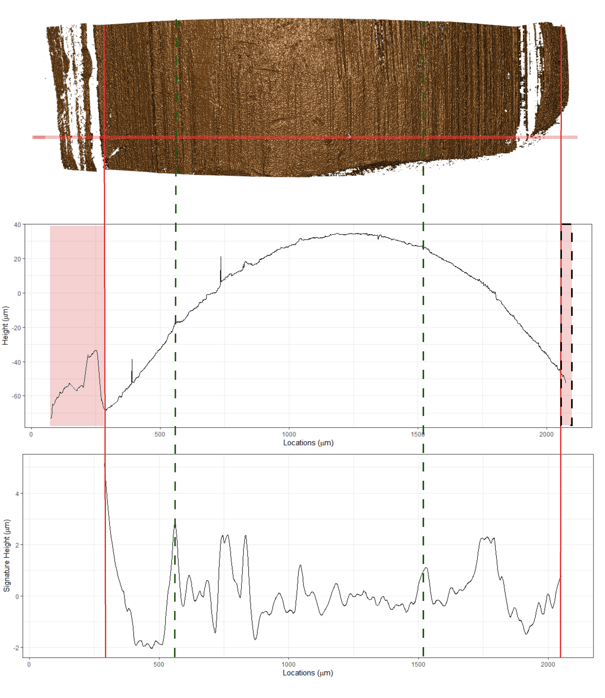
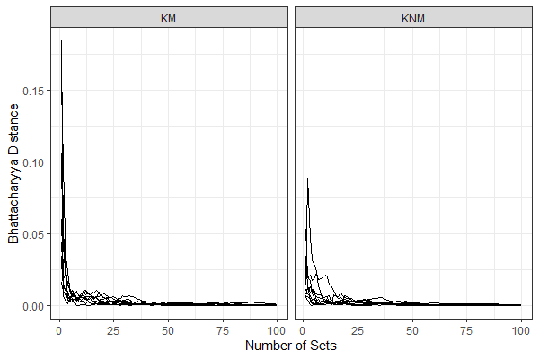
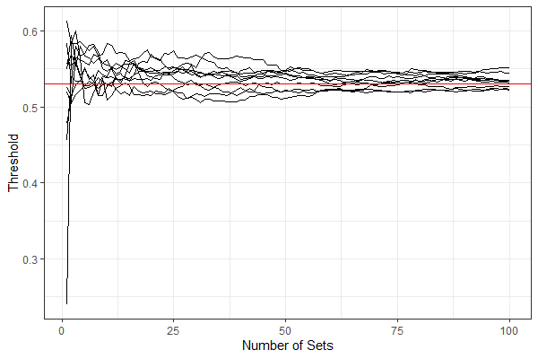
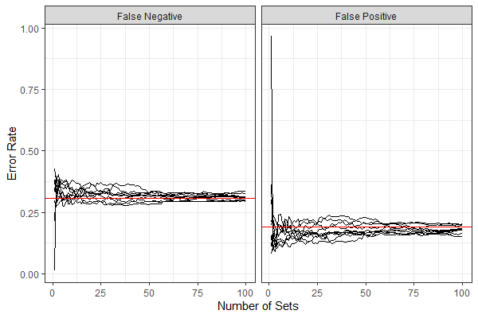

\theoremstyle{definition}
\newtheorem{definition}{Definition}

\newcommand{\hh}[1]{{\textcolor{orange}{#1}}}
\newcommand{\yg}[1]{{\textcolor{blue}{#1}}}

\thanks{This work was partially funded by the Center for Statistics and Applications in Forensic Evidence (CSAFE) through Cooperative Agreement 70NANB20H019 between NIST and Iowa State University, which includes activities carried out at Carnegie Mellon University, Duke University, University of California Irvine, University of Virginia, West Virginia University, University of Pennsylvania, Swarthmore College and University of Nebraska, Lincoln.}

<!-- _Text based on elsarticle sample manuscript, see [http://www.elsevier.com/author-schemas/latex-instructions#elsarticle](http://www.elsevier.com/author-schemas/latex-instructions#elsarticle)_ -->

```{r setup, warning=FALSE,message=FALSE, echo=FALSE}
library(dplyr)
library(ggplot2)
library(purrr)
library(readr)
library(stringr)
library(kableExtra)
library(xtable)
library(tables)
library(gridExtra)
library(tidyr)
theme_set(theme_bw())
knitr::opts_chunk$set(echo = FALSE, cache = TRUE)
```

```{r data-input-section, include=FALSE}
# Here is all the input data, some are bullet data, some are used sequences or index as records
# I call part1 for the model estimation part and
# part2 for the "application" section
#ccf_data <- read.csv("../data/organized data/ccf-related/ccf_data.csv")
ccf_data <- read.csv("../data/ccf_data.csv")
ccf_data_part1 <- ccf_data %>% filter(usage == "part1")
# Some land names is not well coded for part2, will be updated later 
ccf_data_part2 <- ccf_data %>% filter(usage == "part2")

# Used for the changing sample size section. These are randomly generated sequences, to reduce the randomness of each run, it is stored
#change_size_sequences <- read.csv("../data/organized data/ccf-related/change_size_sequences.csv")
change_size_sequences <- read.csv("../data/change_size_sequences.csv")

# The randomly generated database set (complement set is test set) ) (application section)
# database_inex_data <- read.csv("../data/organized data/ccf-related/database_index_data.csv")
database_inex_data <- read.csv("../data/database_index_data.csv")

# The randomly generated (1) questioned bullet and (3) test bullets pairs (application section)
#test_quesetioned_pairs_data <- read.csv("../data/organized data/ccf-related/test_quesetioned_pairs_data.csv")
test_quesetioned_pairs_data <- read.csv("../data/test_quesetioned_pairs_data.csv")
```

```{r model-estimation-section, include=FALSE}
ccf_km_full_data <- ccf_data_part1 %>% filter(source == "KM")
ccf_knm_full_data <- ccf_data_part1 %>% filter(source == "KNM")

# only 35 knms out of 146880 knms are greater than (or equal to) 0.9, remove those
ccf_knm_full_data <- ccf_knm_full_data %>% filter(ccf < 0.90)

# The function to do the model fit====================
#par: starting values provided, different by each k
#par = c(a, b) when k = 1,
#par = c(p1, a1, b1, a2, b2), when k = 2
#par = c(p1, p2, a1, b1, a2, b2, a3, b3), when k =3
#k: number of components 1, 2 or 3.
#data: numeric vector
#control: provided to "optim"
#if the function produce warnings of NaN, that's not a problem, since I don't set hard bounds for parameters
#the "optim" function will handle that well
mine_betamix <- function(data, par, k, control = list(), hessian = FALSE){
  beta_likelihood <- function(par, data) {
    a1 <- par[1]
    b1 <- par[2]
    
    beta_1 <- dbeta(data, shape1 = a1, shape2 = b1)
    
    output <- -sum(log(beta_1))
  }
  
  betamix_likelihood <- function(par = c(0.5, 1, 1, 1, 1), data) {
    p1 <- par[1]
    a1 <- par[2]
    b1 <- par[3]
    a2 <- par[4]
    b2 <- par[5]
    
    if (p1<=0 | p1>=1 | a1<= 0 | b1 <= 0| a2<=0| b2<=0){
      output <- Inf
    } else if ((a1/(a1 + b1))>=(a2/(a2 + b2))) {
      output <- Inf
    } else {
      beta_1 <- dbeta(data, shape1 = a1, shape2 = b1)
      beta_2 <- dbeta(data, shape1 = a2, shape2 = b2)
      output <- -sum(log(p1*beta_1 + (1-p1)*beta_2))
    }
    
    output
  }
  
  beta_c3_likelihood <- function(par, data) {
    p1 <- par[1]
    p2 <- par[2]
    a1 <- par[3]
    b1 <- par[4]
    a2 <- par[5]
    b2 <- par[6]
    a3 <- par[7]
    b3 <- par[8]
    
    if (p1 < 0|p2 < 0|p1 > 1|p2 > 1|p1+p2>1) {
      output <- Inf
    } else if ((a1/(a1 + b1))>=(a2/(a2 + b2))|(a2/(a2 + b2))>=(a3/(a3 + b3))) {
      output <- Inf
    } else {
      beta_1 <- dbeta(data, shape1 = a1, shape2 = b1)
      beta_2 <- dbeta(data, shape1 = a2, shape2 = b2)
      beta_3 <- dbeta(data, shape1 = a3, shape2 = b3)
      output <- -sum(log(p1*beta_1 + p2*beta_2 + (1-p1-p2)*beta_3))
    }
    
    output
  }
  
  beta_c4_likelihood <- function(par, data) {
    p1 <- par[1]
    p2 <- par[2]
    p3 <- par[3]
    a1 <- par[4]
    b1 <- par[5]
    a2 <- par[6]
    b2 <- par[7]
    a3 <- par[8]
    b3 <- par[9]
    a4 <- par[10]
    b4 <- par[11]
        
    if (p1 < 0|p2 < 0|p3 < 0|p1 > 1|p2 > 1|p3 > 1|p1+p2+p3>1) {
      output <- Inf
    } else if ((a1/(a1 + b1))>=(a2/(a2 + b2))|(a2/(a2 + b2))>=(a3/(a3 + b3))|(a3/(a3 + b3))>=(a4/(a4 + b4))) {
      output <- Inf
    } else {
      beta_1 <- dbeta(data, shape1 = a1, shape2 = b1)
      beta_2 <- dbeta(data, shape1 = a2, shape2 = b2)
      beta_3 <- dbeta(data, shape1 = a3, shape2 = b3)
      beta_4 <- dbeta(data, shape1 = a4, shape2 = b4)
      output <- -sum(log(p1*beta_1 + p2*beta_2 + p3*beta_3 + (1-p1-p2-p3)*beta_4))
    }
    
    output
  }
  
    beta_c5_likelihood <- function(par, data) {
    p1 <- par[1]
    p2 <- par[2]
    p3 <- par[3]
    p4 <- par[4]
    a1 <- par[5]
    b1 <- par[6]
    a2 <- par[7]
    b2 <- par[8]
    a3 <- par[9]
    b3 <- par[10]
    a4 <- par[11]
    b4 <- par[12]
    a5 <- par[13]
    b5 <- par[14]
        
    if (p1 < 0|p2 < 0|p3 < 0|p4 < 0|p1 > 1|p2 > 1|p3 > 1|p4 > 1|p1+p2+p3+p4>1) {
      output <- Inf
    } else if ((a1/(a1 + b1))>=(a2/(a2 + b2))|(a2/(a2 + b2))>=(a3/(a3 + b3))|(a3/(a3 + b3))>=(a4/(a4 + b4))|(a4/(a4 + b4))>=(a5/(a5 + b5))) {
      output <- Inf
    } else {
      beta_1 <- dbeta(data, shape1 = a1, shape2 = b1)
      beta_2 <- dbeta(data, shape1 = a2, shape2 = b2)
      beta_3 <- dbeta(data, shape1 = a3, shape2 = b3)
      beta_4 <- dbeta(data, shape1 = a4, shape2 = b4)
      beta_5 <- dbeta(data, shape1 = a5, shape2 = b5)
      output <- -sum(log(p1*beta_1 + p2*beta_2 + p3*beta_3 + p4*beta_4 + (1-p1-p2-p3-p4)*beta_5))
    }
    
    output
  }
  
  
  
  if (k == 1) {
    output <- optim(par = par, fn = beta_likelihood, 
                    data = data,
                    control = control,
                    hessian = hessian)
  } else if (k == 2) {
    output <- optim(par = par, fn = betamix_likelihood, 
                    data = data,
                    control = control,
                    hessian = hessian)
  } else if (k == 3) {
    output <- optim(par = par, fn = beta_c3_likelihood, 
                    data = data,
                    control = control,
                    hessian = hessian)
  } else if (k == 4) {
    output <- optim(par = par, fn = beta_c4_likelihood, 
                    data = data,
                    control = control,
                    hessian = hessian)
  } else if (k == 5) {
    output <- optim(par = par, fn = beta_c5_likelihood, 
                    data = data,
                    control = control,
                    hessian = hessian)
  }
  
  output$value <- -output$value
  names(output)[which(names(output) == "value")] <- "logLik"
  output
}

# single beta============================
ccf_km_c1 <- mine_betamix(data = ccf_km_full_data$ccf, 
                          par = c(4.16, 2.38),
                          k = 1)
# be sure to check the convergence
ccf_km_c1$convergence

ccf_knm_c1 <- mine_betamix(data = ccf_knm_full_data$ccf, 
                           par = c(6.457, 9.54),
                           k = 1)
ccf_knm_c1$convergence

# two-component beta mixture=========================
ccf_km_c2 <- mine_betamix(data = ccf_km_full_data$ccf, 
                          par = c(0.3, 5, 5, 5, 2),
                          k = 2,
                          control = list(maxit = 1000))

ccf_km_c2$convergence

# starting values borrowed from betamix fit result, however, it doesn't need to be so informative,
# par = c(0.5, 5, 10, 5, 5) works well too
ccf_knm_c2 <- mine_betamix(data = ccf_knm_full_data$ccf, 
                           par = c(0.634, 11.5, 21, 6.8, 7.2),
                           k = 2,
                           control = list(maxit = 1000))
ccf_knm_c2$convergence

# three-component beta mixture========================

ccf_km_c3 <- mine_betamix(data = ccf_km_full_data$ccf,
                          par = c(0.2, 0.548, 10.69, 17, 7.5, 4.19, 26, 6),
                          k = 3,
                          control = list(maxit = 3000))
ccf_km_c3$convergence

ccf_knm_c3 <- mine_betamix(data = ccf_knm_full_data$ccf,
                           par = c(0.65, 0.314, 12, 23, 12.5, 12.5, 12.3, 6.2),
                           k = 3,
                           control = list(maxit = 3000))
ccf_knm_c3$convergence
# four-component beta mixture=========================
ccf_km_c4 <- mine_betamix(data = ccf_km_full_data$ccf,
                          par = c(0.3, 0.3, 0.3, 10.69, 17, 7.5, 4.19, 26, 6, 30, 5),
                          k = 4,
                          control = list(maxit = 3000))
ccf_km_c4$convergence

ccf_knm_c4 <- mine_betamix(data = ccf_knm_full_data$ccf,
                           par = c(0.3, 0.3, 0.3, 12, 23, 12.5, 12.5, 12.3, 6.2, 12, 4),
                           k = 4,
                           control = list(maxit = 3000))
ccf_knm_c4$convergence

# five-component beta mixture=========================
ccf_km_c5 <- mine_betamix(data = ccf_km_full_data$ccf,
                          par = c(0.3, 0.2, 0.2, 0.2, 10, 20, 10, 15, 7, 4, 26, 6, 30, 5),
                          k = 5,
                          control = list(maxit = 5000))
ccf_km_c5$convergence

ccf_knm_c5 <- mine_betamix(data = ccf_knm_full_data$ccf,
                           par = c(0.3, 0.2, 0.2, 0.2, 12, 23, 12, 18, 12, 12, 12, 6, 12, 4),
                           k = 5,
                           control = list(maxit = 5000))
ccf_knm_c5$convergence


# summary model params================================
#par = c(a, b) when k = 1,
#par = c(p1, a1, b1, a2, b2), when k = 2
#par = c(p1, p2, a1, b1, a2, b2, a3, b3), when k =3

param_extract <- function(model) {
  if(model$convergence != 0) warning("model not converged")
  par <- model$par
  nparam <- length(par)
  
  if(nparam == 2) {
    output <- data.frame(a = par[1],
                         b = par[2])
    output <- output %>% mutate(mu = a/(a+b),
                                phi = a+b)
    
  } else if (nparam == 5) {
    output <- data.frame(p1 = par[1],
                         a1 = par[2],
                         b1 = par[3],
                         a2 = par[4],
                         b2 = par[5])
    output <- output %>% mutate(mu1 = a1/(a1+b1),
                                phi1 = a1+b1,
                                mu2 = a2/(a2+b2),
                                phi2 = a2+b2)
  } else if (nparam == 8) {
    output <- data.frame(p1 = par[1],
                         p2 = par[2],
                         a1 = par[3],
                         b1 = par[4],
                         a2 = par[5],
                         b2 = par[6],
                         a3 = par[7],
                         b3 = par[8])
    output <- output %>% mutate(mu1 = a1/(a1+b1),
                                phi1 = a1+b1,
                                mu2 = a2/(a2+b2),
                                phi2 = a2+b2,
                                mu3 = a3/(a3+b3),
                                phi3 = a3+b3)
  } else if (nparam == 11) {
    output <- data.frame(p1 = par[1],
                         p2 = par[2],
                         p3 = par[3],
                         a1 = par[4],
                         b1 = par[5],
                         a2 = par[6],
                         b2 = par[7],
                         a3 = par[8],
                         b3 = par[9],
                         a4 = par[10],
                         b4 = par[11])
    output <- output %>% mutate(mu1 = a1/(a1+b1),
                                phi1 = a1+b1,
                                mu2 = a2/(a2+b2),
                                phi2 = a2+b2,
                                mu3 = a3/(a3+b3),
                                phi3 = a3+b3,
                                mu4 = a4/(a4+b4),
                                phi4 = a4+b4)
  } else if (nparam == 14) {
    output <- data.frame(p1 = par[1],
                         p2 = par[2],
                         p3 = par[3],
                         p4 = par[4],
                         a1 = par[5],
                         b1 = par[6],
                         a2 = par[7],
                         b2 = par[8],
                         a3 = par[9],
                         b3 = par[10],
                         a4 = par[11],
                         b4 = par[12],
                         a5 = par[13],
                         b5 = par[14])
    output <- output %>% mutate(mu1 = a1/(a1+b1),
                                phi1 = a1+b1,
                                mu2 = a2/(a2+b2),
                                phi2 = a2+b2,
                                mu3 = a3/(a3+b3),
                                phi3 = a3+b3,
                                mu4 = a4/(a4+b4),
                                phi4 = a4+b4,
                                mu5 = a5/(a5+b5),
                                phi5 = a5+b5)
  } else {
    stop("The function can't handle this case")
  }
  return(output)
}

param_km_c1 <- param_extract(ccf_km_c1)
param_knm_c1 <- param_extract(ccf_knm_c1)
param_km_c2 <- param_extract(ccf_km_c2)
param_knm_c2 <- param_extract(ccf_knm_c2)
param_km_c3 <- param_extract(ccf_km_c3)
param_knm_c3 <- param_extract(ccf_knm_c3)
param_km_c4 <- param_extract(ccf_km_c4)
param_knm_c4 <- param_extract(ccf_knm_c4)
param_km_c5 <- param_extract(ccf_km_c5)
param_knm_c5 <- param_extract(ccf_knm_c5)
# simulation to plot===================================

# two-component betamix
myfit1_simulation <- data.frame(ccf = (1:99)/100, 
                                y1 = dbeta((1:99)/100, 
                                           shape1 = param_km_c2$a1, 
                                           shape2 = param_km_c2$b1),
                                y2 = dbeta((1:99)/100, 
                                           shape1 = param_km_c2$a2, 
                                           shape2 = param_km_c2$b2))

myfit1_simulation <- myfit1_simulation %>% mutate(y = param_km_c2$p1*y1 + (1-param_km_c2$p1)*y2)

myfit2_simulation <- data.frame(ccf = (1:99)/100, 
                                y1 = dbeta((1:99)/100, 
                                           shape1 = param_knm_c2$a1, 
                                           shape2 = param_knm_c2$b1),
                                y2 = dbeta((1:99)/100, 
                                           shape1 = param_knm_c2$a2, 
                                           shape2 = param_knm_c2$b2))

myfit2_simulation <- myfit2_simulation %>% mutate(y = param_knm_c2$p1*y1 + (1-param_knm_c2$p1)*y2)

myfit1n2_simulation <- bind_rows(myfit1_simulation, myfit2_simulation, .id = "Class")

# single beta
# one component
myfit3_simulation <- data.frame(ccf = (1:99)/100, 
                                y = dbeta((1:99)/100, 
                                          shape1 = param_km_c1$a, 
                                          shape2 = param_km_c1$b))

myfit4_simulation <- data.frame(ccf = (1:99)/100, 
                                y = dbeta((1:99)/100, 
                                          shape1 = param_knm_c1$a, 
                                          shape2 = param_knm_c1$b))

myfit3n4_simulation <- bind_rows(myfit3_simulation, myfit4_simulation, .id = "Class")

# statistics calculated for the models=========================

# likelihood ratio
lr1 <- 2*(ccf_km_c2$logLik - ccf_km_c1$logLik)
lr1p <- 1-pchisq(2*(ccf_km_c2$logLik - ccf_km_c1$logLik), df = 3)

lr2 <- 2*(ccf_km_c3$logLik - ccf_km_c2$logLik)
lr2p <- 1-pchisq(2*(ccf_km_c3$logLik - ccf_km_c2$logLik), df = 3)

lr3 <- 2*(ccf_knm_c2$logLik - ccf_knm_c1$logLik)
lr3p <- 1-pchisq(2*(ccf_knm_c2$logLik - ccf_knm_c1$logLik), df = 3)

lr4 <- 2*(ccf_knm_c3$logLik - ccf_knm_c2$logLik)
lr4p <- 1-pchisq(2*(ccf_knm_c3$logLik - ccf_knm_c2$logLik), df = 3)

# bic
bic1 <- 2*log(nrow(ccf_km_full_data))- 2*ccf_km_c1$logLik
bic2 <- 5*log(nrow(ccf_km_full_data))- 2*ccf_km_c2$logLik
bic3 <- 8*log(nrow(ccf_km_full_data))- 2*ccf_km_c3$logLik

bic4 <- 2*log(nrow(ccf_knm_full_data))- 2*ccf_knm_c1$logLik
bic5 <- 5*log(nrow(ccf_knm_full_data))- 2*ccf_knm_c2$logLik
bic6 <- 8*log(nrow(ccf_knm_full_data))- 2*ccf_knm_c3$logLik

bic7 <- 11*log(nrow(ccf_km_full_data))- 2*ccf_km_c4$logLik
bic8 <- 14*log(nrow(ccf_km_full_data))- 2*ccf_km_c5$logLik

bic9 <- 11*log(nrow(ccf_knm_full_data))- 2*ccf_knm_c4$logLik
bic10 <- 14*log(nrow(ccf_knm_full_data))- 2*ccf_knm_c5$logLik
```

```{r error-rate-section, include=FALSE}
pbetamix2 <- function(x, model){
  p1 <- model$par[1]
  p2 <- 1 - model$par[1]
  a1 <- model$par[2]
  b1 <- model$par[3]
  a2 <- model$par[4]
  b2 <- model$par[5]
  
  pdf <- p1*pbeta(x, shape1 = a1, shape2 = b1) + 
    p2*pbeta(x, shape1 = a2, shape2 = b2)
  
  pdf
}

dbetamix2 <- function(x, model){
  p1 <- model$par[1]
  p2 <- 1 - model$par[1]
  a1 <- model$par[2]
  b1 <- model$par[3]
  a2 <- model$par[4]
  b2 <- model$par[5]
  
  pdf <- p1*dbeta(x, shape1 = a1, shape2 = b1) + 
    p2*dbeta(x, shape1 = a2, shape2 = b2)
  
  pdf
}

find_cross <- function(m1, m2, start = 0.4, end = 0.9, step = 0.0001, tolerance = 0.001, outboundDefault = NULL){
  a <- 1
  b <- 2
  x <- start
  while(abs(a - b)>=tolerance) {
    x <- x + step
    a <- dbetamix2(x, m1)
    b <- dbetamix2(x, m2)
    
    if (x > end){
      if (is.null(outboundDefault)){
        stop("the cutoff exceeds end point, try smaller steps, larger range or set default")
      } else {
        if (!is.numeric(outboundDefault)) stop("outboundDefault needs a numeric input")
        x <- outboundDefault
        return(x)
      }
    }
  }
  x
}

# 0.529
cutoff1 <- find_cross(ccf_km_c2, ccf_knm_c2, 0.4)

# numbers as a reference but changed a little for now
# FPR: 0.148
fpr <- 1 - pbetamix2(cutoff1, ccf_knm_c2)
# FNR: 0.301
fnr <- pbetamix2(cutoff1, ccf_km_c2)
# FIR: 0.212
fir <- (1 - pbetamix2(cutoff1, ccf_knm_c2))/(1 - pbetamix2(cutoff1, ccf_km_c2))
# FER: 0.354
fer <- pbetamix2(cutoff1, ccf_km_c2)/pbetamix2(cutoff1, ccf_knm_c2)


```

```{r application-section, include=FALSE}
# some abuse of notations in part2 data
# the "nonmatched" in the name refer to the case one bullet with a different source compared with three same source bullets. The "KM" and "KNM" as a variable indicating the way we treat those comparisons. "KNM" refers to "KNM" the same as before. "KM" here doesn't mean all of them is known-matched, for those comparisons among the three same source bullets, they are, for those involving the one different bullet, they are not. But the "KM" involving the one different bullet refers to those lands we suspect to be matched in those bullet comparisons.

# Use part1 data: database, same-source comparison (True results: all same source comparisons)=========
test_index <- test_quesetioned_pairs_data$FAU1
questioned_bullet_index <- test_quesetioned_pairs_data$bullet1

# introduce FAU and bullet in ccf_km_full_data, ccf_knm_full_data
ccf_km_full_data <- ccf_km_full_data %>% 
  mutate(FAU1 = as.numeric(str_extract(land1, pattern = "(?<=LAPD - (FAU )?)\\d+")),
         FAU2 = as.numeric(str_extract(land2, pattern = "(?<=LAPD - (FAU )?)\\d+")))

ccf_knm_full_data <- ccf_knm_full_data %>% 
  mutate(FAU1 = as.numeric(str_extract(land1, pattern = "(?<=LAPD - (FAU )?)\\d+")),
         FAU2 = as.numeric(str_extract(land2, pattern = "(?<=LAPD - (FAU )?)\\d+")))

# split out the test set (from the database set), FAU1 = FAU2 here. The list is listed in numeric order.
# not all good, some not 36 because of the bad names: FAU 245, known minority, fixed by update of data later
test_km_sets <- ccf_km_full_data %>%
  filter(as.character(FAU1) %in% as.character(test_index)) %>%
  split(f = .$FAU1)

test_knm_sets <- ccf_knm_full_data %>%
  filter(as.character(FAU1) %in% as.character(test_index)) %>%
  split(f = .$FAU1)

if (any(names(test_km_sets) != names(test_knm_sets))) stop("FAUs not matched in application section, node1")

# find out and deal with the unincluded data and exclude the index correspondingly
unincludedFAU <- setdiff(as.character(test_index), names(test_km_sets))
# update the two vectors
test_index <- test_quesetioned_pairs_data$FAU1[!as.character(test_quesetioned_pairs_data$FAU1) %in% unincludedFAU]
questioned_bullet_index <- test_quesetioned_pairs_data$bullet1[!as.character(test_quesetioned_pairs_data$FAU1) %in% unincludedFAU]

if (any(names(test_km_sets) != as.character(test_index))) stop("FAUs not matched in application section, node2")

# split the questioned bullet out in each set
test_questioned_sets <- Map(function(x, y, z) {
  
  test_km <- x %>% filter(bullet1 != z, bullet2 != z)
  test_knm <- y %>% filter(bullet1 != z, bullet2 != z)
  questioned_km <- x %>% filter(bullet1 == z|bullet2 == z)
  
  output <- list(test_km = test_km, test_knm = test_knm,
                 questioned_km = questioned_km)
  
}, test_km_sets, test_knm_sets, questioned_bullet_index)

# fit the distributions for each set (three test fires)
case_by_case_models <- lapply(test_questioned_sets, FUN = function(x) {
  # the starting values are those from the full data models
  km_model <- mine_betamix(data = x$test_km$ccf, 
                           par = ccf_km_c2$par,
                           k = 2,
                           control = list(maxit = 3000),
                           hessian = FALSE)
  knm_model <- mine_betamix(data = x$test_knm$ccf, 
                            par = ccf_knm_c2$par,
                            k = 2,
                            control = list(maxit = 3000),
                            hessian = FALSE)
  # cutoff1 is the all data threshold in the estimation section
  threshold_equal_pdf <- find_cross(km_model, knm_model,start = 0.1,end = 0.9, step = 0.0001, outboundDefault = cutoff1)
  
  output <- list(km_model = km_model, knm_model = knm_model, threshold_equal_pdf = threshold_equal_pdf)
  output
})

# The following check of convergence is not reported
# KM convergence results, 1 indicates not converged
case_by_case_models %>% map_dbl(.f = function(x) x$km_model$convergence)
# KNM convergence results
case_by_case_models %>% map_dbl(.f = function(x) x$knm_model$convergence)
# The ones we can use: (both knm and km are converged)
converged_index <- case_by_case_models %>% map_dbl(.f = function(x) x$km_model$convergence)==0 &
  case_by_case_models %>% map_dbl(.f = function(x) x$knm_model$convergence) == 0

case_by_case_classifcation <- Map(function(x, y) {
  # True: identification; False: elimination
  class <- x$questioned_km$ccf > y$threshold_equal_pdf
  class
}, test_questioned_sets, case_by_case_models)

case_by_case_classifcation_converged <- subset(case_by_case_classifcation, converged_index)
case_by_case_classifcation_converged %>% unlist() %>% sum
case_by_case_classifcation_converged %>% unlist() %>% length

# Use part2 data(True results: all different source comparisons)=================================

ccf_nonmatched_km_data <- ccf_data_part2 %>% filter(source == "KM")
ccf_nonmatched_knm_data <- ccf_data_part2 %>% filter(source == "KNM")

ccf_nonmatched_km_data <- ccf_nonmatched_km_data %>% 
  mutate(FAU1 = as.numeric(str_extract(land1, pattern = "(?<=LAPD - (FAU )?)\\d+")),
         FAU2 = as.numeric(str_extract(land2, pattern = "(?<=LAPD - (FAU )?)\\d+"))) %>%
  mutate(uniqueIndex = ifelse(FAU1 < FAU2, yes = paste(FAU1, FAU2), no = paste(FAU2, FAU1)))

ccf_nonmatched_knm_data <- ccf_nonmatched_knm_data %>% 
  mutate(FAU1 = as.numeric(str_extract(land1, pattern = "(?<=LAPD - (FAU )?)\\d+")),
         FAU2 = as.numeric(str_extract(land2, pattern = "(?<=LAPD - (FAU )?)\\d+"))) %>%
  mutate(uniqueIndex = ifelse(FAU1 < FAU2, yes = paste(FAU1, FAU2), no = paste(FAU2, FAU1)))

# For the current coding method, it's not available to get all FAU1 and FAU2 (It is now, but this is still a good way)
# but the following would work for the purpose of split (the following step) (to get list forms)

if (nrow(ccf_nonmatched_km_data)%%36 != 0 | nrow(ccf_nonmatched_knm_data)%%240 != 0) stop("Incorrect dimension in application section for part2 data, node1")
if (nrow(ccf_nonmatched_km_data)/36 != nrow(ccf_nonmatched_knm_data)/240) stop("Incorrect dimension in application section for part2 data, node3")

# less sets than included FAUs, since when interchange the questioned bullets, this cause more missing coparisons
# actually reversed the operation to get the data.frames
ccf_nonmatched_km <- ccf_nonmatched_km_data %>%
  split(f = rep(1:(nrow(ccf_nonmatched_km_data)/36), each = 36))

ccf_nonmatched_knm <- ccf_nonmatched_knm_data %>%
  split(f = rep(1:(nrow(ccf_nonmatched_knm_data)/240), each = 240))

# check if the split is making sense
lapply(ccf_nonmatched_km, FUN = function(x){
  x <- x %>%
    mutate(FAU1 = as.numeric(str_extract(land1, pattern = "(?<=LAPD - (FAU )?)\\d+")),
           FAU2 = as.numeric(str_extract(land2, pattern = "(?<=LAPD - (FAU )?)\\d+")))
  output <- ""
  if(length(unique(c(x$FAU1, x$FAU2))) != 2){
    print("error1")
    print(unique(c(x$FAU1, x$FAU2)))
    print(length(unique(c(x$FAU1, x$FAU2))))
    print(dim(x))
    #stop("more than 2 barrels used in application section part2 data, node2")
    output <- paste(output, "error1")
  } else {
    xfau1fau2 <- paste(min(x$FAU1, x$FAU2), max(x$FAU1, x$FAU2))
    if(!xfau1fau2 %in% paste(pmin(test_quesetioned_pairs_data$FAU1, test_quesetioned_pairs_data$FAU2),
                             pmax(test_quesetioned_pairs_data$FAU1, test_quesetioned_pairs_data$FAU2))) {
      print("error2")
      print(xfau1fau2)
      #stop("split in application section part2 data, not as expected")
      output <- paste(output, "error2")
    } 
  }
  output
}) %>% unlist()
# should be no errors (since we excluded all problematic data)

# to form the included cases, this again needs some manual work due to bad names (correct the names)
# use the information from the last step
# note there is no simple exchange of bullets since we excluded that case initially
# includedTestPairs <- lapply(ccf_nonmatched_km, FUN = function(x) {
#     x <- x %>%
#     mutate(FAU1 = as.numeric(str_extract(land1, pattern = "(?<=LAPD - (FAU )?)\\d+")),
#            FAU2 = as.numeric(str_extract(land2, pattern = "(?<=LAPD - (FAU )?)\\d+")))
#     output <- paste(min(x$FAU1, x$FAU2), max(x$FAU1, x$FAU2))
#     output
# }) %>% unlist()
# 
# includedTestPairsKNM <- lapply(ccf_nonmatched_knm, FUN = function(x) {
#     x <- x %>%
#     mutate(FAU1 = as.numeric(str_extract(land1, pattern = "(?<=LAPD - (FAU )?)\\d+")),
#            FAU2 = as.numeric(str_extract(land2, pattern = "(?<=LAPD - (FAU )?)\\d+")))
#     output <- paste(min(x$FAU1, x$FAU2), max(x$FAU1, x$FAU2))
#     output
# }) %>% unlist()
# 
# if(!identical(includedTestPairs, includedTestPairsKNM)) stop("unexpected order in application part2, node3") 

# the first one doesn't change it actually
# includedTestPairs[33] <- "14 608"
# includedTestPairs[132] <- "246 337"
# includedTestPairs[133] <- "247 398"
# includedTestPairs[205] <- "324 602"
# includedTestPairs[242] <- "246 368"
# includedTestPairs[386] <- "247 525"
# includedTestPairs[392] <- "531 571"
# includedTestPairs[426] <- "321 571"

test_quesetioned_pairs_data <- test_quesetioned_pairs_data %>%
  mutate(uniqueIndex = ifelse(FAU1 < FAU2, yes = paste(FAU1, FAU2), no = paste(FAU2, FAU1)))
# unincludedTest <- setdiff(test_quesetioned_pairs_data$uniqueIndex, includedTestPairs)
# setdiff(includedTestPairs, test_quesetioned_pairs_data$uniqueIndex)
# not sure why some of them not included
# unincludedTest
# unincludedFAU

# I think it is so bad experience to deal with the bad data at this level, I will just exclude all of them
# gooddata1 <- c(1:32, 0, 34:131, 0, 0, 134:204, 0, 206:241, 0, 243:385, 0, 387:391, 0, 393:425, 0, 427:510) != 0
# 
# ccf_nonmatched_km2 <- ccf_nonmatched_km[gooddata1]
# ccf_nonmatched_knm2 <- ccf_nonmatched_knm[gooddata1]
# 
# test_quesetioned_pairs_data2 <- test_quesetioned_pairs_data %>%
#   filter(uniqueIndex %in% includedTestPairs)

# nonmatched_km_fau_names <- lapply(ccf_nonmatched_km, FUN = function(x){
#   output <- unique(x$FAUtoSplit[!is.na(x$FAUtoSplit)])
#   if (length(output) != 1) stop("Incorrect split in application section for part2 data")
#   output
# }) %>% unlist()
# 
# nonmatched_knm_fau_names <- lapply(ccf_nonmatched_knm, FUN = function(x){
#   output <- unique(x$FAUtoSplit[!is.na(x$FAUtoSplit)])
#   if (length(output) != 1) stop("Incorrect split in application section for part2 data")
#   output
# }) %>% unlist()

# if (any(nonmatched_km_fau_names != nonmatched_knm_fau_names)) stop("Incorrect split in application section for part2 data")
# names(ccf_nonmatched_km) <- nonmatched_km_fau_names
# names(ccf_nonmatched_knm) <- nonmatched_knm_fau_names

# introduce FAU and bullet
# ccf_nonmatched_km_data <- ccf_nonmatched_km_data %>% 
#   mutate(FAU1 = as.numeric(str_extract(land1, pattern = "(?<=LAPD - (FAU )?)\\d+")),
#          FAU2 = as.numeric(str_extract(land2, pattern = "(?<=LAPD - (FAU )?)\\d+")))
# 
# ccf_nonmatched_knm_data <- ccf_nonmatched_knm_data %>% 
#   mutate(FAU1 = as.numeric(str_extract(land1, pattern = "(?<=LAPD - (FAU )?)\\d+")),
#          FAU2 = as.numeric(str_extract(land2, pattern = "(?<=LAPD - (FAU )?)\\d+")))
# 
# ccf_nonmatched_km <- ccf_nonmatched_km_data %>%
#   split(f = .$FAU1)
# 
# ccf_nonmatched_knm <- ccf_nonmatched_knm_data %>%
#   split(f = .$FAU1)
# investigate the ccf extraction (from comp) function to see if it works well with the nonmatched bullets

# To fit the models
nonmatched_test_questioned_sets <- Map(function(x, y) {
  xIndex <- unique(x[x$FAU1 != x$FAU2, ]$uniqueIndex)
  yIndex <- unique(y[y$FAU1 != y$FAU2, ]$uniqueIndex)
  if ((length(xIndex) != 1)|(length(yIndex) != 1)) stop("unexpected uniqueIndex")
  if (xIndex != yIndex) stop("unexpected non-matching uniqueIndex")
  TheuniqueIndex <- xIndex
  
  if (sum(test_quesetioned_pairs_data$uniqueIndex == TheuniqueIndex) != 1) stop("comparisons not existed")
  theComparison <- test_quesetioned_pairs_data[test_quesetioned_pairs_data$uniqueIndex == TheuniqueIndex,]
  test_km <- x %>% filter(FAU1 != theComparison$FAU1,
                          FAU2 != theComparison$FAU1)
  
  test_knm <- y %>% filter(FAU1 != theComparison$FAU1,
                           FAU2 != theComparison$FAU1)
  
  questioned_km <- x %>% filter(FAU1 == theComparison$FAU1|FAU2 == theComparison$FAU1)
  
  # test_km <- x %>% filter(bullet1 != "Q", bullet2 != "Q")
  # test_knm <- y %>% filter(bullet1 != "Q", bullet2 != "Q")
  # questioned_km <- x %>% filter(bullet1 == "Q"|bullet2 == "Q")
  
  output <- list(test_km = test_km, test_knm = test_knm,
                 questioned_km = questioned_km)
  
}, ccf_nonmatched_km, ccf_nonmatched_knm)

nonmatched_test_questioned_sets[[1]]

nonmatched_case_by_case_models <- lapply(nonmatched_test_questioned_sets, FUN = function(x) {
  # the starting values are those from the full data models
  test_km_ccf <- x$test_km$ccf
  test_knm_ccf <- x$test_knm$ccf
  if (any(test_knm_ccf>=0.95)) test_knm_ccf  <- test_knm_ccf [test_knm_ccf < 0.95]
  km_model <- mine_betamix(data = test_km_ccf, 
                           par = c(0.419, 7.37, 8.45, 14.03, 4.45),
                           k = 2,
                           control = list(maxit = 3000),
                           hessian = FALSE)
  knm_model <- mine_betamix(data = test_knm_ccf, 
                            par = c(0.666, 11.23, 20.33, 7.06, 7.22),
                            k = 2,
                            control = list(maxit = 3000),
                            hessian = FALSE)
  
  threshold_equal_pdf <- find_cross(km_model, knm_model,start = 0.1,end = 0.9, step = 0.0001, outboundDefault = cutoff1)
  output <- list(km_model = km_model, knm_model = knm_model, threshold_equal_pdf = threshold_equal_pdf)
  output
})

# Similarly, check the convergence
# KM convergence results, 1 indicates not converged
nonmatched_case_by_case_models %>% map_dbl(.f = function(x) x$km_model$convergence)
# KNM convergence results
nonmatched_case_by_case_models %>% map_dbl(.f = function(x) x$knm_model$convergence)
# The ones we can used: (both knm and km are converged)
nonmatched_converged_index <- nonmatched_case_by_case_models %>% map_dbl(.f = function(x) x$km_model$convergence)==0 &
  nonmatched_case_by_case_models %>% map_dbl(.f = function(x) x$knm_model$convergence) == 0


nonmatched_case_by_case_classifcation <- Map(function(x, y) {
  # True: identification; False: elimination
  class <- x$questioned_km$ccf > y$threshold_equal_pdf
  class
}, nonmatched_test_questioned_sets, nonmatched_case_by_case_models)

# The above code is for case-specific scenario. Now for the database scenario==================
test_km_sets <- ccf_km_full_data %>%
  filter(as.character(FAU1) %in% as.character(test_index)) %>%
  split(f = .$FAU1)

database_matchedB_km <- mine_betamix(data = ccf_km_full_data %>%
                                       filter(!as.character(FAU1) %in% as.character(test_index)) %>%
                                       as.data.frame() %>%
                                       pull(ccf),
                                     par = c(0.419, 7.36, 8.45, 14, 4.45),
                                     k = 2,
                                     hessian = FALSE,
                                     control = list(maxit = 3000))
database_matchedB_km$converge 
database_matchedB_km

database_matchedB_knm <- mine_betamix(data = ccf_knm_full_data %>%
                                       filter(!as.character(FAU1) %in% as.character(test_index)) %>%
                                       as.data.frame() %>%
                                       pull(ccf),
                                      par = c(0.666, 11.23, 20.33, 7.065, 7.22),
                                      k = 2,
                                      hessian = FALSE,
                                      control = list(maxit = 3000))


database_matchedB_knm$converge 
database_matchedB_knm

database_threshold <- find_cross(m1 = database_matchedB_km, m2 = database_matchedB_knm)
###

database_matchedB_km_result <- lapply(test_questioned_sets, 
                                      FUN = function(x) x$questioned_km$ccf > database_threshold)

database_matchedB_km_result %>% subset(converged_index) %>% unlist() %>% sum() 


# non-matched bullets
database_nonmatchedB_result <- lapply(nonmatched_test_questioned_sets, FUN = function(x) x$questioned_km$ccf > database_threshold )


# turn the data unchanged
ccf_km_full_data <- ccf_km_full_data %>% 
  select(-FAU1, -FAU2)

ccf_knm_full_data <- ccf_knm_full_data %>%
  select(-FAU1, -FAU2)

# save the results
# saveRDS(case_by_case_classifcation, file = "../data/case-by-case-classification.rds")
# saveRDS(nonmatched_case_by_case_classifcation, file = "../data/nonmatched-case-by-case-classification.rds")
# saveRDS(database_matchedB_km_result, file = "../data/database-matchedB-km-result.rds")
# saveRDS(database_nonmatchedB_result, file = "../data/database-nonmatchedB-result.rds")
```

```{r sample-size-section, include=FALSE}
# make use of different starting values (this actually has no significant effect, and only part of it is shown in the final report)
# the full model one:
starting_1 <- matrix(c(param_km_c2$p1,  param_km_c2$a1,  param_km_c2$b1, param_km_c2$a2, param_km_c2$b2,
                       param_knm_c2$p1,  param_knm_c2$a1,  param_knm_c2$b1, param_knm_c2$a2, param_knm_c2$b2),
                     nrow = 2, byrow = TRUE, 
                     dimnames = list(class = c("KM", "KNM"), param = c("p1", "a1", "b1", "a2", "b2")))

starting_1

# kind of non-informative (some 6's to let the mu1 < mu2)
starting_2 <- matrix(c(0.3, 5, 6, 5, 5,
                       0.7, 5, 6, 5, 5),
                     nrow = 2, byrow = TRUE, 
                     dimnames = list(class = c("KM", "KNM"), param = c("p1", "a1", "b1", "a2", "b2")))
starting_2

# The function to do the fit
# For example: example <- change_size_sequence_fit(ccf_km_full_data, seq = change_size_sequences$seq1, start = starting_1[1,], class = "km")
change_size_sequence_fit <- function(data, seq, start = c(0.3, 5, 6, 5, 5), k = 2, class) {
  if (class == "km") {
    step <- 36
  } else if (class == "knm") {
    step <- 240
  } else {
    stop("class not one of km or knm")
  }
  model_list <- lapply(seq_along(seq), FUN = function(i) {
    index_start <- sort(seq[1:i]-1)*step+1
    index_end <- sort(seq[1:i])*step
    index <-  Map(f = function(x, y) {
      output <- x:y
      output
    }, index_start, index_end) %>% unlist
    
    used_data <- data$ccf[index]
    model <- mine_betamix(data = used_data,
                          par = start,
                          k = k,
                          control = list(maxit = 3000),
                          hessian = FALSE)
    
  })
  model_list
}


# The run=================================================
km_st1_sq1to10_100 <- lapply(1:10, FUN = function(i) {
  output <- change_size_sequence_fit(ccf_km_full_data, 
                                     seq = change_size_sequences[,i][1:100], 
                                     start = starting_1[1,], 
                                     class = "km")
})

knm_st1_sq1to10_100 <- lapply(1:10, FUN = function(i) {
  output <- change_size_sequence_fit(ccf_knm_full_data, 
                                     seq = change_size_sequences[,i][1:100], 
                                     start = starting_1[2,], 
                                     class = "knm")
})

# Analysis of results=====================================================

# seq: which sequence used
# sets: number of sets used
long_form_result_trans <- function(result) {
  output1 <- lapply(result, FUN = function(sets) {
    output2 <- lapply(sets, FUN = function(x) {
      output3<- data.frame(p1 = x$par[1],
                           a1 = x$par[2],
                           b1 = x$par[3],
                           a2 = x$par[4],
                           b2 = x$par[5])
      output3
    }) %>% bind_rows(.id = "sets")
    
    output2 <- output2 %>%
      mutate(mu1 = a1/(a1 + b1),
             mu2 = a2/(a2 + b2),
             mu = p1*mu1 + (1-p1)*mu2,
             var1 = a1*b1/(a1+b1)^2/(a1+b1+1),
             var2 = a2*b2/(a2+b2)^2/(a2+b2+1),
             var = p1^2*var1 + (1-p1)^2*var2)
    output2
  })
  output1
}

change_size_sequence_knm1to10_data <- long_form_result_trans(knm_st1_sq1to10_100) %>% bind_rows(.id = "seq")
change_size_sequence_km1to10_data <- long_form_result_trans(km_st1_sq1to10_100) %>% bind_rows(.id = "seq")

# To get thresholds, we need to match the KM and KNM models in using same "seq" and same "sets" used

threshold_newcol <- lapply(1:1000, FUN = function(i){
  data <- bind_rows(change_size_sequence_km1to10_data,
                    change_size_sequence_knm1to10_data)
  kmrow <- data[i, ]
  knmrow <- data[i+1000, ]
  fakekmmodel <- list(par = c(kmrow[3:7]) %>% unlist)
  fakeknmmodel <- list(par = c(knmrow[3:7]) %>% unlist)
  
  threshold <- find_cross(m1 = fakekmmodel, m2 = fakeknmmodel,
                          start = 0.2, end =  0.9, step = 0.0001, outboundDefault = cutoff1)
  threshold
}) %>% unlist

change_size_sequence_data <- bind_rows(change_size_sequence_km1to10_data,
                                       change_size_sequence_knm1to10_data)
change_size_sequence_data$threshold <- c(threshold_newcol, threshold_newcol)
change_size_sequence_data$class <- rep(c("KM", "KNM"), each = 1000)

# bd column: Bhattacharyya Distance
# compare the estimated model with the model estimated with all available data: ccf_km_c2, ccf_knm_c2
bd_part1 <- lapply(1:1000, FUN = function(i) {
  therow <- change_size_sequence_data[i, ]
  fakemodel <- list(par = c(therow[3:7]) %>% unlist)
  
  f_integrate <- function(x) {
    sqrt(dbetamix2(x, ccf_km_c2)*dbetamix2(x, fakemodel))
  }
  
  output <- integrate(f_integrate, lower = 0.001, upper = 0.999)[[1]]
  output <- -log(output)
}) %>% unlist

bd_part2 <- lapply(1001:2000, FUN = function(i) {
  therow <- change_size_sequence_data[i, ]
  fakemodel <- list(par = c(therow[3:7]) %>% unlist)
  
  f_integrate <- function(x) {
    sqrt(dbetamix2(x, ccf_knm_c2)*dbetamix2(x, fakemodel))
  }
  
  output <- integrate(f_integrate, lower = 0.001, upper = 0.999)[[1]]
  output <- -log(output)
}) %>% unlist

change_size_sequence_data$bd <- c(bd_part1, bd_part2)
```

```{r app-scenario3, include=FALSE}
permutation_scenario3 <- function(one_of_test_questioned_sets, times = 10000) {
  test_km <- one_of_test_questioned_sets$test_km
  test_knm <- one_of_test_questioned_sets$test_knm
  questioned_km <- one_of_test_questioned_sets$questioned_km
  
  if (nrow(test_km) != 18 | nrow(test_knm) != 135 | nrow(questioned_km) != 18) return(999)
  
  test_km$pair <- paste(test_km$bullet1, test_km$bullet2, sep = "-")
  test_knm$pair <- paste(test_knm$bullet1, test_knm$bullet2, sep = "-")
  
  pairid <- unique(test_km$pair)
  
  # define the data structure: every 6 rows are one phase, first 6 first phase and so on
  # first phase is the selected candidate km
  
  comparison1 <- bind_rows(test_km %>% filter(pair == pairid[1]),
                           test_knm %>% filter(pair == pairid[1])) %>%
    mutate(rank = rank(ccf))
  
  comparison2 <- bind_rows(test_km %>% filter(pair == pairid[2]),
                           test_knm %>% filter(pair == pairid[2])) %>%
    mutate(rank = rank(ccf))
  
  comparison3 <- bind_rows(test_km %>% filter(pair == pairid[3]),
                           test_knm %>% filter(pair == pairid[3])) %>%
    mutate(rank = rank(ccf))
  
  if(nrow(comparison1) != 36 | nrow(comparison2) != 36 | nrow(comparison3) != 36) return(999)
  
  observed_sum <- sum(comparison1$rank[1:6]) + sum(comparison2$rank[1:6]) + sum(comparison3$rank[1:6])
  
  get_permutation <- lapply(1:times, FUN = function(i) {
    perm1 <- sample(1:36, 36, replace = TRUE)
    perm2 <- sample(1:36, 36, replace = TRUE)
    perm3 <- sample(1:36, 36, replace = TRUE)
    
    perm1_com <- comparison1[perm1,]
    perm2_com <- comparison2[perm2,]
    perm3_com <- comparison3[perm3,]
    
    perm1_com$phase <- rep(1:6, each = 6)
    perm2_com$phase <- rep(1:6, each = 6)
    perm3_com$phase <- rep(1:6, each = 6)
    
    maxphase1 <- perm1_com %>%
      group_by(phase) %>%
      summarise(sumrank = sum(rank)) %>%
      pull(sumrank) %>%
      max()
    
    maxphase2 <- perm2_com %>%
      group_by(phase) %>%
      summarise(sumrank = sum(rank)) %>%
      pull(sumrank) %>%
      max()
    
    maxphase3 <- perm3_com %>%
      group_by(phase) %>%
      summarise(sumrank = sum(rank)) %>%
      pull(sumrank) %>%
      max()
    
    perm_sum <- sum(maxphase1, maxphase2, maxphase3)
    perm_sum
  }) %>% unlist
  
  pvalue <- sum(get_permutation > observed_sum)/times
  
  # output <- list(observed_sum = observed_sum,
  #                pvalue = pvalue,
  #                permutation = get_permutation)
  
  output <- pvalue
  output
}

test_questioned_sets_pvalue <- lapply(test_questioned_sets, FUN = function(x) {
  output <- permutation_scenario3(x, times = 1000)
}) %>% unlist

nonmatched_test_questioned_sets_pvalue <- lapply(nonmatched_test_questioned_sets, FUN = function(x) {
  output <- permutation_scenario3(x, times = 1000)
}) %>% unlist

```


```{r generated-values-calculation, include=FALSE}
# to get those values needed in text, but avoid the rerun of the core sections
# quick and easy changes here
123
```


Introduction
====================================

Firearm examination is an important topic in forensic science to answer the questions, if two pieces of firearm evidence are from a same source. This examination is based on class and individual characteristics left by the firearm on bullets and cartridge cases.  Under current state of the art, these examinations are executed in forensic labs by Firearms and Toolmark Examiners (FTEs) under the regulation of AFTE [@AFTE1992], and involves visual inspection of similarities, generally with the help of a comparison microscope. 
This process is in its nature based on human decisions and therefore subjective. The National Research Council criticized this subjectivity in the conventional firearm identification process and called for it to be reduced or to be complemented by more objective procedures [@Council2009]. The President’s Council of Advisers on Science and Technology (PCAST) also emphasized the importance to establish the scientific validity and reliability of subjective forensic feature-comparison methods by blind empirical testing [@PCAST2016]. Additionally, the PCAST report recognized the importance of developing objective computer-based algorithms in its following addendum [@PCAST2016addendum].

In response to this criticism,  research on cartridge case comparisons introduced the method of  congruent matching cells (CMC) [@Song2015], which allows a quantitative assessment of the similarity of two breech face impressions. Theoretical error rates of CMC were analyzed by @Song2018 and @Zhang2019 on the data set of @Fadul2011 based on variants of a binomial model. 
In bullet comparisons, a fully automatic matching algorithm was proposed by @Hare2016, its error rates  <!--The discussion about the degraded land comparison was also made in the following paper [@Hare2017].--> are empirically evaluated and  discussed by @Vanderplas2020  based on three test sets. 
The most prominent single feature in the random forest model @Hare2016  proposed is the cross-correlation function (CCF), previously identified as important in other methods of similarity assessment [@chumbley; @vorburger2011; @Krishnan2019; @cmps]. 
<!--Other automated comparison methods or improvement such as Robust LOESS in groove engraved area identification [@Rice2020], Chumbley score method [@Krishnan2019] are also proposed. -->
One less well investigated aspect of the cross-correlation measure, however, is its distribution.

Due to  limitations of sample sizes and study designs, sound distributional assumptions about the resulting similarity scores are not well established in the bullet comparison field for automated matching algorithms. Therefore, error rates are generally estimated empirically. This estimation is often based on only dozens of bullets from a selected few firearms. <!--originally used in case studies to estimate the current lab practice's error rates. -->
<!-- \hh{I'm not sure how the next factoid is relevant} And many of those tests are also criticized for the closed-set design and potential information provided to the examiners as pointed out by PCAST [@PCAST2016; @PCAST2016addendum].-->
To estimate the theoretical error rates of any automatic algorithm, it is important to understand the underlying distributions of the similarity scores. These distributions also play a key role in an analysis of  score-based likelihood ratios (SLR) \yg{which becomes more and more prevalent in forensic science to quantify the strength of  similarities and unify the measurement of strength of evidence.} @eu2016 \yg{endorsed likelihood methods to evaluate the forensic evidence in their published guidelines for evaluatetion, interpretation and reporting of scientific evidence. @ommen18 formally set up the framework of the likelihood ratios in forensic science}. @Nate2020 \yg{showed the implementation of score based likelihood with good performance in practice}. @RIVA2020110363 and @HEPLER2012129 \yg{showed the importance of the proper estimation of the denominator distributions in score based likelihood analysis in cartridge case and handwriting evidence respectively}. 
<!-- used to quantify the strength of  similarities and unify the measurement of strength of evidence.  -->
\hh{XXX the following description needs to get away from a descriptive mode 'this is what we have done' to a description of results 'this is what we have found'.}
<!-- In this paper, we build beta mixture distribution models for the cross-correlation function (CCF) to provide a framework for error rate estimations and score-based likelihood ratio analysis of the output of automatic algorithms. We also evaluate the size of data needed to reach good estimations for the distributions.  -->
<!-- We show the size of the data is crucial in applying score-based likelihood ratios and thus, relevant reference databases are needed and required to exceed the minimal number of specimens. -->
\yg{In this paper, we propose beta mixture distribution models for the cross-correlation function (CCF) to provide a framework for error rate estimations and score-based likelihood ratio analysis of the output of automatic algorithms. We also make suggestions on the size of data needed to reach good estimations for the distributions. 
We show the size of the data is crucial in applying score-based likelihood ratios and thus, relevant reference databases are needed and required to exceed the minimal number of specimens.}

<!-- \hh{Don't start sentences with `And`. I am also not sure, what you refer to by `that`. }
And that also helps later \hh{in this paper?} to choose proper thresholds for the methods to reduce the overall error rates instead of simply choosing a threshold to distinguish between same and different sources. \hh{first define thresholds and the need to get from scores to actionable conclusions.}
-->

In section 2... In section 3...


Background
============================


\hh{A sketch of a bullet and a barrel would be good here - showing rifling (grooves and lands) and striation marks. Introduce rifling, Describe LEA and GEA, and structure of LEAs}

Generally, in forensic science, we consider the problem of determining for two pieces of evidence whether they originate from the same source or from different sources. 
Specifically, when bullet evidence is compared, it is of interest if two bullets were fired from the same gun. 
For firearms, there is rifling machined into the internal of the barrels aiming to improve the aerodynamic stability of bullets. During the firing process, microimperfections in a barrel leave markings on a bullet. These  markings are thought to be unique and are used as the basis to determine the source of the bullets. 
<!--For forensic purpose, we distinguish between two different levels of characteristics. Characteristics shared by a type of guns and bullets are called class characteristics, such as the number of lands, rifling directions or type of rifling. Different class characteristics lead to a conclusion of `elimination`. Class characteristics can never be used to identify a same source. The characteristics corresponding to a particular firearm are called individual characteristics and are used to identify the source of the bullets.--> 
For bullet evidence, in particular, striations on land engraved areas (LEAs) are used by firearms and toolmarks examiners to determine same source of two pieces of evidence [@AFTE1992]. <!--The grooves engraved area (GEAs) are the markings left by the grooves between two lands. We usually don't use GEAs directly for the identification purpose but we usually need to distinguish between GEAs and LEAs especially for the computer based algorithms.-->
For computer based algorithms, 3D scans of the LEAs are used. <!-- to carry more information than traditional 2D scans.-->
Following the process described in @Hare2016, we extract **signatures** \hh{XXX pictures!} from these scans. Various  scores are used in the literature to describe the similarity between two signatures [@ma2004; @nichols1997; @nichols2003; @Hare2016].
Here, we  employ the cross-correlation function (CCF) to measure similarity.
The cross-correlation function (CCF) is calculated by maximizing the  correlation of two  signatures under a vertical shift.

```{r signature-fig, out.width="70%", fig.align="center",  fig.cap="Pipeline of the pre-processing", fig.keep="hold", fig.pos="h"}


```

Mathematically, CCF is  a value between -1 and 1, with larger values indicating higher similarity between pairs of signatures. Deciding between identifications and eliminations based on pairs of signatures is based on a cutoff value of the corresponding maximized CCF value. Naively, one could assign positive CCF values to indicate same-source pairs and, similarly, negative values to different-source pairs. However, in practice it turns out that values of CCF based on pairs of bullet land signatures are not symmetric around the origin, but mostly positive regardless of source. Negative values are rarely observed for LEA comparisons in practice (and in none of the more than 100k comparisons considered in this paper).
Moreover, different pairings of firearm and ammunition result in different distributions of values, therefore no single CCF value is sufficient to distinguish between same-source and different-source pairs. Alternatively to using scores directly, @RIVA2020110363 suggests the use of score-based log-likelihood ratios to evaluate the strength of forensic evidence. 

<!--This provides us with a rich tool box and help the field advance, but it comes with issues. For the practitioners not in statistical major who don't fully understand the differences among those algorithms, a same number represents different strength of evidence is extremely confusing. And even in the academic field, we need a unified way to quantify the strength of evidence considering different behaviors of different scores. The score based on likelihood ratios is proposed in forensic science to measure the strength of evidence.-->

Score-based log-likelihood ratios (SLR) quantify how much more likely one outcome is than the other one. SLRs are used for their well-understood statistical properties and large-sample properties, which allow to both evaluate prediction error rates and control them.
<!--\yg{
And it represents how much one result is more likely than the other one and comes with great statistical properties in terms of minimizing losses and achieving large sample properties.}--> 
<!--The key of making use of likelihood ratios is to understand the underlying theoretical distributions of each particular type of scores. Intuitively, without knowing how a type of score is distributed, it makes no sense to make any claim for a particular value. For example, the random forest method in the bullet comparison gives very separated scores, either close to one or close to zero, and it actually achieves good classification results. But it doesn't mean it won't make an error, it makes error even when the score close to zero which we might expect to be different source pairs. But when CCF achives that score close to 0, we hardly make wrong claims. It's because the difference of distributions of each score and the absolute value itself could be misleading. And the prediction error rates should be evaluated and controlled at the same time.-->

<!-- And the LEA is also used in the developed computer-based methods. So, we are not doing one step to identify bullets, instead we consider each LEA and then combine the land level conclusions to a bullet level one. Accordingly, we start our discussion about underlying distributions and error rates from the land level. -->

Methods and data
============================

The distributional forms of similarity scores
----------------------------

Two  distributions are of immediate interest in the case of bullet comparisons: (1) the known-match (KM) or same-source distribution for similarity scores of same-source pairs of LEA scans, and (2)  the known-non-match (KNM) or different-source distribution for similarity scores for pairs of LEA scans from different sources. Any decision on the source of a comparison pair is then based on making a choice between those two  distributions. 
The strength of any identification is also measured by the disparities of those distributions. 
However, those two distributions are only available in experimental settings where we know the ground truth.

<!-- The quantitative methods used to objectively measure the similarity between LEAs report various quantities, such as counts, correlations, distances, probabilities and more general similarity scores [@ma2004; @nichols1997; @nichols2003; @Hare2016]. To understand how those quantities reflect the strength of evidence and to study the underlying error rates in making decisions based on those quantities, distributional forms are usually set up [@Zhang2019; @Song2018]. Particularly, we are focusing on the similarity scores which range from 0 to 1. The similarity scores reported in the forensic researches are classified into two categories as known matches (KM) and known non-matches (KNM), and the corresponding distributions are named as KM distributions and KNM distributions. When we make any decisions based on any quantitative measurement, we are actually making a choice between those two potential distributions. The strength of any identification process is also measured by the disparities of those distributions. However, in practice, we can hardly discriminate those two distributions entirely, thus, we are never 100% sure which distribution the observed score comes from. This is where the identification error raises.  -->

<!-- The cross-correlation function (CCF) is the most prominent single feature in the automatic random forest algorithm [@Hare2016] which has theoretical range from -1 to 1. But in real applications, this similarity score always has values in 0 to 1, e.g. in our case, none of 121992 comparisons has negative values. So, it is selected as a representative of similarity scores with range from 0 to 1 in this paper for further analysis. The similarity scores in 0 to 1 can be explained as probabilities that quantify the likelihood that a pair of LEAs are actually a match. Or we can think of them as general similarity measurement. As the name indicated, the higher the similarity score is, the stronger evidence is to support the same source assumption. For different combination of ammunition and firearms, the scores are distributed differently. It is expected that systematic differences exist there for different cases [@Vanderplas2020]. So, it is necessary to study the scores under controlled conditions. -->

```{r example, out.width="90%", fig.align="center", fig.cap="Histograms of the maximized cross-correlations for the known matched (KM) and known non-matched (KNM) comparisons of the LAPD data. The histograms imply that the KNM distribution has a mode below a value of 0.5 while the KM distribution peaks in a value above 0.5. The KM distribution also shows a heavy tail to the left or possibly a potential second mode", fig.keep="hold", fig.pos="h", fig.height = 4, fig.width=6}
myfit3n4_simulation %>%
  ggplot(aes(color = Class, fill = Class)) +
  geom_histogram(aes(x = ccf, y = ..density..), binwidth = 0.05, #color = "gray99",
                 position = "identity", alpha = 0.5, 
                 data = bind_rows(ccf_km_full_data, ccf_knm_full_data, .id = "Class")) +
  # geom_density(aes(x = ccf, y = ..density..), #color = "gray99",
  #                position = "identity", alpha = 0.5,
  #                data = bind_rows(ccf_km_full_data, ccf_knm_full_data, .id = "Class")) +
  scale_color_manual(breaks = c("1", "2"), label = c("KM", "KNM"), values = c("darkorange", "darkgrey")) +
  scale_fill_manual(breaks = c("1", "2"), label = c("KM", "KNM"), values = c("darkorange", "darkgrey")) +
  ylab("Density") +
  xlab("CCF")
```


\autoref{fig:example} shows histograms of cross-correlation values for both known-matching pairs and known non-matching pairs of bullet land-engraved areas (LEAs). The two histograms exhibit a fairly typical pattern, in the sense, that the distribution for known non-matching (KNM) pairs has a mode for CCF values below 0.5 and the distribution of CCF values for known matching (KM) pairs peaks in a value above 0.5.


<!--In the bullet LEA comparison problems, we usually have well separated bullet scores \yg{but not for the land scores according to} @Vanderplas2020.-->

In order to capture the features of the KM and KNM-distributions as shown in \autoref{fig:example}, we consider the beta distribution family.
Beta distributions  are relativlely flexible in capturing unimodal asymmetric densities on the $[0,1]$ interval.

However, a single Beta density might not be sufficient to explain a heavy tail or  a second mode such as the one in the KM distribution in \autoref{fig:example}. We therefore further consider the beta mixture distribution. <!--which is a more complicated distribution than the beta distribution as a special case.-->
In the beta mixture distribution, we introduce a set of prior probabilities to combine several beta densities as one:


\begin{definition}[Beta distribution]
Random variable $X$ is said to follow a Beta distribution, $X \sim B(\mu, \phi)$, with real-valued parameters $\mu \in (0,1)$ and $\phi > 0$, if its density can be written as
\begin{align*}
f(x;\mu, \phi) =  \frac{\Gamma(\phi)}{\Gamma(\mu\phi)\Gamma\left((1-\mu)\phi\right)}x^{\mu\phi-1}(1-x)^{(1-\mu)\phi-1},
\end{align*}
where $\Gamma(.)$ is the Gamma function. In this parameterization, $E[X] = \mu$ and Var$[X] = \mu(1-\mu) / (\phi +1)$.
$\mu$ is the location parameter of the distribution, $\phi$ is called the precision or dispersion parameter[@Ferrari2004].
\end{definition}


Note that we are using the mean and precision parameterization of beta distributions. This parameterization simplifies the mathematical expressions and is also more intuitive. The mean and precision parameterization is equivalent to the more usual parameterization using shape parameters $\alpha$ and $\beta$ through the following transformation:

\begin{align*}
\mu = \frac{\alpha}{\alpha+\beta}\ \ \ \text{ and } \ \ \ 
\phi = \alpha + \beta
\end{align*}

\begin{definition}[Beta-Mix distribution]
Random variable $Y$ is said to follow a $k$-component beta mixture distribution $Y \sim  \text{Betamix}(p, \mu, \phi)$ with parameter vectors $p$, $\mu$ and $\phi$, if its density is written as:

\begin{align*}
f(y;p, \mu, \phi) =& \sum_{\ell=1}^k p_{\ell} \cdot f_\ell(y;\mu_{\ell}, \phi_{\ell}) 
\end{align*}
where
$f_\ell(\cdot;\mu_{\ell}, \phi_{\ell})$, $\ell = 1, 2, 3, ..., k$ are beta densities
with parameter vectors
$p$, $\mu$ and $\phi$. For these parameters holds: $p \in S_{k+1}$, i.e. $p \in R^{k}$,  all elements in $p$ are positive and sum to 1:  $0 \le p_{\ell} \le 1, \forall \ell \in {1, 2, 3, ..., k}$ and $\sum_{\ell = 1}^k p_{\ell} = 1$.

$\mu_{l}$ and $\phi_{l}$ are distribution parameters for $l^{\text{th}}$ component:
\begin{align*}
&\mu = (\mu_{1}, \mu_{2}, \mu_{3}, ... , \mu_{k}),        &\mu_{\ell} \in (0, 1),~~ l = 1, 2, 3, ..., k \\
&\phi = (\phi_{1}, \phi_{2}, \phi_{3}, ... , \phi_{k}),    &\phi_{\ell} \in (0, +\infty),~~ l = 1, 2, 3, ..., k
\end{align*}
\end{definition}

```{r betamixFig, out.width="\\textwidth", fig.align="center", fig.cap="Examples illustrating two component beta-mixture densities. The component on the right is held fixed at $\\mu_2 = 0.759, \\phi_2 = 18.476$. The other component with parameters $\\mu_1$ and $\\phi_1$ changes the location $\\mu_1$ in horizontal direction from 0.1 to 0.466 (low to high), and dispersion $\\phi_1$ changes in vertical direction from $15.8^{3/4}$ to $15.8^{3/2}$ (low to high).  The prior probability $p_1$ is fixed at 0.419. With an increase in $\\mu_1$, the two modes gradually get closer to one another. Smaller dispersion values correspond to wider and flatter peaks. The parameters are inspired by the KM estimation of the 2-component model in section 4.1. ", fig.pos="h", warning = FALSE}

p1 <- 0.419
mu1 <- 0.466
phi1 <- 15.812
mu2 <- 0.759
phi2 <- 18.476

simdata <- function(p1, a1, b1, a2, b2) {
  dcomp1 <- dbeta(1:999/1000, shape1 = a1, shape2 = b1)
  dcomp2 <- dbeta(1:999/1000, shape1 = a2, shape2 = b2)
  
  output <- data.frame(x = 1:999/1000, y = p1*dcomp1 + (1-p1)*dcomp2)
  output
}

# seq_mu1 <- seq(from = 0.1, to = 0.466, length.out = 7)
seq_mu1 <- seq(from = 0.1, to = 0.466, length.out = 3)
seq_phi1 <- c(15.812^.75, 15.812, 15.812^1.5)

params <- data.frame(p1 = p1, 
                     expand.grid(mu1 = seq_mu1, phi1= seq_phi1), 
                     mu2 = mu2, phi2 = phi2)
comdata <- lapply(1:nrow(params), FUN = function(i) {
  p1 <- params$p1[i]
  mu1 <- params$mu1[i]
  phi1 <- params$phi1[i]
  mu2 <- params$mu2[i]
  phi2 <- params$phi2[i]
  output <- simdata(p1, a1 = mu1*phi1, b1 = (1-mu1)*phi1, a2 = mu2*phi2, b2 = (1-mu2)*phi2)
  output
}) %>% bind_rows(.id = "id")

params$id <- 1:nrow(params)

comdata <- comdata %>%
  mutate(
        id = parse_number(id)
  ) %>%
  left_join(params, by="id")

comdata <- comdata %>%
  mutate(
    mu1_label = factor(mu1),
    phi1_label = factor(phi1)
  ) 
levels(comdata$mu1_label) <- c("mu[1]: low", "mu[1]: medium", "mu[1]: high")
levels(comdata$phi1_label) <- c("phi[1]: low", "phi[1]: medium", "phi[1]: high")

comdata %>%
  ggplot(aes(x = x, y = y, group = id)) + 
  geom_vline(aes(xintercept=mu1), colour = "grey70", data = comdata %>% select(mu1, mu1_label, phi1_label, id) %>% unique()) +
  geom_vline(aes(xintercept=mu2), colour = "grey70", data = comdata %>% select(mu2, id) %>% unique()) +
  geom_text(aes(x=mu1+.1), y = 0.4, hjust=1, label=expression(mu[1]), colour = "grey60", data = comdata %>% select(mu1, mu1_label, phi1_label, id) %>% unique()) +
  geom_text(aes(x=mu2+.1), y = 0.4, hjust=1, label=expression(mu[2]), colour = "grey60", data = comdata %>% select(mu2, id) %>% unique()) +
  geom_line(size=1) + 
  scale_color_gradient2(low = "black", mid = "grey", high = "darkorange", midpoint = 4) +
  ylab("Density") + 
  xlab("Value") +
#  guides(color = guide_none()) + # whenever you are tempted to remove a legend, just don' but re-think your approach
  facet_grid(phi1_label~mu1_label, labeller = "label_parsed", scale="free_y") +
  xlab("y")
  

```

<!-- \hh{XXX Comment a bit on the i.i.d.\ assumption in the discussion. Put in a teaser here.} -->

\autoref{fig:betamixFig} shows some examples of two-component beta-mixture densities. One of the modes is fixed, a second mode changes location ($\mu_1$) and precision ($\phi_1$). The panel in the second row on the right form a density similar to what we see for the distribution of the KMs. Note, that we assume different beta-mixture distributions for KM and KNM cases. Within each case,  we assume that scores are  independent and identically distributed, i.e. we assume that there is no dependence structure among  LEA comparisons and  scores within each class  follow the same distribution.


Error rate analysis
-----------------------------------------

<!-- \hh{XXX for the next section, please switch to present tense. Present tense is used when you describe something that is constant. Past tense describes a process that is finished. We do not want to focus on that process, but we want to focus on the truth we have found. In that vein, also avoid any chronological descriptions } -->

<!-- https://depts.washington.edu/engl/askbetty/tenses.php#:~:text=Verb%20tenses%20tell%20readers%20when,or%20effects%20of%20an%20action. -->


Estimating the underlying theoretical error rates for comparisons of pattern evidence is a fundamental challenge in  forensic science [@PCAST2016; @PCAST2016addendum]. 
<!-- \hh{XXX let's please focus on comparisons rather than 'making identifications'. the result of a comparison should be either an identification or an elimination. 'Making identifications' is inherently biased towards the prosecution. } -->
Different types of error rates are used to evaluate the performance of a decision-making process.
Here, we focus on  four commonly used error rates as defined in \autoref{Error rate table2}:
  
  1. the false positive rate (FPR)
  2. the false negative rate (FNR)
  3. the false identification rate (FIR)
  4. the false exclusion rate (FER)
  
<!-- \hh{XXX only use either rates or probabilities. Make sure to define probabilities before using them} -->

FPR and FNR are considered source-specific assessment [@inconclusives2021]. Both of these are rates to make a false conclusion given  ground truth. These error rates are particular useful when we evaluate the process of decision-making or an algorithm. FIR and FER are considered decision-specific assessment [@inconclusives2021]. These two rates assess the risk of a false claim given a decision. They are particularly useful in situations, such as when a jury is asked to decide on a defendant's guilt after being presented with conclusions from forensic evidence. 

Theoretically, these error rates are calculated as conditional probabilities based on the beta mixture distributions set up in the previous section 
given a standard decision making procedure. In the current paper, we make decisions by introducing a threshold $c$ for the CCF values, that distinguishes between identifications ($CCF > c$) and eliminations ($CCF < c$) \yg{for the land comparisons}. \yg{Further, we extend the land comparisons to bullet comparisons where we aggregate the land level results by majority voting to the bullet level. The definition of error rates can be similarly defined for the bullet comparisons.} 

\begin{table}[h]
\centering
\begin{tabular}{ |p{1.8cm}||p{3.2cm} |p{3.1cm}| p{2.5cm}|}
 \hline
 &\multicolumn{2}{c|}{Ground Truth}&  \\
 \hline
    & Match & Non-Match&Error Rate\\
 \hline
 Identification &  {\bf True Positives (TP)}: Correctly judged as matches & {\bf False Positive (FP)}: Incorrectly judged as matches& False Identification Rate $FIR = \frac{FP}{TP + FP}$ \\
 \hline
 Elimination & {\bf False Negative (FN)}: Incorrectly judged as non-matches& {\bf True Negative (TN)}: Correctly identified non-matches&False Exclusion Rate $FER = \frac{FN}{TN + FN}$ \\
 \hline
 Error Rate & False Negative Rate $FNR = \frac{FN}{FN + TP}$ & False Positive Rate $FPR = \frac{FP}{FP + TN}$&\\
 \hline
\end{tabular}
\caption{\label{Error rate table} Definitions for most commonly used error rates in binary decisions of match versus non-match comparisons.}


\end{table}

\begin{table}[h]
\footnotesize
\centering
\begin{tabular}{ |p{1.5cm}|p{3.7cm} |p{3.7cm}| p{1.7cm}|}
 \hline
 &\multicolumn{2}{c|}{Ground Truth}&  \\
 \hline
    & Same-Source(SS) & Different Source(DS)&Error Rate\\
 \hline
 Identification & $P(TP)= P(CCF > c \mid \text{SS})$ & $P(FP) = P(CCF > c \mid \text{DS})$& $FIR = \frac{P(FP)}{P(TP) + P(FP)}$ \\
 \hline
 Elimination & $P(FN)=P(CCF < c \mid\text{SS})$&$P(TN)=P(CCF<c\mid\text{DS})$& $FER = \frac{P(FN)}{P(TN) + P(FN)}$ \\
 \hline
 Error Rate & $FNR = \frac{P(FN)}{P(FN) + P(TP)}$ & $FPR = \frac{P(FP)}{P(FP) + P(TN)}$&\\
 \hline
\end{tabular}
\caption{\label{Error rate table2} Probability definitions for most commonly used error rates in binary decisions of same source versus different source comparisons. The notations are: TP for true positive, FP for false positive, FN for false negative, TN for true negative.}


\end{table}

<!-- The probabilities of making the four decisions in \autoref{Error rate table2} are then simply expressed as conditional probabilities: -->
<!-- \begin{eqnarray*} -->
<!-- P(TP) &=& P(CCF > c \mid \text{same source})        \\ -->
<!-- P(FP) &=& P(CCF > c \mid \text{different source})   \\ -->
<!-- P(FN) &=& P(CCF < c \mid \text{same source})        \\ -->
<!-- P(TN) &=& P(CCF < c \mid \text{different source}).  \\ -->
<!-- \end{eqnarray*} -->

\yg{XXX make decisions for the table}

<!-- The theoretical values of the four type of error rates are the expressed in probability form as: \hh{XXXX I'm not sure that we need table 1 anymore - everything that was included in the table is now included in the text. Space is one of the most valuable commodities in a paper - we need to save it. Either the table needs to go or the text :(} -->
<!-- \begin{eqnarray}\label{eq:theoretical} -->
<!-- E(FNR) &=& \frac{P(FN)}{P(FN) + P(TP)}\\\nonumber -->
<!-- E(FPR) &=& \frac{P(FP)}{P(FP) + P(TN)}\\\nonumber -->
<!-- E(FIR) &=& \frac{P(FP)}{P(TP) + P(FP)}\\\nonumber -->
<!-- E(FER) &=& \frac{P(FN)}{P(TN) + P(FN)} -->
<!-- \end{eqnarray} -->


Error rates are therefore affected by the threshold $c$. Error rates  also depend on each other, i.e. we can not optimize all at the same time, but we have to make trade-offs. In an extreme example, we can set a very conservative threshold of $CCF >= 0.99$ to make identifications. This yields a false positive rate (FPR) of zero. But at the same time, the False negative rate (FNR) approaches one. 
To make  error rates comparable and consistent, we base the decision threshold here on the likelihood ratio and use threshold $c_{X}$ where the probability densities of the KM and KNM distributions cross each other. At this crossing threshold $c_X$, the likelihood ratio equals 1. 
\hh{XXX do we have citations to the literature where this threshold is used?}

In the application of the algorithms, the threshold need to be carefully chosen where the study of associated error rates will in turn be essential guiding that process.

\hh{XXX What if this threshold is not unique? - under what assumptions does the KNM density dominate KM?}

Data
-----------------------------------------

Our analysis is based on a large reference database of four firings from each of 625 Beretta 92 F/FS collected by Srinivasan Rathinam from the Los Angeles Police Department. The bullets used in the study are copper full metal jacketed 9 mm Winchester Luger.

High-resolution 3d topographic scans of the striation marks on the land-engraved areas of fired bullets were acquired at the Iowa State Roy J.\ Carver Microscopy facility. 
These scans form the basis of the investigation here and will be referred to as the **LAPD data**. These scans are publicly available through the NIST Ballistics Toolmark Research Database [@nist].

It is the first time such a large data set available to the researchers, which makes it possible for a statistical analysis for the distributions of similarity scores. The barrel of the Beretta 92 F/FS is traditionally rifled, consisting of a spiral of six alternating grooves and lands. When a bullet is fired, a barrel therefore leaves six land-engraved areas (LEAs) on a bullet. Striation marks on LEAs are usually used to determine which barrel a bullet has been fired from. 
For each land-to-land comparison, we assign a CCF  score to quantify the similarity between signatures  following the procedure described by @Hare2016. This yields $6 \times 6$ pairs of comparisons for each bullet-to-bullet comparison, as shown at the example of a known-matching and a known-non-matching pair of bullets in \autoref{fig:tileplot}.

<!--
We follow the \hh{XXX the method described is not standard - be careful about how you use that word. Standards are something a committee in a discipline agrees upon. @Hare2016 is a publication.} ~~aforementioned standard~~ procedure to generate CCFs as similarity scores (\hh{XXX describe the procedure in 'Background'} include the procedure). 
-->

```{r create-small-data, echo=FALSE, warning = FALSE, message = FALSE}
library(tidyverse)
ccfplus <- ccf_data %>% separate(land1, into = c("b1", "study","br1", "foo1","l1","foo2", "foo3", "foo4", "foo5", "foo6", "foo7"), 
                            sep="-", remove = FALSE) %>% select(-starts_with("foo")) %>%
  separate(land2, into = c("b2", "foo10","br2", "foo11","l2","foo12", "foo13", "foo14", "foo15", "foo16", "foo17"), 
           sep="-", remove = FALSE) %>% select(-starts_with("foo"))  

ccfplus <- ccfplus %>% 
  mutate(
   br1 = parse_number(br1),
   br2 = parse_number(br2),
   l1 = paste0("L",parse_number(l1)),
   l2 = paste0("L",parse_number(l2)),
   b1 = gsub("ullet ","", b1),
   b2 = gsub("ullet ","", b2)
  )

small <- ccfplus %>% 
  filter((br1==20 & br2 == 20 & b2=="BA"& b1=="BB") | (br1==20 & br2 == 522 & b1 == "BA" & b2=="BA"))
```

```{r tileplot, fig.cap="Overview of all 36 land-to-land comparisons of two pairs of bullets. Left: the bullets are known to be from the same source. Right: the bullets were fired from two different barrels.", out.width=".8\\textwidth", fig.align="center", fig.height = 4}
km <- small %>% 
  filter(usage=="part1") %>%
  mutate(l2 = factor(l2, level=paste0("L",c(5:6, 1:4)))) %>%
  ggplot(aes(x = l1, y = l2, fill=ccf)) + 
  geom_tile() + 
  scale_fill_gradient2(low="darkgrey", high="darkorange", 
                       midpoint = 0.5, limit=c(0,1)) + 
  ggtitle("Known match") +
  xlab("Lands of Bullet B, Barrel FAU 020") +
  ylab("Lands of Bullet A, Barrel FAU 020") +
  theme(legend.position = "bottom",
        aspect.ratio = 1) 
knm <- small %>% 
  filter(usage=="part2") %>%
  ggplot(aes(x = l1, y = l2, fill=ccf)) + 
  geom_tile() + 
  scale_fill_gradient2(low="darkgrey", high="darkorange", 
                       midpoint = 0.5, limit=c(0,1)) + 
  ggtitle("Known non-match") +
  xlab("Lands of Bullet A, Barrel FAU 020") +
  ylab("Lands of Bullet A, Barrel FAU 522") +
  theme(legend.position = "bottom",
        aspect.ratio = 1)

grid.arrange(km, knm, ncol=2)
```


For each pair of bullets from the same source, there are six land-to-land scores corresponding to matching lands, and 30 scores from non-matching lands. For a set of four bullets from a single barrel there are six pairs of bullets yielding a total of 36 scores from same-source land-to-land comparisons. 
For  different-source land-to-land comparisons, we have many more cases. If we limit the scope of different-source comparisons to within a single barrel, there are  $\underbrace{30\times 6}_{\text{different bullets}} + \underbrace{15 \times 4}_{\text{same bullet}} = 240$ scores from land-to-land comparisons.


Database model v.s. case specific model
------------------------------------------

### Study Design

<!--
\hh{There are two major scenarios that firearms examiners come across in case work} [@ommen18]: 
\begin{itemize}
\item determine whether a questioned bullet was fired from a specific firearm (specific source problem)
\item determine whether two questioned bullets were fired from the same firearm (common source).
\end{itemize}
-->


The approach in this paper investigates \yg{three} scenarios. Scenario I is modelled after current practice when a suspected firearm is available: In current practice, FTEs  fire two or three test bullets from a suspected firearm using ammunition that  matches the evidence found on the crime scene as closely as possible. Test fires are checked for consistency of striation marks between fires. Generally, the bullet with the best striation marks is used to compare to the evidence. 

For Scenario II we assume, that a reference database  is available for comparison. This approach is similar to what has been described by Zheng et al in their presentation at AAFS 2019 (A Pathway Toward Firearm Population Statistics). Zheng et al (2019) described the identification of breech faces. Here, we are investigating an assessment of similarities of bullets based on 3d LEA scans. When dealing with reference databases, the FTE would, similar to current work in labs, include all known information into the system, such as ammunition and type of the firearm. Scores from the evidence are then compared to the most relevant scores in the database.

\yg{For Scenario III, we add an additional pre-screening procedure to exclude those barrels which don't leave well expressed marks on bullets and review the results from the first two scenarios. We achieve this by doing a permutation test for those comparison scores (i.e. CCFs) among test fires. If we reject the null hypothesis that the barrel doesn't mark, then it implies that the barrel leaves well expressed marks. Thus, we have higher confidence to conduct analysis on the questioned bullets. Otherwise, we conclude that we can't even distinguish the matches and non-matches within the test fires and the analysis on the questioned bullets is not reliable. This responds to the observed fact that some barrels don't mark well as in [figure]. Intuitively, this will significantly improve the classification performance but with some tradeoff on the other side. The tradeoff is that for some cases, we failed to do classications.}

For either \yg{of the first two scenarios}, we will assume that we can generate scores from an automated matching algorithm to assess similarity.  These similarity scores are then used to get score-based likelihood ratios which quantify the strength of evidence supporting either the prosecution's or the defense's hypothesis. The critical step of producing these likelihood ratios lies in the estimation of the distributions for the similarity scores of known matches and known non-matches.
We will also assume that a suspected firearm is available. In case a firearm is not available, deriving reliable scores and associated densities becomes more complicated. We touch on this scenario and its limitations in the discussion.

There are three sets of scores we are interested in: 
scores corresponding to known matches that the distribution of $f_\text{KM}$ is based on; scores from known non-matches that enable an estimation of $f_\text{KNM}$; and comparison scores of the questioned bullet with the test fires.
Under Scenario I, the distributions of known matches and known non-matches are based on the scores from pair-wise comparisons of the test fired bullets: assuming that we are able to access three test-fired bullets with six land engraved areas each, $f_\text{KM}$ is based on 18 scores of matching land-to-land signatures, while $f_\text{KNM}$ is based on 135 scores of non-matching land-to-land signatures from  pair-wise comparisons.
Under Scenario II, these distributions are estimated from the scores of the closest matching reference fires (same firearm, same ammunition).
Comparison scores are gained in the same way under both scenarios: the questioned bullet is compared to each of the test fires.
We designate the six scores identified by SAM as the best possible phase-match as 'candidate KM'. 

For the remainder of the paper, we  investigate the difference in algorithmic scores between scenarios I and II. We also address the question on how big the reference sample has to be to enable valid inference.

We estimate the reference distributions of KM and KNM based on the reference data. Denote the questioned comparison score 
<!-- \hh{XXX singular? shouldn't we have more than one comparison score?}  -->
as $y$, the estimated KM and KNM distributions as $f_{KM}(.) = f_{KM}(.; p_{KM}, \mu_{KM}, \phi_{KM})$ and $f_{KNM}(.) = f_{KNM}(.; p_{KNM}, \mu_{KNM}, \phi_{KNM})$ respectively. The score-based likelihood ratio
<!-- \hh{XXX plural here, but they are all called SLR. This should probably be an SLR(y) } -->
(SLR) is then calculated as:

$$SLR = \frac{f_{KM}(y)}{f_{KNM}(y)}$$

<!-- \hh{The next paragraph disrupts the flow - there's good ideas, but we need a different order. } -->

\yg{The SLR is to quantify the strength of similarity between a questioned land and a land from test fires. By choosing a cutoff for SLR, e.g. we choose 1 in this paper, we could get the classification result for a land comparison. To get bullet classification results, we aggregate the results for the land level to the bullet level. In the current setting, we do a majority vote based on the 18 land comparisons to get the bullet classification result.}

For a similar combination of firearms and ammunition, the similarity scores extracted through a same algorithm are considered identically distributed and comprise the relevant population. In real cases, as stated, we can only make use of similarity scores from two or three test fires. This is good enough to produce valid comparisons but likely not good enough to estimate the distributions which generate the likelihood ratios. Besides the likelihood ratio calculation, the reference distributions are also important in deciding thresholds and to control the error rates.

<!-- For thresholds specifically, we choose the point where the likelihood ratio is 1 which has no preference for either hypothesis. -->


\hh{XXX Notes: case-specific advantage: the only firearm involved is the suspected firearm. Distributions of scores should be close, as long as the ammunition matches the questioned bullet. (removing any  variability due to different firearms)
disadvantage: we need the firearm; there are not many scores that the density is based -suffers both from over-fitting and possibly high variability (within firearm). Ideally we would like to get a lot of reference shots - unrealistic, time-consuming and cost-expensive.}

<!-- Then, for the first scenario, the KM and KNM distributions will be estimated with the KM and KNM similarity scores among the test fired bullets respectively. While for the second scenario, the distributions are estimated with a database of the similarity scores from similar firearms and ammunition where all four bullets in each set are considered as test fired with a known source to fit the above pipeline. -->

Finally, we compare the classification results for the two scenarios to show the usefulness of the relevant population and the better distribution estimations and classification performance by using a database.

### Training and testing set

To achieve the above two scenarios, we need to carefully generate the database and the individual cases from the LAPD data. Secondly, we define what is being tested and what is the available data, i.e. training data. 
<!-- After splitting the original data into database sets and individual case sets, in the first scenario, the training and testing data is relatively easier, i.e. everything related to the question -->
<!-- To show the usefulness of the relevant population and the better distribution estimations by using a database, we design an experiment with the LAPD data.  -->
We randomly split the data into the database sets and individual case sets. For the database sets, we conduct every comparison within each set (among four bullets), and estimate the KM and KNM reference distribution as two component beta mixture distributions with all available data. For the individual case sets, we randomly choose one bullet out of each set (four bullets a set) as a questioned bullets and leave the other three as test fired bullets. By compare the questioned bullet with the other three from the sets, we get known-matched bullet comparisons. By randomly matching the questioned bullets with the test fired bullets (except its own set and simple exchanges of bullets between two sets), we get known-non-matched bullet comparisons. One important question is how many sets of bullets should be assigned as database sets since we would like to keep it small but sufficient and put more data into individual case sets to evaluate the performance. This is also an important question in general that how many test fires do we need in general firearm forensic practice. We consider this issue in the later section. But for now, we split the 625 sets into 100 database sets and 525 test sets.

Following the above procedure, we have 525 questioned bullets (same bullets in same and different source cases), 525 same source question-test pairs, 525 different source question-test pairs. For each questioned bullet in either case (same or different source), we have 18 questioned land comparisons. For the database scenario, we have $100\times36 = 3600$ known matched land comparisons, and $100\times240 = 24000$ known non-matched land comparisons. For the individual case scenario, we have 18 known matched land comparisons (among test bullets), and 125 known non-matched land comparisons. [may be summarized in a table, and for the specific counts, we will provide details of that when introducing the LAPD data]

<!-- Following the above procedure, we have 100 questioned bullets (same bullets in same and different source cases), 100 same source question-test pairs, 100 different source question-test pairs. For each questioned bullet in either case (same or different source), we have 18 questioned land comparisons. For the database scenario, we have 342x36 = 12312 known matched land comparisons, and 342x240 = 82080 known non-matched land comparisons. For the individual case scenario, we have 18 known matched land comparisons (among test bullets), and 125 known non-matched land comparisons. [may be summarized in a table, and for the specific counts, we will provide details of that when introducing the LAPD data] -->

Sample size effect and convergence
----------------------------------------

To address the question that how many test fires we need to reach good estimations of the distributions in a database and finally, a good classification result with controlled error rates, we investigate the estimations and error rates in a changing sample size setting. There are two ways we might evaluate the estimations. First, from a statistical view, we can quantify the variation of the estimated curves, and find the minimum requirement to make the estimation converge. From a practical view, we look at the error rate and find a sample size when the error rates converge. Then, we can make sure to get reliable estimations of the densities and reliable performance of making predictions with likelihood ratios.

We design a study to evaluate the effect of data sizes. As in the previous sections, we are using the LAPD data. Set the unit of data size as a set of four same source bullets as in the case of LAPD and in general, the way of forming a data base. It's worth noting that any meaningful statistical results rely on replications. But we must be careful that as the used sample size in a single trial increases, the replications can require very large data sets. Otherwise, the heavy reuse of data could cause high dependence among the results and lead to false conclusions. We are using a approach that is adopted in machine learning field of dealing with this issue. Instead of using different samples at each fixed sample size to achieve replications, we are adding new data to the existing pool of used data to achieve replications by sequentially fitting the model. This also meets the sequential convergence pattern in a statistical sense perfectly. When the addition of new data doesn't significantly change some adopted measurements of our goal, then we find the minimum number of sample size reaching that stage. Additionally, we also repeat the above process with ten randomly selected sequences, which further investigates the data specific effect in the process and it is harder to see all the sequences converged uniformly to a same reasonable small interval. So we also introduce different levels of convergence to formulate the conclusions.

Results and discussion
========================================

Model result 
------------------------------------

<!-- \yg{For the following sections of the paper, we will base our analysis on the LAPD data[reference]. The data set consists of bullets fired from 626 Beretta F/FS firearms with 4 bullets for each barrel. It is the first time such a large data set available to the researchers, which makes it possible for a statistical analysis for the distributions of similarity scores. For the firearms used, there are 6 lands in each barrel which will leave 6 LEAs on the bullets for comparisons. We follow the aforementioned standard procejure to generate CCFs as similarity scores (include the procedure). There are 6 different bullet comparisons within a set of 4 bullets for a barrel. There are 6 same source land comparisons and 30 distinct different source land comparisons in each of those 6 bullet comparisons. In total, for a single barrel, there are 36 same source land to land comparisons. For the different source land to land comparisons, we have much more cases. If we limit the scope within each barrel, there will be} $30\times 6 + 15 \times 4 = 240$ \yg{land to land comparisons for which we also take the comparisons among lands on a same bullet into consideration.} -->

<!-- We consider cross correlation functions (CCF) for land comparisons, which is produced by calculating the maximized CCF between two signatures extracted from a pair of bullet LEAs. -->

The estimation is done using Nelder-Mead algorithm in R [reference]. This is a general purpose numeric method which works reasonably well for multidimensional optimization problems. In our case, the objective function is the log likelihood function of the beta mixture distribution. Therefore, we finally found the maximum likelihood estimates (MLE). We start with estimating all single-component, two-component and three-component beta mixture models for both KM and KNM distributions. By comparing the models, we could see how well they fit the data and test if some components are necessary. The estimated beta mixture distributions for KM and KNM are in Table \ref{kmestimation} and Table \ref{knmestimation} respectively. For the single-component beta distributions, the KM distribution has a mean at `r round(param_km_c1$mu, digits = 2)` and the KNM distribution has a mean at `r round(param_knm_c1$mu, digits = 2)`. We can also see that for the two-component beta mixture distributions for both KM and KNM, there are components with mean around 0.5 and the other components are more separated from each other. This indicates the model successfully accounted for different situations of comparisons involving tank rash and random identification etc., which is an ideal property we would like to see and make use of in explaining the similarity scores. Another point about the estimates that is worth mentioning is that the $\phi$ of the KM beta distribution is much smaller than any of the two components of the two-component KM beta mixture distribution. This indicates that the two components well accounted for each mode locally with much smaller variation than the overall single-beta distribution which fails to capture the local structure and the heavy tail.

<!-- \autoref{kmestimation} -->
<!-- \ref{kmestimation} -->

```{r kmestimation}

table1_data <- data.frame(Model = c("Beta", "2-comp", "2-comp", rep("3-comp", 3), rep("4-comp", 4), rep("5-comp", 5)),
                          `Prior Probability` = c("1", 
                                                  as.character(round(param_km_c2$p1, digits = 2)),
                                                  as.character(round(1-param_km_c2$p1, digits =2)),
                                                  as.character(round(param_km_c3$p1, digits = 2)),
                                                  as.character(round(param_km_c3$p2, digits =2)),                                                as.character(round(1-param_km_c3$p1-param_km_c3$p2, digits = 2)),
                                                  as.character(round(param_km_c4$p1, digits = 2)),
                                                  as.character(round(param_km_c4$p2, digits = 2)),
                                                  as.character(round(param_km_c4$p3, digits = 2)),
                                                  as.character(round(1-param_km_c4$p1 - param_km_c4$p2 - param_km_c4$p3, digits = 2)),
                                                  as.character(round(param_km_c5$p1, digits = 2)),
                                                  as.character(round(param_km_c5$p2, digits = 2)),
                                                  as.character(round(param_km_c5$p3, digits = 2)),
                                                  as.character(round(param_km_c5$p4, digits = 2)),
                                                  as.character(round(1-param_km_c5$p1 - param_km_c5$p2 - param_km_c5$p3 - param_km_c5$p4, digits = 2))),
                          mu = c(round(param_km_c1$mu, digits = 2), 
                                 round(param_km_c2$mu1, digits = 2),
                                 round(param_km_c2$mu2, digits = 2),
                                 round(param_km_c3$mu1, digits = 2), 
                                 round(param_km_c3$mu2, digits = 2),
                                 round(param_km_c3$mu3, digits = 2),
                                 round(param_km_c4$mu1, digits = 2), 
                                 round(param_km_c4$mu2, digits = 2),
                                 round(param_km_c4$mu3, digits = 2),
                                 round(param_km_c4$mu4, digits = 2),
                                 round(param_km_c5$mu1, digits = 2), 
                                 round(param_km_c5$mu2, digits = 2),
                                 round(param_km_c5$mu3, digits = 2),
                                 round(param_km_c5$mu4, digits = 2),
                                 round(param_km_c5$mu5, digits = 2)),
                          phi = c(round(param_km_c1$phi, digits = 2), 
                                 round(param_km_c2$phi1, digits = 2),
                                 round(param_km_c2$phi2, digits = 2),
                                 round(param_km_c3$phi1, digits = 2), 
                                 round(param_km_c3$phi2, digits = 2),
                                 round(param_km_c3$phi3, digits = 2),
                                 round(param_km_c4$phi1, digits = 2), 
                                 round(param_km_c4$phi2, digits = 2),
                                 round(param_km_c4$phi3, digits = 2),
                                 round(param_km_c4$phi4, digits = 2),
                                 round(param_km_c5$phi1, digits = 2), 
                                 round(param_km_c5$phi2, digits = 2),
                                 round(param_km_c5$phi3, digits = 2),
                                 round(param_km_c5$phi4, digits = 2),
                                 round(param_km_c5$phi5, digits = 2)),
                          LogLik = c(ccf_km_c1$logLik, ccf_km_c2$logLik, ccf_km_c2$logLik,
                                     ccf_km_c3$logLik, ccf_km_c3$logLik, ccf_km_c3$logLik,
                                     ccf_km_c4$logLik, ccf_km_c4$logLik, ccf_km_c4$logLik, 
                                     ccf_km_c4$logLik, ccf_km_c5$logLik, ccf_km_c5$logLik,
                                     ccf_km_c5$logLik, ccf_km_c5$logLik, ccf_km_c5$logLik),
                          BIC  = c(bic1, bic2, bic2, bic3, bic3, bic3, bic7, bic7, bic7, bic7, bic8, bic8, bic8, bic8, bic8))
names(table1_data) <- c("Model", "Prior Probability", "$\\mu$", "$\\phi$",
                        "LogLik", "BIC")

kbl(table1_data, booktabs = T, align = "l", escape = F, caption = 'Parameter estimations for the Beta distribution (1-component beta mixture distribution), 2-component and 3-component distributions for the KM CCF. "2-comp" refers to the 2-component beta mixture distribution, and the same for "3-comp". Column "LogLik" is the maximized log likelihood for each distribution.\\label{kmestimation}') %>%
  column_spec(1, bold = T) %>%
  collapse_rows(columns = c(1, 5, 6), latex_hline = "major", valign = "middle")

```

<!-- \begin{table}[h] -->
<!-- \centering -->
<!-- \begin{tabular}{ |p{1.3cm}||p{2.1cm} p{0.8cm} p{0.8cm} p{0.8cm}p {1.2cm} p{1.2cm}|} -->
<!--  \hline -->
<!--  \multicolumn{7}{|c|}{Full Data KM Distribution Estimation} \\ -->
<!--  \hline -->
<!--  Model & Component& $\mu$ & $\phi$ & logLik & p-value& BIC\\ -->

<!--        & Prior& & & & &\\ -->

<!--        & Probability& & & & & \\ -->
<!--  \hline -->
<!--  \multirow{3}{*}{3-comp} &  0.247 &0.406&   24.097 & \multirow{3}{*}{6278} & &\multirow{3}{*}{-12479}\\ -->
<!--  & 0.521  & 0.664 & 13.342& & &\\ -->
<!--  & 0.232 &0.819&   33.823 & & &\\ -->
<!--  \hline -->
<!--  \multirow{2}{*}{2-comp} & 0.419  & 0.466 & 15.812 & \multirow{2}{*}{6243} & \multirow{2}{*}{0}&\multirow{2}{*}{-12438}\\ -->
<!--  & 0.581 &0.759&   18.476 & & &\\ -->
<!--  \hline -->
<!--  Beta &  & 0.635 & 6.529 & 5712 & 0&-11404\\ -->
<!--  \hline -->
<!-- \end{tabular} -->
<!-- \caption{Parameter estimations for the Beta distribution (1-component beta mixture distribution), 2-component and 3-component distributions for the KM CCF. "2-comp" refers to the 2-component beta mixture distribution, and the same for "3-comp". Column "logLik" is the maximized log likelihood for each distribution. Column "p-value" is the p-value for asymptotic likelihood ratio tests between the current model and one-step more complex model, which suffers from the large sample size and the resulting over-stated actual significance} -->
<!-- \label{Full Data KM Distribution Estimation} -->

<!-- \end{table} -->

<!-- Parameter estimations for the Beta distribution (1-component beta mixture distribution), 2-component and 3-component distributions for the KM CCF. "2-comp" refers to the 2-component beta mixture distribution, and the same for "3-comp". Column "logLik" is the maximized log likelihood for each distribution. Column "p-value" is the p-value for asymptotic likelihood ratio tests between the current model and one-step more complex model, where 0 indicates that we would reject the hypothesis that the current one is sufficient to decribe the data -->

```{r knmestimation}

table2_data <- data.frame(Model = c("Beta", "2-comp", "2-comp", rep("3-comp", 3), rep("4-comp", 4), rep("5-comp", 5)),
                          `Prior Probability` = c("1", 
                                                  as.character(round(param_knm_c2$p1, digits = 2)),
                                                  as.character(round(1-param_knm_c2$p1, digits =2)),
                                                  as.character(round(param_knm_c3$p1, digits = 2)),
                                                  as.character(round(param_knm_c3$p2, digits =2)),                                                as.character(round(1-param_knm_c3$p1-param_knm_c3$p2, digits = 2)),
                                                  as.character(round(param_knm_c4$p1, digits = 2)),
                                                  as.character(round(param_knm_c4$p2, digits = 2)),
                                                  as.character(round(param_knm_c4$p3, digits = 2)),
                                                  as.character(round(1-param_knm_c4$p1 - param_knm_c4$p2 - param_knm_c4$p3, digits = 2)),
                                                  as.character(round(param_knm_c5$p1, digits = 2)),
                                                  as.character(round(param_knm_c5$p2, digits = 2)),
                                                  as.character(round(param_knm_c5$p3, digits = 2)),
                                                  as.character(round(param_knm_c5$p4, digits = 2)),
                                                  as.character(round(1-param_knm_c5$p1 - param_knm_c5$p2 - param_knm_c5$p3 - param_knm_c5$p4, digits = 2))),
                          mu = c(round(param_knm_c1$mu, digits = 2), 
                                 round(param_knm_c2$mu1, digits = 2),
                                 round(param_knm_c2$mu2, digits = 2),
                                 round(param_knm_c3$mu1, digits = 2), 
                                 round(param_knm_c3$mu2, digits = 2),
                                 round(param_knm_c3$mu3, digits = 2),
                                 round(param_knm_c4$mu1, digits = 2), 
                                 round(param_knm_c4$mu2, digits = 2),
                                 round(param_knm_c4$mu3, digits = 2),
                                 round(param_knm_c4$mu4, digits = 2),
                                 round(param_knm_c5$mu1, digits = 2), 
                                 round(param_knm_c5$mu2, digits = 2),
                                 round(param_knm_c5$mu3, digits = 2),
                                 round(param_knm_c5$mu4, digits = 2),
                                 round(param_knm_c5$mu5, digits = 2)),
                          phi = c(round(param_knm_c1$phi, digits = 2), 
                                 round(param_knm_c2$phi1, digits = 2),
                                 round(param_knm_c2$phi2, digits = 2),
                                 round(param_knm_c3$phi1, digits = 2), 
                                 round(param_knm_c3$phi2, digits = 2),
                                 round(param_knm_c3$phi3, digits = 2),
                                 round(param_knm_c4$phi1, digits = 2), 
                                 round(param_knm_c4$phi2, digits = 2),
                                 round(param_knm_c4$phi3, digits = 2),
                                 round(param_knm_c4$phi4, digits = 2),
                                 round(param_knm_c5$phi1, digits = 2), 
                                 round(param_knm_c5$phi2, digits = 2),
                                 round(param_knm_c5$phi3, digits = 2),
                                 round(param_knm_c5$phi4, digits = 2),
                                 round(param_knm_c5$phi5, digits = 2)),
                          LogLik = c(ccf_knm_c1$logLik, ccf_knm_c2$logLik, ccf_knm_c2$logLik,
                                     ccf_knm_c3$logLik, ccf_knm_c3$logLik, ccf_knm_c3$logLik,
                                     ccf_knm_c4$logLik, ccf_knm_c4$logLik, ccf_knm_c4$logLik, 
                                     ccf_knm_c4$logLik, ccf_knm_c5$logLik, ccf_knm_c5$logLik,
                                     ccf_knm_c5$logLik, ccf_knm_c5$logLik, ccf_knm_c5$logLik),
                          BIC  = c(bic4, bic5, bic5, bic6, bic6, bic6, bic9, bic9, bic9, bic9, bic10, bic10, bic10, bic10, bic10))
names(table2_data) <- c("Model", "Prior Probability", "$\\mu$", "$\\phi$",
                        "LogLik", "BIC")

kbl(table2_data, booktabs = T, align = "l", escape = F, caption = 'Parameter estimations for the Beta distribution (1-component beta mixture distribution), 2-component and 3-component distributions for the KNM CCF. "2-comp" refers to the 2-component beta mixture distribution, and the same for "3-comp". Column "LogLik" is the maximized log likelihood for each distribution.\\label{knmestimation}') %>%
  column_spec(1, bold = T) %>%
  collapse_rows(columns = c(1, 5, 6), latex_hline = "major", valign = "middle")

```

<!-- \begin{table}[h] -->
<!-- \centering -->
<!-- \begin{tabular}{ |p{1.3cm}||p{2.1cm} p{0.8cm} p{0.8cm} p{0.8cm}p {1.2cm} p{1.2cm}|} -->
<!--  \hline -->
<!--  \multicolumn{7}{|c|}{Full Data KNM Distribution Estimation} \\ -->
<!--  \hline -->
<!--  Model & Component& $\mu$ & $\phi$ & logLik & p-value& BIC\\ -->

<!--        & Prior& & & & &\\ -->

<!--        & Probability& & & & & \\ -->
<!--  \hline -->
<!--  \multirow{3}{*}{3-comp} &  0.650 &0.345&   35.017 & \multirow{3}{*}{78961} & &\multirow{3}{*}{-157830}\\ -->
<!--  & 0.314  & 0.490 & 24.979& & &\\ -->
<!--  & 0.032 &0.667&   18.454 & & &\\ -->
<!--  \hline -->
<!--  \multirow{2}{*}{2-comp} & 0.674  & 0.358 & 39.908 & \multirow{2}{*}{78808} & \multirow{2}{*}{0}&\multirow{2}{*}{-157558}\\ -->
<!--  & 0.336 &0.494&   13.324& & &\\ -->
<!--  \hline -->
<!--  Beta &  & 0.404 & 15.801 & 75349 & 0&-150675\\ -->
<!--  \hline -->
<!-- \end{tabular} -->
<!-- \caption{Parameter estimations for the Beta distribution (1-component beta mixture distribution), 2-component and 3-component distributions for the KNM CCF. "2-comp" refers to the 2-component beta mixture distribution, and the same for "3-comp". Column "logLik" is the maximized log likelihood for each distribution. Column "p-value" is the p-value for asymptotic likelihood ratio tests between the current model and one-step more complex model, which suffers from the large sample size and the resulting over-stated actual significance} -->
<!-- \label{Full Data KNM Distribution Estimation} -->

<!-- \end{table} -->

The estimated beta distributions are shown in \autoref{fig:one-two-component-betamix} and the estimated two-component beta mixture distributions are also shown in \autoref{fig:one-two-component-betamix}. As expected, the estimated distributions show the properties we desire for CCFs. 
For a given value 0.5 (which is not a special one), the KNM distribution put a large probability for values under 0.5, while the KM distribution put a large probability for values above 0.5, indicating the degree of separation could be achieved by the observed values from the two distributions. However, both distributions put some probabilities on the other side of 0.5 where most realizations of the CCFs are from a different distribution. We could then use the likelihood ratio based on the distributions we have to evaluate the results in that case.
<!-- The majorities of the estimated distributions are apart from each other, while the minority part of the two distributions has some overlap.  -->
It's worth noting that both curves have heavy tails to the farther boundaries from the modes and the KM curve has a heavier tail compared to KNM. We can see the two-component distributions fit the data very well, while the single beta distributions are not as good as the two-component distributions for both KM and KNM. The single beta distribution for KM clearly fails to capture the potential second mode of the histogram indicating it is not sufficient. The single beta distribution for KNM captured the mode but still fails to capture the distributional information for some parts. This indicates that even though beta distributions are flexible for variables in 0 to 1, they are still too restrictive to be able to describe the cases here. The two-component beta mixture distributions are more promising.

```{r one-two-component-betamix, out.width="100%", fig.align="center", fig.cap="Estimated beta mixture distributions for CCFs", fig.keep="hold", fig.pos="h", fig.height = 3}
myfit1234_simulation <- bind_rows(myfit1n2_simulation %>% select(-y1, -y2),
                                  myfit3n4_simulation,
                                  .id = "model")
myfit1234_simulation$model <-ifelse(myfit1234_simulation$model == "1", yes = "Two-component", no = "One-component")
myfit1234_simulation %>%
  ggplot(aes(color = Class, fill = Class)) + 
  geom_line(aes(x = ccf, y = y))  +
  facet_wrap(~model) +
  geom_histogram(aes(x = ccf, y = ..density..), bins = 20, color = "gray99",
                 position = "identity", alpha = 0.5,
                 data = bind_rows(ccf_km_full_data, ccf_knm_full_data, .id = "Class")) +
  scale_color_manual(breaks = c("1", "2"), label = c("KM", "KNM"), values = c("darkorange", "darkgrey")) +
  scale_fill_manual(breaks = c("1", "2"), label = c("KM", "KNM"), values = c("darkorange", "darkgrey")) +
  ylab("density") +
  xlab("CCF")

```

```{r singlebeta, out.width="70%", fig.align="center", fig.cap="Estimated beta distributions for full data", fig.keep="hold", fig.pos="h", eval = FALSE}
myfit3n4_simulation %>%
  ggplot(aes(color = Class, fill = Class)) + 
  geom_line(aes(x = ccf, y = y)) + 
  geom_histogram(aes(x = ccf, y = ..density..), bins = 20, color = "gray99",
                 position = "identity", alpha = 0.5, 
                 data = bind_rows(ccf_km_full_data, ccf_knm_full_data, .id = "Class")) +
  # scale_color_discrete(breaks = c("1", "2"), label = c("KM", "KNM")) + 
  # scale_fill_discrete(breaks = c("1", "2"), label = c("KM", "KNM")) +
  scale_color_manual(breaks = c("1", "2"), label = c("KM", "KNM"), values = c("darkorange", "darkgrey")) +
  scale_fill_manual(breaks = c("1", "2"), label = c("KM", "KNM"), values = c("darkorange", "darkgrey")) +
  ylab("density")
```


```{r two-component-betamix, out.width="70%", fig.align="center", fig.cap="Estimated two-component beta mixture distributions for full data", fig.pos="h", eval = FALSE}
myfit1n2_simulation %>%
  ggplot(aes(color = Class, fill = Class)) + 
  geom_line(aes(x = ccf, y = y)) + 
  geom_histogram(aes(x = ccf, y = ..density..), bins = 20, color = "gray99",
                 position = "identity", alpha = 0.5, 
                 data = bind_rows(ccf_km_full_data, ccf_knm_full_data, .id = "Class")) +
  # scale_color_discrete(breaks = c("1", "2"), label = c("KM", "KNM")) + 
  # scale_fill_discrete(breaks = c("1", "2"), label = c("KM", "KNM")) +
  scale_color_manual(breaks = c("1", "2"), label = c("KM", "KNM"), values = c("darkorange", "darkgrey")) +
  scale_fill_manual(breaks = c("1", "2"), label = c("KM", "KNM"), values = c("darkorange", "darkgrey")) +
  ylab("density")
```

Three candidate distributions for each of KM and KNM are considered. For the increasing of complexity, we have single beta, two-component beta mixture and three-component beta mixture distributions. They are also nested in that order. Naturally, we first look at the maximized log-likelihood of each model, and we can do asymptotic log-likelihood ratio chi-square tests for single beta against two-component beta mixture distributions, and two-component against three-component beta mixture distributions.
<!-- \yg{XXX p-values not shown now}The p-values of those test are shown in the Table \ref{kmestimation} and Table \ref{knmestimation} as the column "p-value". -->
Surprisingly (or not), all the p-values are less than 0.001 which strongly suggest a more complex model when there is one. However, considering the size of the data we are using to fit these models, we can expect the statistical significance can be easily achieved since any small difference of the sufficiency can be detected. So we have to take the sample size effect into consideration. As Bayesian information criterion (BIC) is a well used criterion which takes the model complexity, sufficiency and the sample size (by a log function) into account. As shown in the column "BIC" in the tables, the BICs for the single beta distributions are larger than that of the two-component beta mixtures by relatively large proportions. The BICs for the two-component beta mixture distributions are a little larger than that of the three-component beta mixture distributions for both KM and KNM. Obviously, we would prefer the two-component beta mixture distributions over the single beta distributions, but we would cast a doubt when it comes to the three-component beta mixture distributions. We still prefer the two-component distributions instead of the three-component distributions. The reasons are: 1) these differences of BICs between two and three component distributions are really small in proportion (by `r round((bic3-bic2)/bic2*100, digits = 2)`% for KM and `r round((bic6-bic5)/bic5*100, digits = 2)`% for KNM), 2) the estimation cost is not accounted, which will be higher for a more complex model, 3) the BICs still don't take the sample size effect fully into account since the log function for sample size goes to flat when the sample sizes are large. By simple calculation, we can see that the log-likelihood increased by a multiplicative factor more than 10 when switched from the KM case to the KNM case which is mainly due to the sample size difference, however, at the same time, the log of sample size only roughly increased from 10 to 12. So we choose the two-component beta mixture distributions for both KM and KNM. As we have seen, these distributions also have potential good forensic interpretations. 

It’s also helpful to see how the individual components look like in the beta mixture distributions as in \autoref{fig:components}. The KNM and KM distributions seem to share a common component while keeping the other components far apart from each other. The separated components represent the ideal cases where the bullet land engraved areas preserved the information of the source well and result in clearly distinct separation. The shared components represent the cases where the KM results in lower scores because of some degree of tank rash, pitting, breakoff or other damages on the bullets and the KNM results in higher score because of the random identification effect. According to the estimated prior probabilities, both distributions put less weight on the common component while putting larger weight on the the components characterizing the differences of KM and KNM respectively, which agrees with the expectation that majorities of the distributions are separated while the minorities shared in terms of the modes. These properties together well explained the observed empirical distribution of similarity scores in the studied cases. Particularly, the heavier tail of the KM comparisons is explicitly included in the form of the model by one of the components.

```{r components, out.width="70%", fig.align="center", fig.cap="Estimated-components", fig.keep="hold", fig.pos="h"}
myfit1n2_simulation %>%
  ggplot(aes(color = Class)) + 
  geom_line(aes(x = ccf, y = y1))  +
  geom_line(aes(x = ccf, y = y2))  +
  #scale_color_discrete(breaks = c("1", "2"), label = c("KM", "KNM")) + 
  scale_color_manual(breaks = c("1", "2"), label = c("KM", "KNM"), values = c("darkorange", "darkgrey")) +
  ylab("density")
```

Error rate result
----------------------------------------

\yg{Given the iid assumption, could we develop a further model for the bullet level distribution and estimate the corresponding error rates?}

<!-- Estimating the underlying theoretical error rates is a fundamental challenge in the forensic science [@PCAST2016; @PCAST2016addendum]. The estimation process becomes more straightforward after we finished the distribution estimation. There are many types of error rates can be defined. We focused on the four most used ones, i.e. 1) False positive rate (FPR), 2) False negative rate (FNR), 3) False identification rate (FIR), 4) False exclusion rate (FER), as defined in Table \ref{Error rate table}. FPR and FNR are considered source-specific assessment. They are both probabilities given the ground truth to make false conclusions, which is useful especially when we evaluate an algorithm. FIR and FER are considered decision-specific assessment. They are both probabilities given the algorithm decisions to false claim the actual source, which is useful in real cases when jury is presented with the forensic conclusions to make judgment. -->


<!-- The error rates are also affected by the threshold selected to make decisions. In an extreme example, if we are very conservative in making identifications, we can set the threshold to be large enough, say CCF >= 0.99, then the FPR will be 0. But at the same time, the FNR will be 1. It's clear that there are trade-offs between the error rates. So, to make these error rates comparable and consistent, for the current paper, we refer the threshold as the value where the probability densities of KM and KNM distributions equal with each other. This is not a bad choice, since it has good statistical meaning that at this value, the likelihood ratio equals 1 and any deviation from 1 would give preference to a certain decision (as if a threshold). For the two component beta mixture distributions we estimated in last section, this threshold is 0.529. In the application of the algorithms, the threshold need to be carefully chosen where the study of associated error rates will in turn be essential guiding that process. -->

The four theoretical error rates under the distributions estimated in last section are shown in \autoref{fig:fnr-fpr} and \autoref{fig:fir-fer}. The estimated values of the error rates are reported in Table \ref{estimated-error-rates}. The FPR is `r round(fpr, digits = 2)`, while the FNR is `r round(fnr, digits = 2)` which is much larger. This means for the given threshold value `r round(cutoff1, digits = 2)`, the algorithm has probability `r round(fpr, digits = 2)` to misclssify an actual different-sourced pair of land engraved areas (LEAs) into identifications. At the same time, the algorithm has a probability `r round(fnr, digits = 2)` to misclassify an actual same-sourced pair of land engraved areas (LEAs) into eliminations. The fact that FNR is larger than FPR implies that for the current threshold, we are more likely to misclassify an pair of KM LEAs instead of KNM LEAs. This is partly due to the fact that the KNM distribution is more concentrated than the KM distribution. The FPR will decrease rapidly when increasing the threshold, while the FNR will be small only when the threshold is very low at great cost of FPR. Similar pattern can be observed from FIR and FER. However, these error rates are explained in a totally different view. FIR is `r round(fir, digits = 2)` which means when the algorithm reports an identification, the algorithm could have made wrong claim at probability `r round(fir, digits = 2)`. As we aforementioned, the FPR and FNR are used to evaluate algorithms overall while the FIR and FER are used to evaluate a certain result reported.

<!-- 1) False positive rate -->
<!-- 2) False negative rate -->
<!-- 3) Negative predictive value/ False identification rate -->
<!-- 4) False omission rate/ False exclusion rate -->


```{r fnr-fpr, out.width="70%", fig.align="center", fig.cap="False Negative Rate(FNR) and False Positive Rate(FPR)", fig.keep="hold", fig.pos="h"}
# prepare the polygon
polydata_fnr <- myfit1n2_simulation %>% 
  filter(ccf<=round(cutoff1, digits = 2), Class == "1") %>%
  select(ccf, y) %>%
  bind_rows(data.frame(ccf = round(cutoff1, digits = 2), y = 0))
polydata_fpr <- myfit1n2_simulation %>% 
  filter(ccf>=round(cutoff1, digits = 2), Class == "2") %>%
  select(ccf, y) %>%
  bind_rows(data.frame(ccf = round(cutoff1, digits = 2), y = 0))
polydata_fnrfpr <- bind_rows(polydata_fnr, polydata_fpr, .id = "Class")

myfit1n2_simulation %>%
  ggplot() + 
  geom_polygon(aes(x = ccf, y = y, fill = Class), data = polydata_fnrfpr, alpha = 0.5) +
  geom_vline(xintercept = cutoff1, linetype = 2) +
  geom_line(aes(x = ccf, y = y, color = Class)) +  
  geom_text(aes(x = ccf, y = y, label = label), data = data.frame(ccf = 0.72, y = 3, label = "Threshold = 0.52")) + 
  geom_text(aes(x = ccf, y = y, label = label), data = data.frame(ccf = c(0.375, 0.6), y = c(0.5, 0.45), label = c("FNR", "FPR"))) + 
  # scale_color_discrete(breaks = c("1", "2"), label = c("KM", "KNM")) + 
  # scale_fill_discrete(breaks = c("1", "2"), label = c("KM", "KNM")) +
  scale_color_manual(breaks = c("1", "2"), label = c("KM", "KNM"), values = c("darkorange", "darkgrey")) +
  scale_fill_manual(breaks = c("1", "2"), label = c("KM", "KNM"), values = c("darkorange", "darkgrey")) +
  ylab("density") 
```


```{r fir-fer, out.width="70%", fig.align="center", fig.cap="False Indentification Rate(FIR) and False Exclusion Rate(FER)", fig.keep="hold", fig.pos="h"}
# prepare the polygon
polydata_part3 <- myfit1n2_simulation %>%
  filter(ccf<=round(cutoff1, digits = 2))

polydata_part3[1:52,] <- polydata_part3[1:52,] %>% arrange(desc(ccf))

polydata_part4 <- myfit1n2_simulation %>%
  filter(ccf>=round(cutoff1, digits = 2)) 

polydata_part4[1:48,] <- polydata_part4[1:48,] %>% arrange(desc(ccf))

polydata_part34 <- bind_rows(polydata_part3 %>% select(ccf, y), polydata_part4 %>% select(ccf, y), .id = "Class")
polydata_part34 <- polydata_part34 %>% mutate(Class = as.character(as.numeric(Class) + 2))

polydata <- bind_rows(polydata_fnrfpr, polydata_part34)

polydata %>% 
  ggplot() + 
  geom_polygon(aes(x = ccf, y = y, group = Class), alpha = 0.1) +
  geom_text(aes(x = ccf, y = y, label = label), 
            data = data.frame(ccf = c(0.375, 0.6, 0.375, 0.75), y = c(0.5, 0.45, 2, 1), label = c("A1", "A2", "A3", "A4"))) + 
  geom_line(aes(x = ccf, y = y, color = Class), data = myfit1n2_simulation) +
  geom_vline(xintercept = cutoff1, linetype = 2) +
  geom_text(aes(x = ccf, y = y, label = label), data = data.frame(ccf = 0.72, y = 3, label = "Threshold = 0.52")) + 
  geom_text(aes(x = ccf, y = y, label = label), 
            data = data.frame(ccf = c(0.15, 0.15), y = c(3.5, 3.2), label = c("FIR = A2/(A2+A4)", "FER = A1/(A1+A3)")))+
  # scale_color_discrete(breaks = c("1", "2"), label = c("KM", "KNM")) + 
  scale_color_manual(breaks = c("1", "2"), label = c("KM", "KNM"), values = c("darkorange", "darkgrey")) +
  ylab("density")
```

<!-- \begin{table}[h] -->
<!-- \centering -->
<!-- \begin{tabular}{ |p{4.5cm}|p{3cm}|} -->
<!--  \hline -->
<!--  Type of Error Rates & Estimated Values\\ -->
<!--  \hline -->
<!--  False positive rate (FPR) & ~~~~~~0.148\\ -->
<!--  \hline -->
<!--  False negative rate (FNR)& ~~~~~~0.301\\ -->
<!--  \hline -->
<!--  False identification rate (FIR)& ~~~~~~0.212\\ -->
<!--  \hline -->
<!--  False exclusion rate (FER)& ~~~~~~0.354\\ -->
<!--  \hline -->
<!-- \end{tabular} -->
<!-- \caption{xxxx} -->
<!-- \label{estimated-error-rates} -->

<!-- \end{table} -->

```{r estimated-error-rates}
table3_data <- data.frame(col1 = c("False positive rate (FPR)",
                                   "False negative rate (FNR)",
                                   "False identification rate (FIR)",
                                   "False exclusion rate (FER)"),
                          col2 = c(round(fpr, 2), round(fnr, 2), round(fir, 2), round(fer, 2)))

names(table3_data) <- c("Type of Error Rates", "Estimated Values")

kbl(table3_data, booktabs = T, align = "l", escape = F, caption = 'Estimated error rates.\\label{estimated-error-rates}')
```

Overall, the error rates are not small. But remember the current comparison discussed is in the land level. In dealing with bullets, we will need to combine the land level conclusions to bullet level ones. This process of combining multiple pieces of evidence will improve the performance greatly. One of the common ways in computer-based bullet analysis is to calculate the sequential average maximum (SAM) of land scores.
<!-- [susan's paper and the original paper of SAM?]  -->
<!-- Next, we are going to making use of the KM and KNM distributions in the land level to explore the error rates of the bullet level. -->

Database model v.s. case specific model result
--------------------------------------------

<!-- In the current practice, FTEs  fire two or three test bullets from a suspected firearm using ammunition that matches the evidence found on the crime scene as closely as possible. -->
<!-- Test fires are checked for consistency of striation marks between fires. Generally, the bullet with the more well expressed striations is used to compare to the evidence. With an automated algorithm in these cases as a tool helping the examiners, we will make use of all those available test bullets and lands to generate similarity scores. And those scores will be used to get score-based likelihood ratios which will quantify the strength of evidence supporting either hypothesis from the prosecution side or the defendant side. The critical step of producing likelihood ratio is to get estimations of the distributions of both KM and KNM comparisons. -->

<!-- Here, we distinguish between two scenarios: 1) use scores from comparisons of test fires to estimate densities for same source and different source, and 2) use scores with known provenance from a database of similar ammunition and firearms. The second scenario is where our analysis of the theoretical distributions of the relevant population of similarity scores stand out. For a similar combination of firearms and ammunition, the similarity scores extracted through a same algorithm are considered identically distributed and comprise the relevant population, which is not a bad idea. In real cases, as stated, we can only make use of similarity scores from two or three test fires. This is good enough to produce valid comparisons but likely not good enough to estimate the distributions which generate the likelihood ratios. Besides the likelihood ratio calculation, the reference distributions are also important in deciding thresholds and control the error rates. For thresholds specifically, we choose the point where the likelihood ratio is 1 which has no preference for either hypothesis. -->

<!-- In either of the two scenarios, we derive scores by comparing test fires and the questioned bullet. The pipeline of the process is as follows: 1) given a questioned bullet and a suspected firearm, 2) conduct test fires with the suspected firearm and collect three test fired bullets, 3) for every pair of bullets (including the questioned), we conduct all possible land comparisons and get 36 land comparison scores (6 land engraved areas on each bullet), 4) among 36 comparisons within a pair of bullets, we select the six comparisons as KM comparisons (for comparisons among test fired bullets) or questioned land comparisons (for comparisons between the questioned bullet and any test fired bullet) by SAM [reference] due to the nature order of land engraved areas produced by a same barrels. Then, for the first scenario, the KM and KNM distributions will be estimated with the KM and KNM similarity scores among the test fired bullets respectively. While for the second scenario, the distributions are estimated with a database of the similarity scores from similar firearms and ammunition. -->

<!-- To show the usefulness of the relevant population and the better distribution estimations by using a database, we design an experiment with our LAPD data. We randomly split our data into the database sets and case sets. For the database sets, we conduct every comparison within each set (among four bullets), and estimate the KM and KNM reference distribution as two component beta mixture distributions with all available data. For the case sets, we randomly choose one bullet out of each set (four bullets a set) as a questioned bullets and leave the other three as test fired bullets. By compare the questioned bullet with the other three from the sets, we get known-matched bullet comparisons. By randomly matching the questioned bullets with the test fired bullets (except its own set and simple exchanges of bullets between two sets), we get known-non-matched bullet comparisons. One important question is how many sets of bullets should be assigned as database sets since we would like to keep it small but sufficient and put more data into case sets to evaluate the performance. And also, this is an important question in general that how many test fires do we need in general firearm forensic practice. We will dig into this issue in the later section. But for now, we split the 442 sets into 342 database sets and 100 test sets. -->

<!-- Following the above procedure, we have 100 questioned bullets (same bullets in same and different source cases), 100 same source question-test pairs, 100 different source question-test pairs. For each questioned bullet in either case (same or different source), we have 18 questioned land comparisons. For the database scenario, we have 342x36 = 12312 known matched land comparisons, and 342x240 = 82080 known non-matched land comparisons. For the individual case scenario, we have 18 known matched land comparisons (among test bullets), and 125 known non-matched land comparisons. [may be summarized in a table, and for the specific counts, we will provide details of that when introducing the LAPD data] -->

The results of the experiment show us how the database scenario with well established density estimations improve the over-all accuracy. As shown in \autoref{fig:application-result1}, the left boxplot represents the case-specific scenario where everything is calculated and predicted based on one questioned bullet and three test fired bullets. The right boxplot represents the database scenario where the similarity scores between one questioned bullet and three test fired bullets are evaluated based on a relevant database. \autoref{fig:application-result1} is based on the matching bullets, in which case all the comparisons of lands are actually matches. For each boxplot, there are one hundred data points (number of questioned bullets), and each point represents the proportion of correct predictions (i.e. matching lands) of one questioned bullet and the corresponding three test fired bullets based on total eighteen land-land comparisons.
\autoref{fig:application-result1} is formed similar to \autoref{fig:application-result1}, but all the land-land comparisons are non-matching comparisons based on non-matching bullets. The y-axis in \autoref{fig:application-result1} is the proportion of correctly predicted non-matched lands. 
The results of the experiments are very strong support of making use of a relevant database for automated algorithms. In \autoref{fig:application-result1}, the evaluation based on an individual set are slightly better than using of the database because of its more aggressive and case specific way of calculating likelihood ratio and selecting thresholds. But that improvement is little compared with the significant loss of the accuracy in correctly identifying the non-matching land-land comparisons. \autoref{fig:application-result1} implies that it makes no sense of using only the individual case calculation to do prediction for non-matching bullet comparisons in SLR, while the database scenario works much better and even better than the two results of the matching bullet case, which meets our expectation of a more concentrated KNM distribution than the KM distribution.

```{r application-result1,  out.width="70%", fig.align="center", fig.cap="Land classification error rates in different settings", fig.keep="hold", fig.pos="h"}
nonmatch_casebycase <- data.frame(error = lapply(nonmatched_case_by_case_classifcation, FUN = function(x) mean(x)) %>% unlist)

nonmatch_database <- data.frame(error = lapply(database_nonmatchedB_result, FUN = function(x) mean(x)) %>% unlist)

match_casebycase <- data.frame(error = lapply(case_by_case_classifcation, FUN = function(x) 1-mean(x)) %>% unlist)

match_database <- data.frame(error = lapply(database_matchedB_km_result, FUN = function(x) 1-mean(x)) %>% unlist)

app_combined_data <- data.frame(error = c(nonmatch_casebycase$error,
                                          nonmatch_database$error,
                                          match_casebycase$error,
                                          match_database$error),
                                match = c(rep("nonmatch", length(nonmatch_casebycase$error) +
                                              length(nonmatch_database$error)),
                                          rep("match", length(match_casebycase$error) +
                                                length(match_database$error))),
                                type = c(rep("specific", length(nonmatch_casebycase$error)),
                                         rep("database", length(nonmatch_database$error)),
                                         rep("specific", length(match_casebycase$error)),
                                         rep("database", length(match_database$error)))
                                )
app_combined_data %>%
  ggplot(aes(y = error, x = type)) + 
  geom_boxplot() +
  facet_wrap(~match)

```

```{r application-result2,  out.width="70%", fig.align="center", fig.cap="Bullet classification error rates in different settings based on majority vote", fig.keep="hold", fig.pos="h"}
# use 1 to count 1 error, 0 indicates correct prediction
nonmatch_casebycase2 <- lapply(nonmatched_case_by_case_classifcation, 
                               FUN = function(x) ifelse(mean(x)>0.5, yes = 1, no = 0)) %>% unlist

nonmatch_database2 <- lapply(database_nonmatchedB_result, 
                               FUN = function(x) ifelse(mean(x)>0.5, yes = 1, no = 0)) %>% unlist

match_casebycase2 <- lapply(case_by_case_classifcation, 
                               FUN = function(x) ifelse(mean(x)>0.5, yes = 0, no = 1)) %>% unlist

match_database2 <- lapply(database_matchedB_km_result, 
                               FUN = function(x) ifelse(mean(x)>0.5, yes = 0, no = 1)) %>% unlist

app_combined_data2 <- data.frame(error = c(mean(nonmatch_casebycase2),
                                           mean(nonmatch_database2),
                                           mean(match_casebycase2),
                                           mean(match_database2)),
                                 match = c("nonmatch","nonmatch","match","match"),
                                 type = c("specific", "database", "specific", "database")) %>%
  mutate(group = paste(match, type, sep = "\n"))

app_combined_data2 %>%
  ggplot() + 
  geom_bar(aes(y = error, x = group), stat = "identity", alpha = 0.5) +
  ylim(0, 1)
```

```{r application-result3,  out.width="70%", fig.align="center", fig.cap="Bullet classification error rates in different settings based on majority vote (with screening p-value 0.005)", fig.keep="hold", fig.pos="h"}
# use 1 to count 1 error, 0 indicates correct prediction
pvaluecufoff <- 0.005
nonmatch_casebycase3 <- lapply(nonmatched_case_by_case_classifcation, 
                               FUN = function(x) ifelse(mean(x)>0.5, yes = 1, no = 0)) %>% unlist
nonmatch_casebycase3 <- nonmatch_casebycase3[nonmatched_test_questioned_sets_pvalue < pvaluecufoff]

nonmatch_database3 <- lapply(database_nonmatchedB_result, 
                               FUN = function(x) ifelse(mean(x)>0.5, yes = 1, no = 0)) %>% unlist
nonmatch_database3 <- nonmatch_database3[nonmatched_test_questioned_sets_pvalue < pvaluecufoff]

match_casebycase3 <- lapply(case_by_case_classifcation, 
                               FUN = function(x) ifelse(mean(x)>0.5, yes = 0, no = 1)) %>% unlist
match_casebycase3 <- match_casebycase3[test_questioned_sets_pvalue < pvaluecufoff]

match_database3 <- lapply(database_matchedB_km_result, 
                               FUN = function(x) ifelse(mean(x)>0.5, yes = 0, no = 1)) %>% unlist
match_database3 <- match_database3[test_questioned_sets_pvalue < pvaluecufoff]

app_combined_data3 <- data.frame(error = c(mean(nonmatch_casebycase3),
                                           mean(nonmatch_database3),
                                           mean(match_casebycase3),
                                           mean(match_database3)),
                                 match = c("nonmatch","nonmatch","match","match"),
                                 type = c("specific", "database", "specific", "database")) %>%
  mutate(group = paste(match, type, sep = "\n"))

app_combined_data3 %>%
  ggplot() + 
  geom_bar(aes(y = error, x = group), stat = "identity", alpha = 0.5) +
  ylim(0, 1)
```

```{r application-result4}
# use 1 to count 1 error, 0 indicates correct prediction

table4_data <- data.frame(`total sample` = c(length(match_casebycase2),
                                             length(nonmatch_casebycase2)),
                          `used sample` = c(sum(test_questioned_sets_pvalue < pvaluecufoff),
                                            sum(nonmatched_test_questioned_sets_pvalue < pvaluecufoff)))
row.names(table4_data) <- c("Match", "Non-match")

table4_data %>%
  kbl(caption = "Screening of the data") %>%
  kable_classic(full_width = F)
```

```{r application-result5}
# use 1 to count 1 error, 0 indicates correct prediction

prepare_scenario3 <- function(pvaluecufoff) {
  
  output <- lapply(pvaluecufoff, FUN = function(pvaluecufoff1) {
    nonmatch_casebycase3 <- lapply(nonmatched_case_by_case_classifcation, 
                                   FUN = function(x) ifelse(mean(x)>0.5, yes = 1, no = 0)) %>% unlist
    nonmatch_casebycase3 <- nonmatch_casebycase3[nonmatched_test_questioned_sets_pvalue < pvaluecufoff1]
    
    nonmatch_database3 <- lapply(database_nonmatchedB_result, 
                                 FUN = function(x) ifelse(mean(x)>0.5, yes = 1, no = 0)) %>% unlist
    nonmatch_database3 <- nonmatch_database3[nonmatched_test_questioned_sets_pvalue < pvaluecufoff1]
    
    match_casebycase3 <- lapply(case_by_case_classifcation, 
                                FUN = function(x) ifelse(mean(x)>0.5, yes = 0, no = 1)) %>% unlist
    match_casebycase3 <- match_casebycase3[test_questioned_sets_pvalue < pvaluecufoff1]
    
    match_database3 <- lapply(database_matchedB_km_result, 
                              FUN = function(x) ifelse(mean(x)>0.5, yes = 0, no = 1)) %>% unlist
    match_database3 <- match_database3[test_questioned_sets_pvalue < pvaluecufoff1]
    
    app_combined_data3 <- data.frame(MatchDatabase = mean(match_database3),
                                     MatchSpecific = mean(match_casebycase3),
                                     NonmatchDatabase = mean(nonmatch_database3),
                                     NonmatchSpecific = mean(nonmatch_casebycase3),
                                     pvaluecufoff = pvaluecufoff1,
                                     matchkept = sum(test_questioned_sets_pvalue < pvaluecufoff1)/length(test_questioned_sets_pvalue),
                                     nonmatchkept = sum(nonmatched_test_questioned_sets_pvalue < pvaluecufoff1)/length(nonmatched_test_questioned_sets_pvalue))
    
    app_combined_data3
  }) %>% dplyr::bind_rows()
  
  output
}

app_sc3_summary <- prepare_scenario3((500:5)/1000)

```

```{r application-result6,  out.width="70%", fig.align="center", fig.cap="Bullet classification error rates in different settings based on majority vote (with changing p-value cutoff)", fig.keep="hold", fig.pos="h"}
app_sc3_summary %>%
  tidyr::gather(key = "key", value = "value", -pvaluecufoff) %>%
  ggplot() + 
  geom_line(aes(y = value, x = pvaluecufoff, color = key)) +
  ylim(0, 1)

```

```{r tileplot2, fig.cap="Same source bullet comparisons from different barrels. From left to right, barrels mark increasingly better.", out.width="\\textwidth", fig.align="center", fig.height = 3}
# rank1: FAU66 bullet A&B
# rank2: FAU569 bullet A&C
# rank3: FAU268 bullet A&D
# rank4: FAU300 bullet B&D

tiledata2 <- ccf_data_part1 %>%
  mutate(FAU1 = as.numeric(str_extract(land1, pattern = "(?<=LAPD - (FAU )?)\\d+")),
         FAU2 = as.numeric(str_extract(land2, pattern = "(?<=LAPD - (FAU )?)\\d+")),
         landA = str_extract(land1, pattern = "(?<=Land )[1-6]"),
         landB = str_extract(land2, pattern = "(?<=Land )[1-6]")) %>%
  filter((FAU1 == 66 & bullet1 == "B" & bullet2 == "A")|
         (FAU1 == 569 & bullet1 == "C" & bullet2 == "A")|
         (FAU1 == 268 & bullet1 == "D" & bullet2 == "A")|
         (FAU1 == 300 & bullet1 == "D" & bullet2 == "B"))

tiledata2 %>%
  mutate(landA = paste0("L", landA),
         landB = paste0("L", landB),
         FAU1 = as.character(FAU1)) %>%
  mutate(FAU1 = ifelse(FAU1 == "66", yes = "FAU 66 Bullet A&B", no = FAU1),
         FAU1 = ifelse(FAU1 == "569", yes = "FAU 569 Bullet A&C", no = FAU1),
         FAU1 = ifelse(FAU1 == "268", yes = "FAU 268 Bullet A&D", no = FAU1),
         FAU1 = ifelse(FAU1 == "300", yes = "FAU 300 Bullet B&D", no = FAU1)) %>%
  mutate(FAU1 = factor(FAU1, levels = c("FAU 300 Bullet B&D",
                                        "FAU 268 Bullet A&D",
                                        "FAU 569 Bullet A&C",
                                        "FAU 66 Bullet A&B"))) %>%
  ggplot(aes(x = landA, y = landB, fill=ccf)) + 
  geom_tile() + 
  scale_fill_gradient2(low="darkgrey", high="darkorange", 
                       midpoint = 0.5, limit=c(0,1)) + 
  xlab("Land1") +
  ylab("Land2") +
  theme(legend.position = "bottom",
        aspect.ratio = 1) + 
  facet_grid(.~FAU1)
```

Sample size effect and convergence result
------------------------------------------------

<!-- To address the question that how many test fires we need to reach good estimations of the distributions in a database and finally, a good classification result with controlled error rates, we will investigate the estimations and error rates in a changing sample size setting. There are two ways we might evaluate the estimations. First, from a statistical view, we can quantify the variation of the estimated curves, and find the minimum requirement to make the estimation converge. From a practical view, we look at the error rate and find a sample size when the error rates converge. Then, we can make sure to get reliable estimations of the densities and reliable performance of making predictions with likelihood ratios. -->

<!-- We design a study to evaluate the effect of data sizes. As in the previous sections, we are using the LAPD datas. And set the unit of data size as a set of four same source bullets as in the case of LAPD and in general, the way of forming a data base. It's worth noting that any meaningful statistical results rely on replications. But we must be careful that as the used sample size in a single trial increases, the replications can require very large data sets. Otherwise, the heavy reuse of data could cause high dependence among the results and lead to false conclusions. We are using a approach that is adopted in machine learning field of dealing with this issue. Instead of using different samples at each fixed sample size to achieve replications, we are adding new data to the existing pool of used data to achieve replications by sequentially fitting the model. This also meets the sequential convergence pattern in a statistical sense perfectly. When the addition of new data doesn't significantly change some adopted measurements of our goal, then we find the minimum number of sample size reaching that stage. And additionally, we also repeat the above process with ten randomly selected sequences, which further investigates the data specific effect in the process and it is harder to see all the sequences converged uniformly to a same reasonable small interval. So we also introduce different levels of convergence to formulate the conclusions. -->

\autoref{fig:bd1} shows the Bhattacharyya distance between each estimated distribution and the full data distribution in both KM and KNM cases for the ten sequence of randomly selected data. Bhattacharyya distance is associated with the the amount of overlap of two distributions. The lower it is, the more overlapped under-curve area there is for the two distributions. From \autoref{fig:bd1}, the Bhattacharyya distance decreases rapidly with the increase of the size of the used data at the beginning, and it also reveals that those distributional estimations with one or two sets of data just don't make sense in producing a stable results. But as the sample size increases to about 5 sets of data, the estimations are pretty stable and close the theoretical distributions, and when it increases to about 40 sets of data, the the estimations essentially converged.
<!-- It's worth noting that the KNM distribution estimations do have outliers in the early stage, which could be the result of the using of the two-component distributions since the two-component distributions are better with large data as in the previous analysis but with less data, this improvement could be less the cost of estimating a more complex model.(So we will also need to check the single beta)  -->
For the KNM distribution, we might need more data to achieve stable estimations of the two-components distributions since the two components are not so clearly separable as the KM distribution, but we do have smaller distance for KNM than KM for estimations with more than 40 sets of data even though both of them are small.

\autoref{fig:threshold1} shows the thresholds calculated from using the pair of KM and KM distributions with increasing sample size and the red line is the threshold calculated with the full data distributions. Similar to the case of Bhattacharyya distance, the thresholds are restricted to a small interval after the extreme variation in the first couple of estimations. This is good since we can quickly reach the point to get reasonable thresholds. But it also reveals that the further convergence of the thresholds are difficult. Unlike the Bhattacharyya distance, the thresholds will converge to a smaller interval approximately from 0.52 to 0.55 but not a point. However, if we focus on each sequence (line), we can find that after 60 sets of data, they all almost converged to a point. This reveals the different level of convergence, i.e. the convergence of estimations for a particular data base and the convergence of estimations of different databases. The latter is obviously more demanding. But finally, these are all in a reasonable small interval. Another point worth pointing out is that the thresholds seem to require more data than the Bhattacharyya distance. It is expected that the statistical convergence (Bhattacharyya distance) is more strict than the practical convergence (the thresholds), but it is not the case. Since the thresholds are calculated based on both distributions, the convergence of the thresholds depends on the convergence of both KM and KNM distributions.

\autoref{fig:error1} shows the false negative error rates and the false positive error rates.
Similar to the thresholds behavior, the error rate has two stages of converges at about 5 sets and 60 sets of data. In this figure, the y-axis has the exact practical meaning of error rates and we can quantify how large that variation related to the sample sizes means to us. After 60 sets of data used, the error rates are in reasonably small intervals and the cost of further improvement is high. We also emphasis the point of different levels of convergence, a database with 60 sets of data can give predictions almost converged to a number and tens of sets of additional data won't change that significantly. The further convergence of different databases to a same number is more demanding and pretty slow. The range of the interval after 60 sets of data is about 0.045 which means that the most extreme difference of the error rates achieved with different database is 0.045 (larger in false positive and smaller in false negative error rates) for each land to land comparison.


```{r bd, out.width="70%", fig.align="center", fig.cap="Bhattacharyya Distance", fig.keep="hold", fig.pos="h", eval=FALSE}

```


```{r threshold, out.width="70%", fig.align="center", fig.cap="Threshold", fig.keep="hold", fig.pos="h", eval=FALSE}

```


```{r error, out.width="70%", fig.align="center", fig.cap="Error", fig.keep="hold", fig.pos="h", eval=FALSE}

```

```{r bd1, out.width="70%", fig.align="center", fig.cap="Bhattacharyya Distance", fig.keep="hold", fig.pos="h"}
change_size_sequence_data %>%
  ggplot(aes(x = as.numeric(sets), y = bd, group = seq)) + 
  geom_line() + 
  facet_wrap(~class) + 
  xlab("Number of sets") + 
  ylab("Bhattacharyya Distance")
```

```{r threshold1, out.width="70%", fig.align="center", fig.cap="Threshold", fig.keep="hold", fig.pos="h"}
change_size_sequence_data[1:1000,] %>%
  ggplot(aes(x = as.numeric(sets), y = threshold, group = seq)) + 
  geom_line() + 
  geom_hline(yintercept = cutoff1, color = "red") +
  ylim(0,1) +
  xlab("Number of sets") + 
  ylab("Threshold")
```

```{r error1, out.width="70%", fig.align="center", fig.cap="Error", fig.keep="hold", fig.pos="h"}
change_size_sequence_data$fn <- lapply(change_size_sequence_data$threshold[1:1000], FUN = function(t) {
  output <- 1 - mean(ccf_km_full_data$ccf > t)
  output
}) %>% unlist

change_size_sequence_data$fp <- lapply(change_size_sequence_data$threshold[1:1000], FUN = function(t) {
  output <- mean(ccf_knm_full_data$ccf > t)
  output
}) %>% unlist

totalerror <- c(mean(ccf_knm_full_data$ccf > cutoff1),
                1 - mean(ccf_km_full_data$ccf > cutoff1))
totalerror <- data.frame(error = totalerror,
                         key = c("False Positive", "False Negative"))

change_size_sequence_data %>%
  rename(`False Positive` = fp,
         `False Negative` = fn) %>%
  tidyr::gather(key = "key", value = "value", `False Negative`, `False Positive`) %>%
  ggplot(aes(x = as.numeric(sets), y = value, group = seq)) + 
  geom_line() + 
  geom_hline(mapping = aes(yintercept = error), data = totalerror, color = "red") +
  ylim(0, 1) +
  ylab("Error Rate") +
  xlab("Number of sets") +
  facet_wrap(~key)
```

To conclude the section, we might ask for 5 sets of bullets as the minimum requirement of a meaningful database. Further, 60 sets of bullets could significantly improve the performance. But further improvement can be very expensive.

```{r bulletlevel-error, include=FALSE}
# introduce FAU and bullet in ccf_km_full_data, ccf_knm_full_data
ccf_km_full_data_temp2 <- ccf_km_full_data %>% 
  mutate(FAU1 = as.numeric(str_extract(land1, pattern = "(?<=LAPD - (FAU )?)\\d+")),
         FAU2 = as.numeric(str_extract(land2, pattern = "(?<=LAPD - (FAU )?)\\d+")))

change_size_sequence_data$bulletfn <- lapply(change_size_sequence_data$threshold[1:1000], FUN = function(t) {
  data2_sum <- ccf_km_full_data_temp2 %>%
    group_by(bullet1, bullet2, FAU1) %>%
    summarise(bulletmean = mean(ccf > t)) %>%
    ungroup %>%
    mutate(pred = as.numeric(bulletmean >= 0.5))
  
  output <- 1 - mean(data2_sum$pred)
  output
}) %>% unlist

```

```{r error2, out.width="70%", fig.align="center", fig.cap="Bullet Error (need to be decided)", fig.keep="hold", fig.pos="h"}

change_size_sequence_data[1:1000,] %>%
  ggplot(aes(x = as.numeric(sets), y = bulletfn, group = seq)) + 
  geom_line() + 
#  geom_hline(yintercept = totalerror$error[2], color = "red") +
  ylim(0, 1) +
  ylab("False Negative Error Rate") +
  xlab("Number of sets")
```


<!-- (The convergence of thresholds depends on the convergence of both curves, more demanding) -->

\clearpage

Conclusion
==================================

<!-- (Different measurements of similarities of forensic evidence are proposed, but the strength of those evidence is not clear when we study all those scores in hands. Likelihood ratios are considered as a way to unify the different scores and directly link to the strength of evidence. The distributional form is the key of the likelihood ratio analysis of forensic evidence in determining the densities and the thresholds.) -->

We did a distributional analysis of the similarity scores to guide the use of likelihood ratios in quantifying the strength of forensic evidence. In particular, we picked the CCF as a typical similarity score and established two-component beta mixture distributions as the theoretical forms for both known-matched and known-nonmatched land-land comparisons. Then we showed how effectively the use of those theoretical forms from a relevant population could help in improving the performance of the prediction in forensic practice with likelihood ratios. The false negative error rates based on individual cases are a little bit lower than the ones based on the relevant database, but it comes with extreme false positive error rates. As expected, the predictions based on individual cases face the problem similar to overfitting issues. This result strongly supports using a relevant database for the relevant population in likelihood ratio analyses for forensic science. We analyzed the associated underlying theoretical error rates in using likelihood ratios with the distributional forms we established. Ideally, we would expect to achieve those error rates if the relevant population is accessible. Thus, we could theoretically control the error rates in the practice. Further, we analyzed the amount of data necessary to establish a reasonable database for the relevant population, and finally achieve the target error rates. We introduced different level of convergence for the required data sizes. Intuitively, the requirement for a particular database to produce stable results is lower than the requirement of all databases to produce a same stable result. We could conclude that for a particular database, the ideal size would be 60 sets of bullets.


\clearpage

References {#references .unnumbered}
==========
